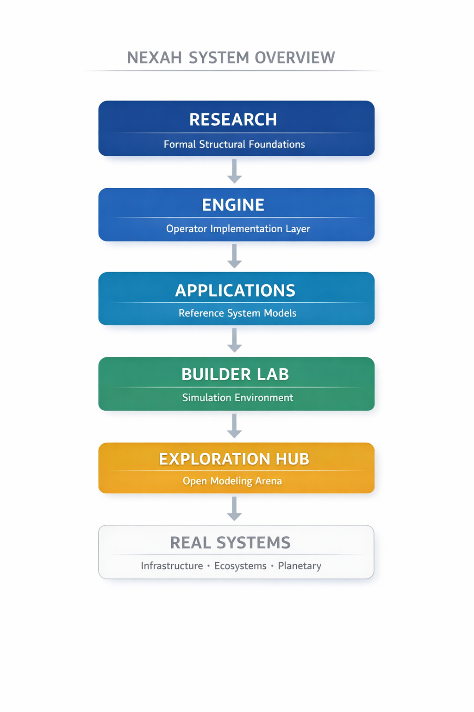

# NEXAH Framework

**Structural navigation for complex dynamical systems.**

NEXAH is a framework for analyzing and navigating **regime landscapes in complex dynamical systems**.

Instead of only simulating system dynamics, NEXAH extracts **state graphs, regimes, and cascade risks**, enabling agents to compute **navigation and stabilization strategies**.

---

# What NEXAH Does

Traditional simulators answer:

```
What happens if the system evolves?
```

NEXAH answers:

```
How can we navigate the system toward stable regimes?
```

NEXAH transforms system models into **navigable regime landscapes**:

```
Simulators
    ↓
State Graph
    ↓
Regime Landscape
    ↓
Navigation
    ↓
Policy
    ↓
Action
```

---

# NEXAH Navigation Layer


Simulators describe system dynamics.

**NEXAH enables navigation through the regime landscape of those systems.**

The navigation layer identifies:

- regime transitions
- cascade risks
- stability basins
- stabilization strategies

---

# Core Kernel

The **NEXAH Kernel** is the minimal structural navigation engine.

Location:

```
ENGINE/nexah_kernel/
```

The kernel converts system graphs into **navigable regime landscapes** and enables structural interventions.

Core workflow:

```
System Graph
    ↓
Regime Landscape
    ↓
Navigation Analysis
    ↓
Structural Intervention
```

Kernel operations include:

- regime detection  
- navigation trajectory analysis  
- cascade risk estimation  
- structural intervention simulation  

The kernel provides the **core navigation logic of the NEXAH framework**.

---

# Framework Architecture



The NEXAH architecture consists of several layers.

```
RESEARCH
    Formal structural foundations

ENGINE
    Kernel and structural computation layer

APPLICATIONS
    Reference system models

BUILDER LAB
    Simulation sandbox

EXPLORATION HUB
    Open modeling environment

REAL SYSTEMS
    Infrastructure, ecosystems, planetary systems
```

---

# The NEXAH Control Stack


NEXAH follows a layered control architecture.

```
META
    semantic system description

ARCHY
    structural system modeling

NEXAH
    navigation across regime landscapes

POLICY
    decision strategies

ACTION
    system interventions

STATE
    resulting system dynamics
```

This stack separates **meaning, structure, navigation, and control**.

---

# NEXAH Engine

The **NEXAH Engine** implements the structural operators and stability analysis systems used by the kernel.

Location:

```
ENGINE/
```

The engine includes:

- finite abstract interpretation  
- fixpoint solvers  
- spectral graph analysis  
- stability landscape computation  
- cascade analysis tools  

It acts as the **computational backbone** of the framework.

---

# Builder Lab

Location:

```
BUILDER_LAB/
```

The Builder Lab provides a sandbox for experiments with:

- infrastructure simulations  
- cascade failure modeling  
- navigation strategies  
- system stabilization experiments  

Example demo:

```
python BUILDER_LAB/demos/nexah_demo.py
```

---

# Exploration Hub

Location:

```
EXPLORATION_HUB/
```

The Exploration Hub provides an **open modeling environment** for exploring complex systems such as:

- planetary infrastructure  
- ecosystems  
- financial systems  
- cities and logistics networks  

Documentation:

```
EXPLORATION_HUB/README.md
```

---

# Repository Map


| Layer | Description |
|------|-------------|
| ENGINE | Kernel and structural computation |
| RESEARCH | Formal mathematical foundations |
| APPLICATIONS | System models and case studies |
| BUILDER LAB | Simulation sandbox |
| NAVIGATOR | Visual documentation |
| EXPLORATION HUB | Open modeling environment |

---

# Research Pipeline


The framework evolves through a structured research pipeline.

```
Axioms
    ↓
Principles
    ↓
Theorems
    ↓
Operators
    ↓
Framework
    ↓
Applications
```

---

# Typical Application Domains

NEXAH can be applied to many complex systems:

- power grid stability  
- cascading infrastructure failures  
- supply chain networks  
- ecological systems  
- climate regime analysis  
- large-scale technological systems  

---

# Quick Start

Clone the repository:

```
git clone https://github.com/Scarabaeus1033/NEXAH.git
cd NEXAH
```

Install the framework:

```
pip install -e .
```

Run the demo simulation:

```
python BUILDER_LAB/demos/nexah_demo.py
```

---

# Implementation Status

Current release: **v1.0**

- kernel navigation engine implemented  
- structural graph models operational  
- fixpoint solver validated  
- stability analysis modules functional  
- modular architecture established  

---

# License

Code: **Apache License 2.0**  
Documentation: **CC BY 4.0**

© 2026 Thomas K. R. Hofmann
