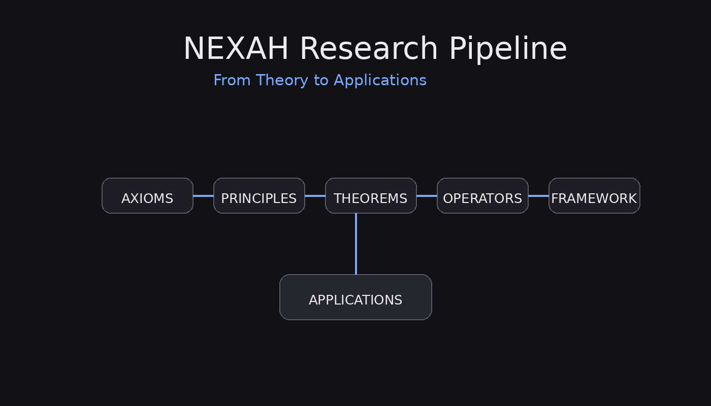
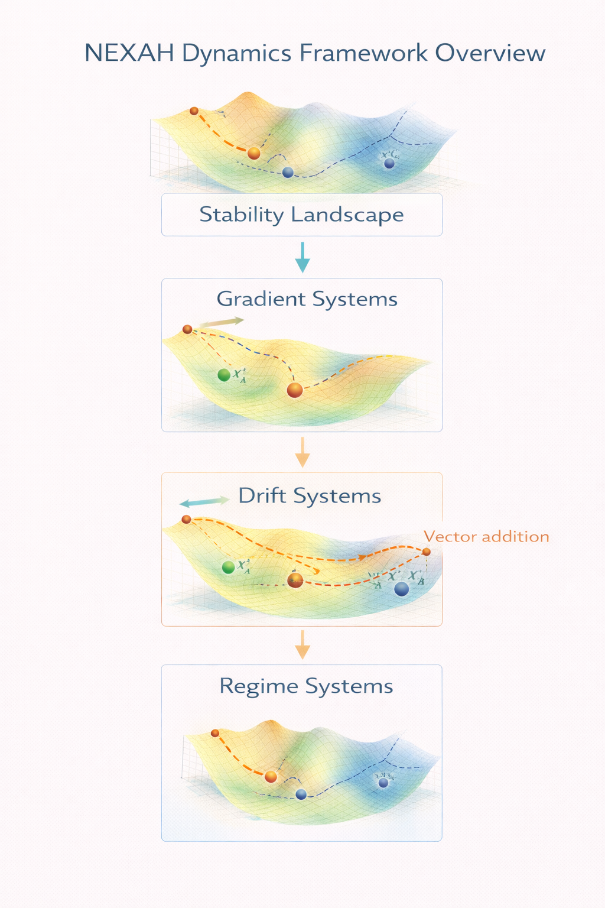

# NEXAH Framework

The official repository for the **NEXAH Framework** —  
a modular system for **structural modeling, stabilization, and relational navigation**.


---

# Overview

NEXAH is a **structural modeling framework** for analyzing complex systems through:

- relational order
- stabilization regimes
- transition and navigation structures
- finite dynamical system modeling

The repository integrates multiple layers that connect **formal system theory with executable simulations and real-world modeling**.

---

# Core System Layers

The NEXAH ecosystem is organized into five major components:

| Layer | Description |
|------|-------------|
| 🏗 **ENGINE** | Finite algebra core and structural operators |
| 📐 **FRAMEWORK** | Conceptual system stack (META / ARCHY / NEXAH) |
| 🔬 **RESEARCH** | Mathematical foundations and structural theory |
| 🚀 **APPLICATIONS** | Dynamical system models and real-world analysis |
| 🧪 **BUILDER LAB** | Experimental simulation sandbox |

---

# 🔎 Quick Navigation

| Section | Description |
|--------|-------------|
| 🏗 **ENGINE** | Finite algebra engine and abstract interpretation core |
| 📐 **FRAMEWORK** | Conceptual system architecture |
| 🔬 **RESEARCH** | Theoretical foundations |
| 🚀 **APPLICATIONS** | Real-world dynamical system models |
| 🧪 **BUILDER LAB** | Simulation sandbox and system experiments |
| 🧭 **NAVIGATOR** | Visual system maps and repository navigation |

---

# Explore the Repository

| Portal | Link |
|------|------|
| Framework Portal | [`NAVIGATOR/framework_portal.md`](./NAVIGATOR/framework_portal.md) |
| Research Portal | [`NAVIGATOR/research_portal.md`](./NAVIGATOR/research_portal.md) |
| Applications Portal | [`NAVIGATOR/applications_portal.md`](./NAVIGATOR/applications_portal.md) |
| Repository Navigator | [`NAVIGATOR/repository_portal.md`](./NAVIGATOR/repository_portal.md) |

---

# Research Pipeline



The NEXAH ecosystem follows a layered development process:

```
Axioms
↓
Principles
↓
Theorems
↓
Operators
↓
Framework
↓
Applications
```

The pipeline illustrates how theoretical ideas become **executable modeling tools** and eventually **real-world system models**.

---

# Dynamical Systems Framework



The applications layer models complex systems using structural dynamical models.

| Model | Description |
|------|-------------|
| **Stability Landscape** | Conceptual stability structure |
| **Gradient Systems** | Dynamics along stability gradients |
| **Drift Systems** | Gradient dynamics with external forcing |
| **Regime Systems** | Systems with multiple attractor regimes |

These models form the basis for **structural system analysis** within NEXAH.

---

# Builder Lab (Simulation Sandbox)

Location: `/BUILDER_LAB`

The Builder Lab provides a **hands-on simulation environment** for exploring the NEXAH framework.

It includes:

- finite state system simulations
- cascade dynamics experiments
- infrastructure modeling
- system navigation agents
- visualization tools

Example experiments include:

- energy grid cascade modeling
- supply chain simulations
- planetary infrastructure networks
- multi-layer system interactions

The Builder Lab acts as a **practical experimentation layer** for the theoretical framework.

---

# Repository Structure

## 🏗 ENGINE

Location: `/ENGINE`

Implements **finite order-theoretic algebra structures** and abstract interpretation tools.

Core components include:

- partially ordered sets
- lattices
- closure operators
- monotone operators
- fixpoint solvers
- regime and frame operators

Validated via automated test suite.

---

## 📐 FRAMEWORK

Location: `/FRAMEWORK`

Defines the conceptual architecture of NEXAH.

| Layer | Role |
|------|------|
| **META** | relational order structures |
| **ARCHY** | stabilization regimes |
| **NEXAH** | orientation and transition modeling |

These layers structure how complex systems are modeled.

---

## 🔬 RESEARCH

Location: `/RESEARCH`

The research layer explores theoretical foundations including:

- stability detection
- regime transitions
- relational modeling
- system orientation

Full documentation available in the **Research Portal**.

---

## 🚀 APPLICATIONS

Location: `/APPLICATIONS`

The applications layer demonstrates how NEXAH models **real-world system dynamics**.

Current modeling examples include:

- gradient systems
- drift systems
- regime transitions
- stability landscapes

These models illustrate how structural analysis can be applied to complex environments.

---

## 🧪 BUILDER LAB

Location: `/BUILDER_LAB`

Experimental sandbox for system simulations and visual system exploration.

Includes:

- simulation engines
- interactive dashboards
- cascade experiments
- visualization tools

---

## 🧭 NAVIGATOR

Location: `/NAVIGATOR`

Provides visual documentation of the NEXAH ecosystem:

- framework diagrams
- repository structure maps
- conceptual portals
- research pipeline visualizations

The Navigator acts as the **entry point for exploring the system architecture**.

---

# Implementation Status

Current release: **v1.0.0**

- finite algebra engine stable
- monotone and fixpoint structures validated
- worklist fixpoint solver operational
- constant propagation example implemented
- ~95% test coverage
- `mypy --strict` clean
- API frozen for finite scope

The system is **finite by design and structurally verified**.

---

# Versioning

The ENGINE follows semantic versioning:

- **v1.0** → stable finite core  
- **v1.x** → backward compatible extensions  
- **v2.x** → structural changes  

Current version: **v1.0.0**

---

# License

Code: **Apache License 2.0**  
Documentation & Research: **CC BY 4.0**

© 2026 Thomas K. R. Hofmann
The NEXAH ecosystem follows a layered development process:

```
Axioms
↓
Principles
↓
Theorems
↓
Operators
↓
Framework
↓
Applications
```

The pipeline illustrates how theoretical ideas are translated into **executable modeling tools** and eventually applied to **complex real-world systems**.

---

# Dynamical Systems Framework


The applications layer uses a hierarchy of dynamical system models:

| Model | Description |
|------|-------------|
| **Stability Landscape** | Conceptual stability structure |
| **Gradient Systems** | Dynamics along stability gradients |
| **Drift Systems** | Gradient dynamics with external forcing |
| **Regime Systems** | Systems with multiple attractor regimes |

These models form the basis for structural system analysis within the NEXAH framework.

---

# Repository Structure

## 🏗 ENGINE

Location: `/ENGINE`

Implements **finite order-theoretic algebra structures** and abstract interpretation tools.

Core components include:

- partially ordered sets
- lattices
- closure operators
- monotone operators
- fixpoint solvers
- regime and frame operators

Validated via automated test suite.

---

## 📐 FRAMEWORK

Location: `/FRAMEWORK`

Defines the conceptual architecture of NEXAH:

| Layer | Role |
|------|------|
| **META** | relational order structures |
| **ARCHY** | stabilization regimes |
| **NEXAH** | orientation and transition modeling |

These conceptual layers structure how complex systems are modeled and analyzed.

---

## 🔬 RESEARCH

Location: `/RESEARCH`

The research layer explores theoretical foundations including:

- stability detection
- regime transitions
- relational modeling
- system orientation

Full documentation available in the **Research Portal**.

---

## 🚀 APPLICATIONS

Location: `/APPLICATIONS`

The applications layer demonstrates how NEXAH models **real-world system dynamics**.

Current modeling examples include:

- gradient systems
- drift systems
- regime transitions
- stability landscapes

These models illustrate how structural analysis can be applied to complex environments.

---

## 🧭 NAVIGATOR

Location: `/NAVIGATOR`

Provides visual documentation of the NEXAH ecosystem:

- framework diagrams
- repository structure maps
- conceptual portals
- research pipeline visualizations

The Navigator acts as the **entry point for exploring the system architecture**.

---

# Implementation Status

Current release: **v1.0.0**

- finite algebra engine stable
- monotone and fixpoint structures validated
- worklist fixpoint solver operational
- constant propagation example implemented
- ~95% test coverage
- `mypy --strict` clean
- API frozen for finite scope

The system is **finite by design and structurally verified**.

---

# Versioning

The ENGINE follows semantic versioning:

- **v1.0** → stable finite core  
- **v1.x** → backward compatible extensions  
- **v2.x** → structural changes  

Current version: **v1.0.0**

---

# License

Code: **Apache License 2.0**  
Documentation & Research: **CC BY 4.0**

© 2026 Thomas K. R. Hofmann
