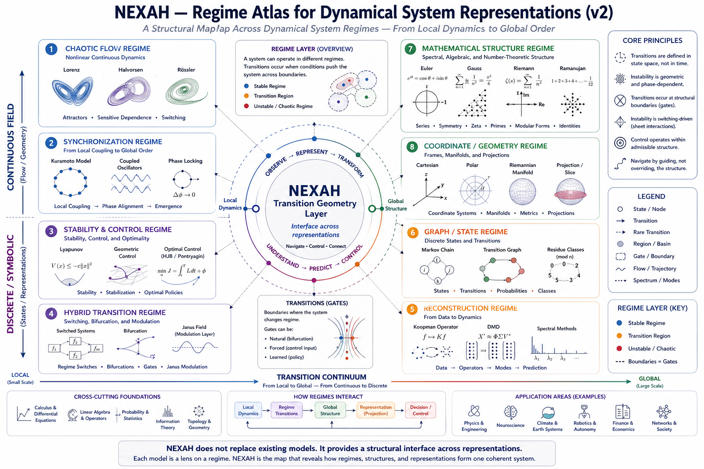
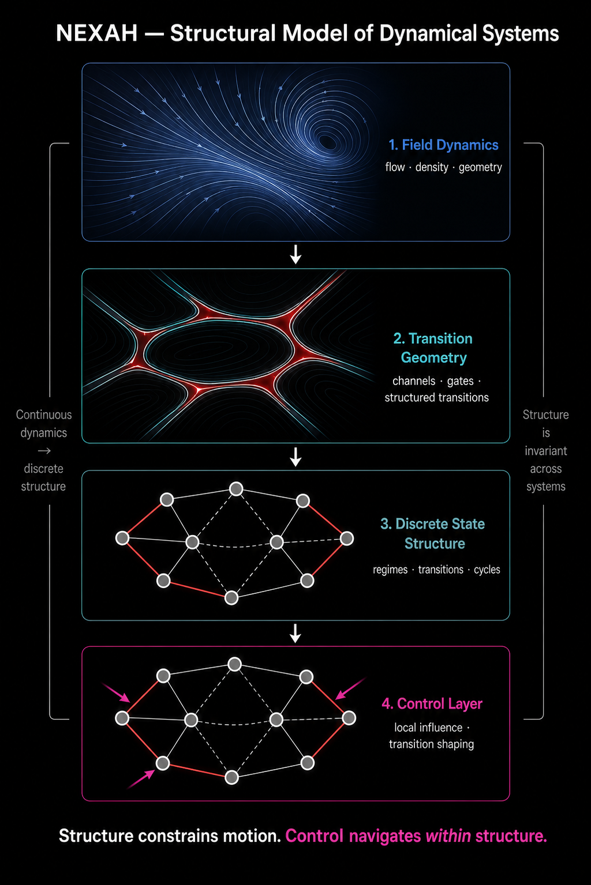

# ⚡ NEXAH — A Geometric Framework for Dynamical Systems


> A framework for discovering and navigating structure in dynamical systems.

> **Status:** Active research system — validation and kernel integration in progress

---

## 🧭 Quick Navigation

| File | Purpose |
|---|---|
| [START_HERE.md](START_HERE.md) | Recommended entry point |
| [VISUAL_GALLERY.md](VISUAL_GALLERY.md) | Main visual showcase |
| [REPOSITORY_MAP.md](REPOSITORY_MAP.md) | Full repository structure |
| [MANIFESTO.md](MANIFESTO.md) | Research vision and philosophy |
| [RESEARCH/RESEARCH_INDEX.md](RESEARCH/RESEARCH_INDEX.md) | Research navigation |

> 👉 New to NEXAH? Start with: [START_HERE.md](START_HERE.md)

---

> NEXAH reconstructs structure, transitions, and stability  
> directly from system dynamics.

> It reveals how systems move, where transitions occur, and when they are triggered.

> Complex systems are not random.  
> They evolve within **structured fields that constrain motion, transitions, and outcomes**.

---

## 🧭 Conceptual Overview



*NEXAH connects continuous dynamics with discrete transition structure across regimes.*

---

## 🌀 Visual Exploration

Explore the primary visual structures discovered across the NEXAH framework:

👉 [VISUAL_GALLERY.md](VISUAL_GALLERY.md)

Includes:

- transition geometry
- gate structures
- fractal transition dynamics
- modular resonance systems
- Kuramoto synchronization fields
- phase mismatch structures
- flow field reconstruction
- regime boundary visualizations

---

## 🧠 What NEXAH Does

NEXAH reconstructs **latent structure from dynamical systems**.

It transforms:

```text
raw trajectories → continuous field → structured regions → transition dynamics
```

into a representation that makes systems:

```text
observable → structurally interpretable → navigable
```

This enables:

- detection of transition regions (gates, boundaries)
- identification of stable regimes (basins)
- reconstruction of system geometry
- simulation of motion within learned structure

---

## 🧠 Central Paradigm Shift

Traditional dynamical systems approaches model:

```text
state → next state
```

NEXAH instead models:

```text
motion within a structured field
```

This reframes:

- stability
- transitions
- instability
- and control

as geometric properties of motion within evolving system structure.

Within this interpretation:

- stability = alignment with field structure
- instability = drift into conflicting or low-density regions
- transitions = movement across structured regions
- phase mismatch = trigger of transitions

---

## 🔬 Research & Findings

📂 [`RESEARCH/`](RESEARCH/)

NEXAH is grounded in a structured research layer:

- empirical findings across systems
- structural models (field, vessel, transitions, phase)
- cross-system invariance analysis

👉 Start here:

- [`RESEARCH/RESEARCH_INDEX.md`](RESEARCH/RESEARCH_INDEX.md)
- [`RESEARCH/CORE_CONCEPT_MAP.md`](RESEARCH/CORE_CONCEPT_MAP.md)

Then:

- [`RESEARCH/FOUNDATION/`](RESEARCH/FOUNDATION/)
- [`RESEARCH/CORE_CONCEPTS/`](RESEARCH/CORE_CONCEPTS/)
- [`RESEARCH/VALIDATION/`](RESEARCH/VALIDATION/)

---

### 🔁 Phase & Control Extension (New)

Recent validation results show:

```text
Transitions are not only triggered by phase mismatch,
but can be causally influenced through phase-dependent control.
```

Key empirical result:

```text
Control effectiveness depends on direction relative to phase dynamics.
```

Observed behavior:

- phase-aligned control → amplifies drift and transition activity
- phase-opposed control → suppresses drift and transitions
- inverse control → stabilizes system near zero-drift regime

This leads to an extended mechanism:

```text
phase → mismatch → transition
            ↑
        control (directional)
```

Interpretation:

- instability defines potential
- phase mismatch triggers transitions
- control direction determines whether dynamics amplify or stabilize

This establishes a closed-loop causal structure:

```text
system dynamics ↔ phase ↔ control
```

and introduces a new control principle:

> effective control is achieved by opposing intrinsic phase-aligned instability,  
> not by reducing system magnitude.

---

## 🧪 Demonstrator (Reproducible Core)

📂 [`NEXAH_DEMONSTRATOR/`](NEXAH_DEMONSTRATOR/)

The demonstrator provides a **minimal, reproducible implementation** of the core pipeline  
and serves as the recommended entry point.

It includes:

- field construction from trajectories
- Gate Operator (continuous instability field)
- Transition Structure (discrete sheet dynamics)
- Navigation Kernel (geometry-aware motion)

👉 Start here:
- [`NEXAH_DEMONSTRATOR/README.md`](NEXAH_DEMONSTRATOR/README.md)

👉 Core components:
- `gate_operator.md`
- `transition_structure.md`
- `navigation_kernel.md`

---

## 🌊 Field Reality (Example)


*System motion follows a constrained flow field — transitions occur only along admissible paths.*

---

## 🎯 Structure-Aware Field (Control View)


*Control emerges from alignment with system geometry rather than external forcing.*

---

## 🧪 Validation (Empirical Layer)

📂 [`RESEARCH/VALIDATION/`](RESEARCH/VALIDATION/)

NEXAH has been tested across:

- chaotic systems (Lorenz, Halvorsen)
- controlled experiments (transition modulation)
- real-world inspired systems (power grids)

Key observations (validated across tested systems):

- early detection of transition behavior before instability
- structure remains robust under noise
- transition geometry persists across systems

These results indicate that transition structure is not system-specific,  
but an emergent property of dynamical systems.

👉 See:
- [`RESEARCH/VALIDATION_SUMMARY.md`](RESEARCH/VALIDATION_SUMMARY.md)

---

### 🔬 Fractal Transition Validation (Extension)

> ⚠️ This section represents an experimental extension of the validation layer.  
> Results are consistent with core findings, but not yet validated across multiple dynamical systems.


```text
Parameter-driven transitions observed in fractal systems (Julia / Mandelbrot).
```

This extension suggests that transitions can also be induced  
through structured parameter motion.

It complements the core validation by showing:

- externally driven transition activation
- observable structural change (Δ) as a proxy for mismatch
- consistent transition patterns across parameter trajectories

---

### 🔍 Interpretation (Minimal)

- intrinsic systems:

  ```text
  phase → mismatch → transition
  ```

- parameter-driven systems:

  ```text
  parameter motion → structural change (Δ) → transition
  ```

---

### 🧭 Status

```text
experimental
internally consistent
not yet cross-system validated
```

---

→ Full analysis:

`RESEARCH/VALIDATION/fractal_tests/README.md`

---

## 🧠 Structural Insight (Unified View)



*Unified structural hierarchy: field dynamics, transition geometry, phase dynamics, and control layer.*

---

## 🧩 Core Modules

### 🔷 Field & Transition System

```text
NEXAH_CORE/
```

Implements:

- field reconstruction
- transition detection (gates, basins)
- probabilistic instability modeling
- structure-aware trajectory analysis

---

### 🔷 Demonstrator (Reference Implementation)

```text
NEXAH_DEMONSTRATOR/
```

- minimal working system
- reproducible experiments
- empirical validation layer

---

## 🔷 System Perspective

NEXAH integrates:

```text
Field (continuous)
↔ Geometry (structure)
↔ Graph (transitions)
↔ Phase (causal dynamics)
↔ Control (trajectory navigation)
```

Interpretation:

- field → defines motion
- geometry → defines constraints
- graph → encodes transition structure
- phase → defines transition activation
- control → navigates trajectories within these constraints

---

## 🔬 Current Capabilities

✔ field reconstruction from data  
✔ stability as spatial structure  
✔ transition detection (gates, basins)  
✔ probabilistic transition modeling  
✔ trajectory simulation within learned fields

---

## ⚠️ Current Limitations

❌ no unified runtime kernel  
❌ limited large-scale validation  
❌ early-stage control integration  
❌ not production-ready

---

## 📦 Repository Overview

```text
ARCHITECTURE/         → implemented architecture
NEXAH_CORE/           → transition and field logic
FIELD_LAYER/          → continuous geometry layer
RESEARCH/             → findings, validation, theory
VALIDATION/           → empirical experiments
NEXAH_DEMONSTRATOR/   → reproducible reference system
VISUAL_GALLERY.md     → curated visual overview
REPOSITORY_MAP.md     → full repository structure
```

---

## 🚀 Quick Start

```bash
pip install -e .
# or
pip install -r requirements.txt

python run_nexah_demo.py
```

---

## 📚 Documentation

- 📊 [System State](ARCHITECTURE/SYSTEM_STATE.md)
- 🔬 [Methods](ARCHITECTURE/METHODS.md)
- 🧭 [Architecture](ARCHITECTURE/README.md)
- 🗺️ [Repository Map](REPOSITORY_MAP.md)
- 🌀 [Visual Gallery](VISUAL_GALLERY.md)
- 🧠 [Research Vision](RESEARCH/RESEARCH_VISION.md)

---

## ⚡ Core Insight

```text
Stability is not a scalar value.

It is a region within a structured field.
```

---

## 🧭 Final Statement

```text
A system does not fail randomly.

It moves through structured transition regions
that constrain what outcomes are possible.
```

---

## 🔬 Try It Yourself

NEXAH is designed to be explored.

Run the demonstrator, test different systems,  
and observe how structure emerges from dynamics.

→ The system is not just described — it can be experienced.

---

**Thomas K. R. Hofmann · NEXAH · 2026**
