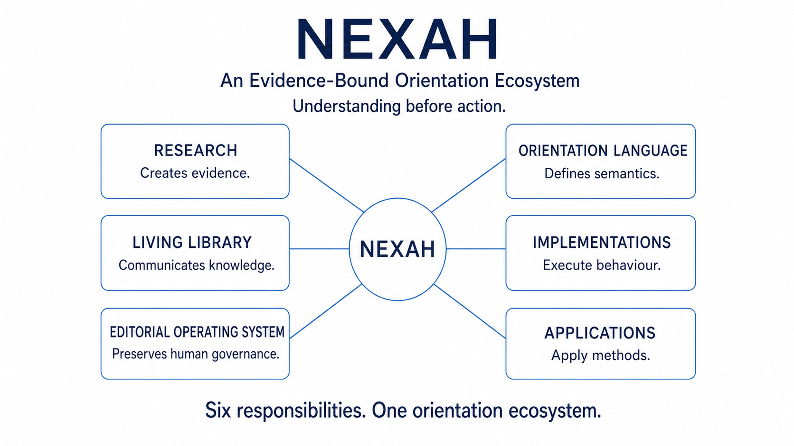

# NEXAH — The Orientation Ecosystem

**Understanding before action.**

NEXAH is an **evidence-bound orientation ecosystem**. It brings together
Research, a canonical Orientation Language, implementations, applications, a
Living Library, and a human-governed Editorial Operating System.

Each subsystem has its own responsibility and authority. None replaces another.
Together they support responsible orientation across complex systems and
bounded representations.

NEXAH is not an oracle, a causal authority, an autonomous controller, or a
replacement for human judgment.



```text
observe → represent → compare → orient → explain → act → improve
```


---

## The Ecosystem at a Glance


This is an informative repository map, not a capability or conformance claim.
It shows how the six coordinated subsystems relate while preserving their
separate responsibilities and authority boundaries.

The canonical semantic authority is the published
**[Orientation Language Release 1.0](ORIENTATION_LANGUAGE/SPECIFICATION/RELEASES/OLS-RELEASE-1.0.0/PUBLICATION_SUMMARY.md)**.
Implementations may realize the language, but conformance must be demonstrated
explicitly; it is never assumed from proximity, naming, or shared concepts.

---

## What Exists Today

| Subsystem | Current repository state |
|---|---|
| **Research** | Active research, experiments, validation, findings, and explicit evidence boundaries |
| **Orientation Language** | Canonical **OLS-RELEASE-1.0.0**: seven normative parts and one informative companion; SHA-256 manifests verified |
| **Implementations** | Maintained Orientation Kernel v0.7, typed contracts, CLI, reports, replay, and bounded-memory safeguards |
| **Applications** | Maintained reference applications for Network Orientation and IEEE Geometry V1 |
| **Living Library** | Canonical Work Registry, curated works, editions, sequences, reader journeys, and Are.na publication layer |
| **Editorial Operating System** | Human review, editorial policies, explanation contracts, snapshots, diffs, and controlled publication workflows |

These areas do not share one maturity label. A canonical specification, a
maintained implementation, a validated application, an active research result,
and an editorial decision are different kinds of evidence.

---

## Responsibility and Authority Map

| Subsystem | Responsibility | Authority | Boundary |
|---|---|---|---|
| **[Research](RESEARCH/README.md)** | Produces hypotheses, models, experiments, validation, and findings | Empirical and analytical evidence within a declared scope | Does not define normative OLS semantics or establish universality |
| **[Orientation Language](ORIENTATION_LANGUAGE/README.md)** | Defines the published language, declarations, profiles, derivations, conformance, extensions, and versioning | The compatible canonical OLS release | Does not execute implementations or establish domain validity |
| **[Implementations](nexah/README.md)** | Execute declared structures and produce inspectable orientation artifacts | Observable implementation behavior and its verification record | Do not redefine OLS meaning; conformance is explicit, not assumed |
| **[Applications](APPLICATIONS/README.md)** | Apply methods to declared domains and use cases | Domain-local evidence, policy, and claim boundaries | Do not redefine OLS or generalize beyond admitted evidence |
| **[Living Library](LIBRARY/README.md)** | Communicates curated knowledge through Works, Editions, sequences, maps, and reader journeys | Editorial identity, classification, context, and sequence | The Library Registry is not an OLS Registry and is not semantic authority |
| **[Editorial Operating System](EDITORIAL_OPERATING_SYSTEM/README.md)** | Governs review, explanation, curation, approval, and controlled editorial execution | Explicit human editorial decisions and their audit trail | Editorial Governance is not Specification Governance and does not infer hidden meaning |

### Critical distinctions

- **Orientation Language defines semantics. Kernel implementations execute behavior.**
- **Kernel conformance is explicit—not assumed.**
- **The Library Registry identifies Works and Editions; OLS registries govern language artifacts.**
- **Editorial Governance governs curated knowledge and execution; Specification Governance governs OLS.**
- **Applications use declared semantics but do not redefine them.**
- **Research may inform every subsystem, but research hypotheses do not become normative merely by being referenced.**

---

## Choose Your Entry Point

Each path begins with one responsible area rather than requiring visitors to
understand the entire repository first.

| Visitor | Begin here |
|---|---|
| **General visitor** | **[Architecture Overview](ARCHITECTURE/README.md)** |
| **Specification reader** | **[Orientation Language](ORIENTATION_LANGUAGE/README.md)** |
| **Software user or developer** | **[Orientation Kernel](nexah/README.md)** |
| **Researcher** | **[Research Portal](RESEARCH/README.md)** |
| **Application evaluator** | **[Applications Overview](APPLICATIONS/README.md)** |
| **Library reader** | **[Living Library](LIBRARY/README.md)** |
| **Editorial contributor** | **[Editorial Operating System](EDITORIAL_OPERATING_SYSTEM/README.md)** |

For complete directory-level navigation, use the
**[Repository Map](REPOSITORY_MAP.md)**.

---

## Run the Current Software

The current Python package is a maintained research implementation. Installing
or running it does not by itself establish OLS conformance or real-world domain
validity.

```bash
python -m venv .venv
source .venv/bin/activate
python -m pip install -e .
```

On Windows:

```powershell
.venv\Scripts\activate
```

### Orient a declared network

```bash
nexah orient-network APPLICATIONS/datasets/supply_chain.json \
  --focus normal_operation \
  --target system_disruption \
  --domain supply-chain \
  --recorded-at 2026-07-13T22:45:00+00:00 \
  --format brief
```

The report describes the supplied representation: reachable and blocked nodes,
declared paths, structural sensitivities, missing information, limitations, and
next questions. It does not establish a real supply-chain risk or authorize an
intervention.

### Replay the frozen IEEE Geometry case

```bash
python validation/ieee_geometry_v1/run_validation.py
```

This reproduces the frozen IEEE-14 benchmark evaluation using the unchanged
IEEE-9 development method and audits the declared claim boundary. See the
**[10-minute walkthrough](APPLICATIONS/power_systems/ieee_geometry_v1/showcase/QUICKSTART_10_MINUTES.md)**.

### Run the visual reference Demonstrator

```bash
python PROTO_CORE/NEXAH_DEMONSTRATOR/scripts/run_demo.py
```

For contracts, CLI usage, system state, and safety boundaries, continue with
the **[Kernel Start](nexah/START_HERE.md)**.

---

## Evidence, Maturity, and Limits

NEXAH preserves the distinction between a representation, an orientation
result, a recommendation, an authorization, an executed action, and an observed
outcome.

```text
orientation
≠ recommendation
≠ authorization
≠ execution
≠ observed outcome
```

The current implementation and reference applications provide:

- typed, evidence-bound Orientation contracts and reports
- inspectable Network Orientation over declared graphs
- a frozen IEEE-9 to IEEE-14 benchmark evaluation
- explicit provenance, uncertainty, failure, and claim boundaries
- append-only episodic storage guarded by observed-outcome admission
- deterministic replay and repository validation paths
- read-only evidence probes that preserve disagreement and unknowns

The repository does **not** currently claim:

- universal transition laws or a closed mathematical theory
- automatic OLS conformance for any implementation
- broad real-world or operational-grid validation
- calibrated uncertainty across domains
- causal intervention guarantees
- autonomous execution authority
- production readiness or one unified runtime for all historical modules

> **NO OBSERVED OUTCOME → NO EPISODIC MEMORY UPDATE**

Passing a software contract establishes neither scientific validity nor domain
validity outside its stated evidence scope. The authoritative implementation
maturity record is **[System State](ARCHITECTURE/SYSTEM_STATE.md)**. Before
connecting sensitive, personal, or operational data, read
**[Safety and Misuse Boundaries](nexah/SAFETY_AND_MISUSE.md)**.

---

## Repository Map

The six coordinated subsystems form the primary repository structure:

```text
NEXAH/
├── RESEARCH/                     hypotheses, experiments, evidence, findings
├── ORIENTATION_LANGUAGE/         canonical OLS specification and releases
├── nexah/                        maintained Orientation Kernel implementation
├── APPLICATIONS/                 domain and use-case realizations
├── LIBRARY/                      Works, Registry, Editions, and reader journeys
├── EDITORIAL_OPERATING_SYSTEM/   review, explanation, governance, execution
│
├── ARCHITECTURE/                 system relationships, state, and boundaries
├── PROTO_CORE/                   demonstrators and prototype lineages
├── EXPERIMENTAL/                 active laboratories and historical work
├── validation/                   reproducible validation entry points
├── testkit/                      evidence and observed-outcome gates
├── assets/                       repository visual assets
├── START_HERE.md                 guided conceptual entry
├── MANIFESTO.md                  purpose, principles, and commitments
└── REPOSITORY_MAP.md             complete directory navigation
```

Detailed architecture and visual material remains available without dominating
the front door:

- **[Detailed Architecture](ARCHITECTURE/README.md)**
- **[Infrastructure and System State](ARCHITECTURE/SYSTEM_STATE.md)**
- **[Visual Gallery](VISUAL_GALLERY.md)**
- **[Experimental Portal](EXPERIMENTAL/README.md)**
- **[Reference and Prototype Implementations](PROTO_CORE/README.md)**

---

## Contribute

Useful contributions preserve evidence, provenance, boundaries, and ownership.
Examples include:

- reproducing a scoped experiment or canonical case
- testing a representation under changed conditions
- comparing a method with an established baseline
- documenting negative results or failed assumptions
- improving an implementation without silently changing semantics
- validating an application within an explicit domain boundary
- connecting editorial or visual claims to exact evidence paths

Choose the responsible subsystem first, then follow its local documentation and
governance. Architectural status belongs in
**[Architecture](ARCHITECTURE/README.md)**; normative language work belongs in
**[Orientation Language](ORIENTATION_LANGUAGE/README.md)**.

---

## Citation and License

NEXAH is released under the **Apache License 2.0**. Individual research records,
canonical OLS releases, validation artifacts, and Library works may carry more
specific citation or provenance information in their responsible subsystem.

---

**Thomas K. R. Hofmann**

NEXAH Orientation Ecosystem · 2026
