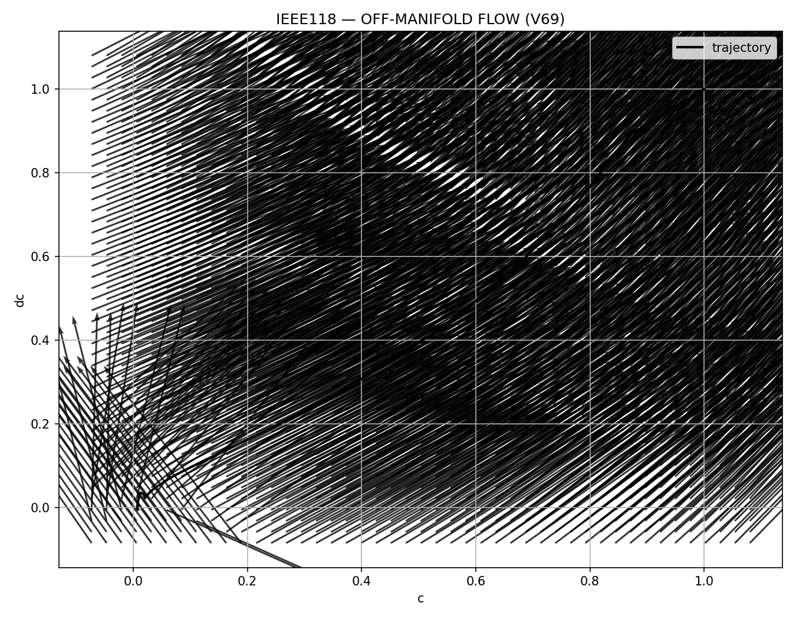
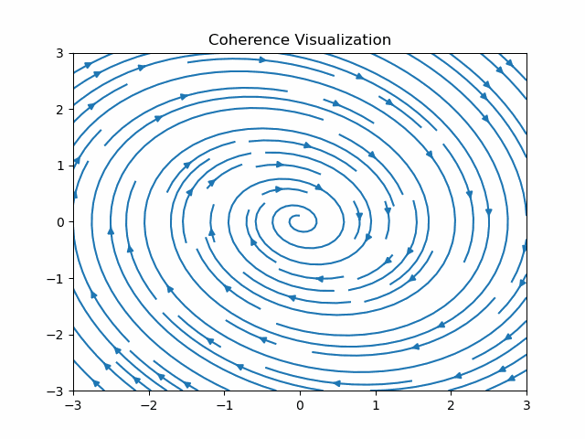
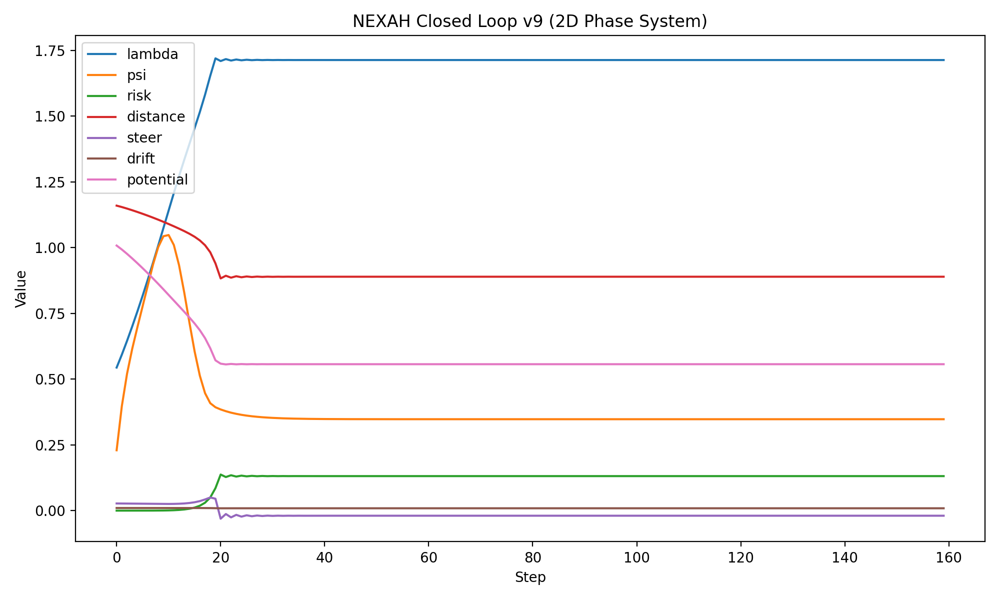
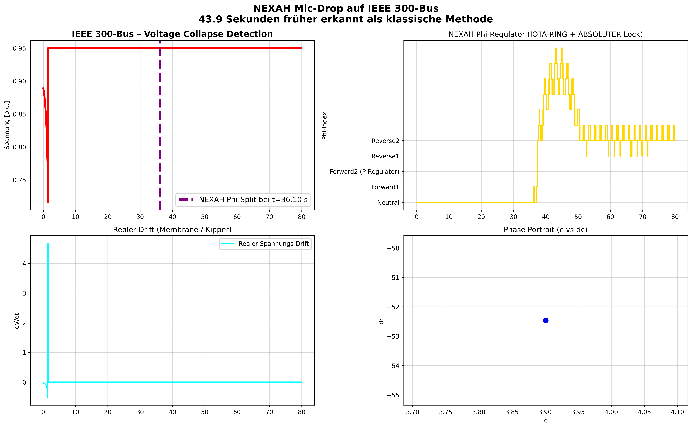

# ⚡ NEXAH — Structural Navigation in Complex Systems


---

## 🧭 NEXAH

> **A structural modeling framework for complex dynamical systems.**  
> Relational structure. Explicit orientation.

---

## 🧭 Abstract

NEXAH is a framework for exploring and analyzing complex dynamical systems through **structure, dynamics, and regimes**.

Instead of treating systems as binary (stable / unstable), NEXAH models them as evolving within:

> **structured dynamical landscapes**

This enables:

- representation of system dynamics as geometric structures  
- identification of regime transitions  
- trajectory-based system interpretation  
- exploration of navigation strategies within stability regions  

NEXAH is designed as a **modular system framework**, with applications to power systems and reference dynamical systems.

---

## 🧭 Overview

Classical system analysis focuses on:

→ threshold violations  
→ event detection  

NEXAH provides a complementary perspective:

> systems evolve as **trajectories within structured state spaces**

This shifts the focus from:

→ "Is the system stable?"  

to:

→ **"How does the system move within its stability field?"**

Stability is no longer a static condition,  
but a property of **trajectory alignment within structure**.

---

## 🌊 Field Structure (Concept)


This visualization shows the **stability field geometry**:

- valleys → low risk (stable regions)  
- slopes → transition zones  
- peaks → instability  

> Systems evolve within this landscape.

---

## ⚡ Real System Example (IEEE Flow Field)



**Observation:**
- trajectories follow structured flow patterns  
- system evolution is directional  

> Even real-world systems exhibit structured dynamics.

---

## 🚀 Start Here

👉 [START HERE — Run your first demo](START_HERE.md)

---

## 🎬 What you will see

- structured dynamics in chaotic systems  
- trajectories evolving in reduced state spaces  
- regime transitions in system behavior  
- geometry-based interpretations of dynamics  

---

## 🎥 Visual System (Core)

👉 [Full Visual Gallery → FRAMEWORK_visual_gallery.md](FRAMEWORK_visual_gallery.md)



NEXAH includes a progressive visualization pipeline:

- Field dynamics (V1)
- Coherence & alignment (V2)
- Risk landscapes (V3)
- Control (V4)
- Geometry & regimes (V6–V9)
- Multi-agent systems (V10)
- Swarm dynamics (V11)
- Communication & emergence (V12)

> These visuals form the executable core of the framework.

---

## 🧭 Explore

- 🧠 [Framework](FRAMEWORK/README.md)  
- ⚡ [Applications](APPLICATIONS/README.md)  
- 🧭 [Navigator](NAVIGATOR/README.md)

---

## 🔁 Core Pipeline

```text
dynamics → structure → field → regimes → navigation
```

## 🔥 Core Insight

Classical control:

→ reacts to deviations  

NEXAH perspective:

→ analyzes trajectory evolution within structure  

👉 Stability becomes a question of:
- regime  
- trajectory  
- structural alignment  

---

## 📊 From Structure → Dynamics

---
### 🔹 Trajectory-Based Control (Prototype)



**Observation:**
- control influences trajectory evolution  
- stabilization occurs in some scenarios  

**Interpretation:**

> Control can be interpreted as **trajectory shaping within system dynamics**

---

## ⚠️ Early Experiment — Misinterpreted Signal (“MicDrop”)



**Context:**

This figure was generated during early experiments and initially interpreted as a strong early-warning signal.

---

**Re-evaluation:**

Further analysis revealed that:

- the detected signal was **not consistently reproducible**
- results depended strongly on signal processing choices  
- similar lead times could not be confirmed across datasets  
- parts of the signal were artifacts of detection logic  

---

**Interpretation:**

> This result is now understood as an **interesting but misleading signal artifact**,  
> not as validated early-collapse detection.

---

👉 In hindsight:

> “MicDrop” → **MicFlop — but a useful one**

---

## ⚖️ Classical vs NEXAH

| Classical | NEXAH |
|----------|------|
| threshold-based | structure-based |
| event detection | regime analysis |
| reactive | trajectory-aware |
| state-focused | dynamics-focused |

---

## 🚀 Run Example

```bash
PYTHONPATH=. python APPLICATIONS/power_systems/nexah_ieee9/controller/nexah_closed_loop_ieee9_v6.py
```

## 🧭 Status

| Component | Status |
|----------|--------|
| Structure Discovery | ✅ |
| Field Interpretation | ✅ |
| Regime Detection | ✅ (experimental) |
| Control | ⚠️ prototype |
| Navigation | 🚧 in development |

---

## ⚠️ Limitations

- no validated universal early-warning metric  
- sensitivity to system and dataset  
- limited evaluation on real-world grid dynamics  
- control layer is experimental  

---

## 🧠 Final Insight

Complex systems are not binary.

They evolve within:

> **structured dynamical regimes**

---

## 🌀 NEXAH

> dynamics → structure → field → regimes → navigation  

---

**Thomas K. R. Hofmann · 2026**


