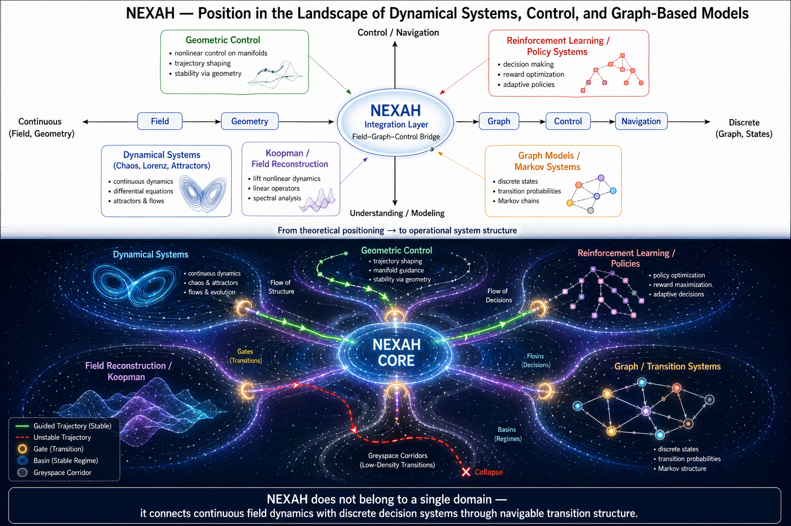

# ⚡ NEXAH — A Geometric Framework for Dynamical Systems

> NEXAH reconstructs structure, transitions, and stability  
> directly from system dynamics.

> Complex systems are not random.  
> They evolve within **structured fields that constrain motion, transitions, and outcomes**.

---

## 🧭 Conceptual Overview



*Positioning of NEXAH within the landscape of dynamical systems, control theory, and graph-based models.*

- continuous field representation (dynamics, flow, geometry)  
- discrete transition structure (basins, regimes, graphs)  
- control as trajectory shaping within structured space  

👉 NEXAH acts as an **integration layer** between these perspectives.

---

## ⚠️ Research Prototype

NEXAH is an experimental framework.

- promising results  
- ongoing validation  
- not yet production-ready  

---

# 🚀 Quick Start

```bash
pip install -e .
# or
pip install -r requirements.txt

python run_nexah_demo.py
```

---

# 🧠 What NEXAH does

NEXAH transforms time-series data into a **geometric system representation**:

```text
dynamics → structure → field → geometry → stability → control → navigation
```

This enables:

- early detection of transitions  
- identification of instability regions  
- reconstruction of system structure  
- trajectory steering inside dynamical fields  

---

# 🔬 Core Idea

Traditional approaches treat systems as:

```text
state → next state
```

NEXAH instead models:

```text
trajectory inside structured field
```

Where:

- stability = alignment with field structure  
- instability = low-density / competing flow regions  
- transitions = movement through structured corridors  

---

# 🧭 Example


→ instability is **not random**  
→ transitions occur in **specific regions**  
→ trajectories follow **field geometry**

---

# 🧩 Core Module

```text
NEXAH_CORE/
```

Implements:

- transition detection  
- probabilistic instability field  
- structure-aware navigation  
- early control concepts  

---

# 📚 Documentation

- 📊 [System State](ARCHITECTURE/SYSTEM_STATE.md)  
- 🔬 [Methods](ARCHITECTURE/METHODS.md)  
- 🧭 [Architecture](ARCHITECTURE/README.md)  
- 🌀 [Visual Gallery](VISUAL_GALLERY.md)  

---

# 🔷 System Perspective

NEXAH combines three layers:

```text
Field (continuous)
↔ Geometry (structure)
↔ Graph (discrete transitions)
↔ Control (trajectory shaping)
```

Interpretation:

- field → defines motion  
- geometry → defines constraints  
- graph → defines regime transitions  
- control → shapes trajectories within structure  

---

# 🔬 Current Capabilities

✔ field reconstruction from data  
✔ stability as spatial structure  
✔ transition detection (gates, basins)  
✔ probabilistic transition modeling  
✔ trajectory steering (early stage)  

---

# ⚠️ Current Limitations

❌ no unified runtime kernel  
❌ limited large-scale validation  
❌ incomplete control optimization  
❌ no production-ready pipeline  

---

# 🧭 Positioning

NEXAH is NOT:

- a simulator  
- a machine learning model  
- a classical control system  

NEXAH is:

> a **field-based transition, control, and navigation framework**

---

# 🚀 Demos

```bash
python run_nexah_demo.py
python run_ieee_demo.py
```

---

# 🧠 Learn More

👉 [START_HERE.md](START_HERE.md)

Full explanation, visuals, and system walkthrough.

---

# ⚡ Core Insight

```text
Stability is not a value.
It is a region in a structured field.
```

---

# 🧭 Final Statement

```text
A system does not randomly fail.

It moves through structured transition regions
that define what outcomes are possible.
```

---

Thomas K. R. Hofmann · NEXAH · 2026
python run_nexah_demo.py
```

---

## 🧩 Core Module

```text
NEXAH_CORE/
```

Implements:

- transition detection  
- probabilistic instability field  
- structure-aware navigation  
- early control concepts  

---

## 📚 Documentation

- 📊 [System State](ARCHITECTURE/SYSTEM_STATE.md)  
- 🔬 [Methods](ARCHITECTURE/METHODS.md)  
- 🧭 [Architecture](ARCHITECTURE/README.md)  
- 🌀 [Visual Gallery](VISUAL_GALLERY.md)  
- 🧠 [Research Vision](RESEARCH/RESEARCH_VISION.md)

---

## 🧠 Learn More

👉 [START_HERE.md](START_HERE.md)

Full explanation, visuals, and system walkthrough.

---

## ⚡ Core Insight

```text
Stability is not a value.

It is a region in a structured field.
```

---

Thomas K. R. Hofmann · NEXAH · 2026
