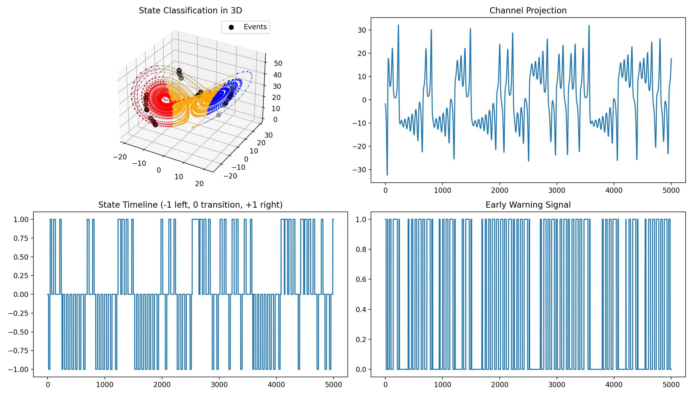
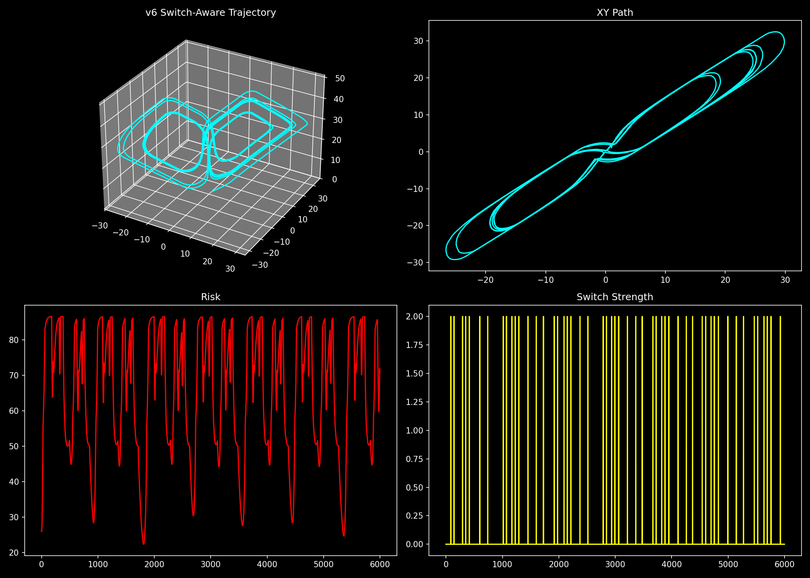

# ⚡ NEXAH — Navigating Structure in Dynamical Systems

> Complex systems are not random.  
> They evolve within **structured fields with direction and destination**.

---

**This is a real system.**

Not noise.  
Not randomness.

👉 This is a **structured flow field**

---

## 🧠 But it looks like this

Chaotic.  
Unpredictable.  
No obvious structure.

---

## 🔍 Until you extract the structure

Suddenly:

- discrete states emerge  
- transitions become visible  
- dynamics form a **graph**

👉 Chaos becomes **structured**

---

## 🔥 And now this becomes possible

- trajectories stabilize  
- regimes are controlled  
- targets can be reached  

👉 The system becomes **navigable**

---

## 🧠 What NEXAH does

NEXAH reconstructs dynamical systems as:

- **fields** instead of states  
- **trajectories** instead of events  
- **attractors** instead of targets  

It reveals:

> how systems **move, transition, and converge** within their intrinsic structure

---

## 🔥 Core idea

    dynamics → structure → field → topology → navigation

---

## 🧭 Architecture

    Dynamics
    → Discovery Engine
    → Field Layer
    → Navigator

### 🔬 Discovery Engine
Extracts structure from raw dynamics.

### 🌊 Field Layer
Transforms structure into a navigable representation.

### 🧭 Navigator
Operates on the system as a trajectory within the field.

---

## ⚡ What this enables

- detection of regime transitions  
- geometric interpretation of instability  
- trajectory-based control  
- navigation within system dynamics  

---

## 🧠 Current State

### ✔ Working (Prototype)

- structure extraction (Lorenz)  
- transition detection  
- short-term prediction  
- adaptive control behavior  
- regime switching  

### ⚠️ Limitations

- not globally predictive  
- system-dependent  
- still under validation  

---

## 🚀 Entry Point

👉 [START HERE — Run your first demo](START_HERE.md)

---

## 🧭 Modules

- 🧠 Framework → `FRAMEWORK/`  
- ⚡ Applications → `APPLICATIONS/`  
- 🧭 Navigation → `NAVIGATOR/`  
- 🔬 Discovery → `DISCOVERY_ENGINE/`  
- 🌊 Field → `FIELD_LAYER/`  

---

## 💡 Core Insight

> Stability is not a fixed state.  
> It is a **region within a structured dynamical field**

---

## 🌀 NEXAH

    dynamics → structure → field → regimes → navigation

---

**Thomas K. R. Hofmann · 2026**
