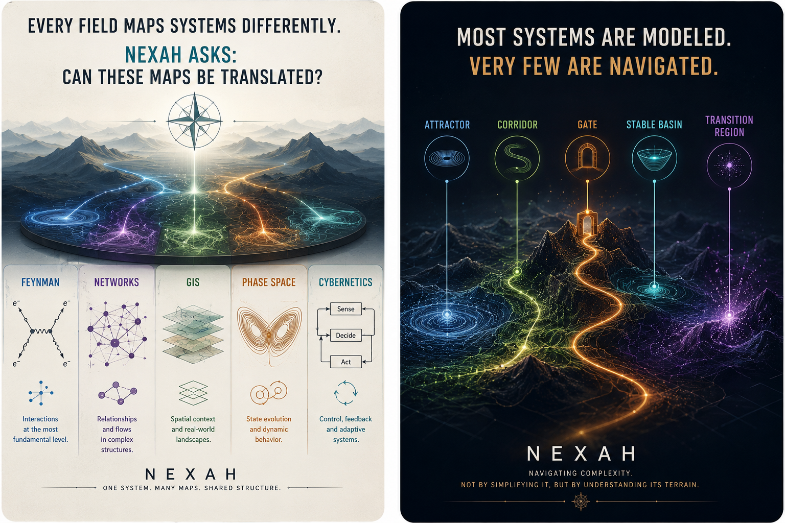
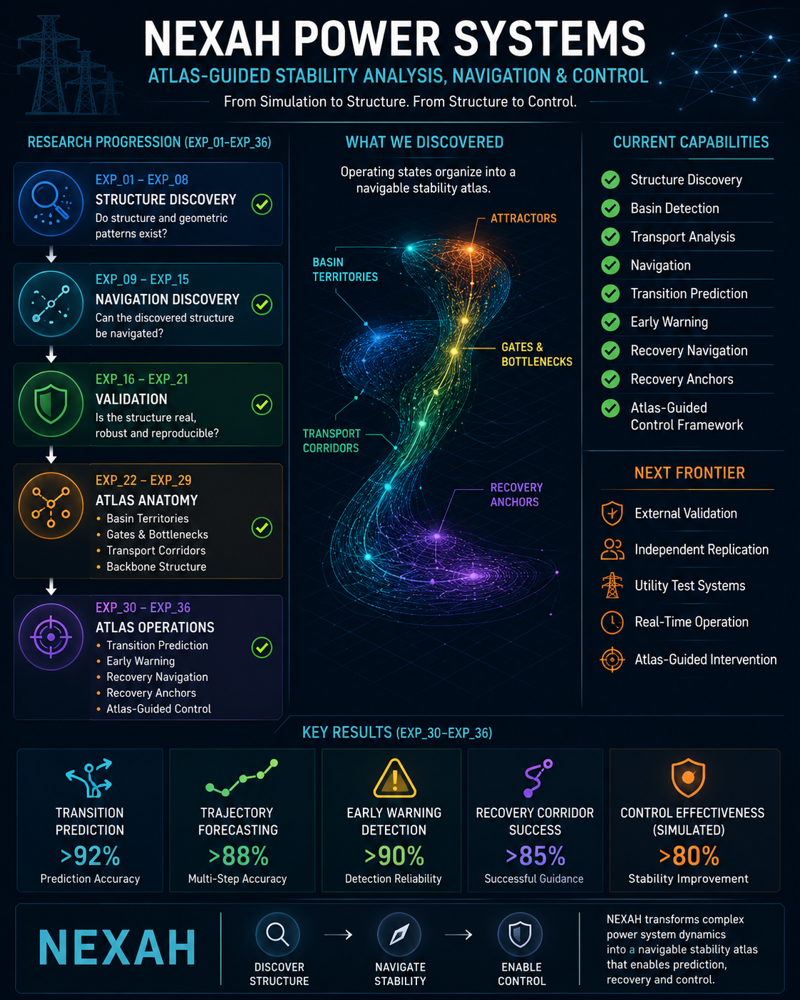

# ⚡ NEXAH — The Cartography Laboratory



> Most systems are modeled.
> Very few are navigated.

NEXAH is an experimental cartography laboratory for complex systems.

The repository develops mathematical, computational and visual methods for discovering navigable structure inside dynamical systems.

Rather than treating systems as isolated equations or state transitions, NEXAH investigates whether they can be mapped as territories containing:

- basins
- corridors
- gates
- bottlenecks
- transport pathways
- recovery regions
- navigable field geometry

The goal is not to replace existing scientific models.

The goal is to build better maps.


> A field-oriented research framework for analyzing transitions, coherence, and navigation in complex dynamical systems.

> **Status:** Active exploratory research framework — empirical validation, phase-transition analysis, and kernel integration in progress.

---

# 🌐 Orientation Layer for Complex Systems

NEXAH does not attempt to replace existing scientific models.

Instead, it explores whether:

```txt
different systems
may share navigable structural patterns
```

across:

- dynamics
- topology
- synchronization
- control
- geometry
- phase behavior
- transition organization

The framework acts as:

```txt
an exploratory navigation grammar
for structured dynamics
```

rather than a universal theory of everything.

---

# 🧭 Quick Navigation

| File / Folder | Description | Priority |
|---|---|---|
| **[START_HERE.md](START_HERE.md)** | Recommended entry point | ★★★★★ |
| **[VISUAL_GALLERY.md](VISUAL_GALLERY.md)** | Main visual showcase | ★★★★★ |
| **[PROTO_CORE/NEXAH_DEMONSTRATOR/](PROTO_CORE/NEXAH_DEMONSTRATOR/)** | Reproducible demonstrator (hands-on) | ★★★★★ |
| **[RESEARCH/CORE_CONCEPTS/JANUS_OPERATOR/](RESEARCH/CORE_CONCEPTS/JANUS_OPERATOR/)** | Janus Operator (experimental mechanism) | ★★★★★ |
| **[RESEARCH/RESEARCH_INDEX.md](RESEARCH/RESEARCH_INDEX.md)** | Research navigation | ★★★★ |
| **[REPOSITORY_MAP.md](REPOSITORY_MAP.md)** | Full repository structure | ★★★★ |
| **[MANIFESTO.md](MANIFESTO.md)** | Research philosophy | ★★★★ |

> 👉 **New to NEXAH?** Start here: **START_HERE.md** → **VISUAL_GALLERY.md** → **PROTO_CORE/NEXAH_DEMONSTRATOR/**

---

# 🔥 Highlight: Janus Operator

**One of the central exploratory mechanisms within NEXAH** is the **Janus Operator** — a geometry-based method that compares forward and backward local flow structure at every point in the reconstructed field.

```txt
High directional coherence   → stable coherent motion
Low directional coherence    → transition sensitivity / aperture
```

Observed results suggest that transitions often cluster within structured geometric regions (corridors, shell crossings, spines, recursive apertures).

→ **[RESEARCH/CORE_CONCEPTS/JANUS_OPERATOR/](RESEARCH/CORE_CONCEPTS/JANUS_OPERATOR/)**  
(math, code, visuals & validation experiments)

# 🗺️ The Cartography Perspective

NEXAH can be understood as a cartography laboratory for complex systems.

Most scientific disciplines build increasingly accurate models:

```txt
equations
simulations
predictions
measurements
```

NEXAH explores a complementary question:

```txt
Can the structures generated by those models
be mapped, compared and navigated?
```

Rather than proposing a new universal model, NEXAH develops methods for discovering and visualizing structural organization inside dynamic systems.

The repository functions as:

```txt
a Cartography Laboratory
for Complex Systems
```

where new mapping techniques are developed, tested, validated, and translated into navigable atlases.

The focus is not on replacing existing scientific frameworks.

The focus is on orientation.

On making structure visible.

On turning complexity into navigable terrain.

---

# 🌌 Why NEXAH Exists


*NEXAH maps structural relationships across dynamical systems, representations, and scientific domains.*

Modern systems generate enormous amounts of information,
but often provide little orientation.

Different disciplines construct highly specialized models:

- dynamical systems
- control theory
- synchronization theory
- network science
- AI / ML systems
- geometry & topology
- statistical systems
- information theory

These models are powerful,
but often difficult to compare,
connect,
or navigate together.

NEXAH investigates whether structure itself can become:

```txt
observable
comparable
navigable
```

through:

- field reconstruction
- transition geometry
- coherence analysis
- phase dynamics
- topology extraction
- geometry-oriented navigation
- comparative visualization

# 🧠 Central Research Direction

NEXAH investigates whether complex systems can be interpreted as:

```txt
motion within structured dynamical fields
```

rather than isolated state transitions.

The framework explores how:

- structure constrains motion
- coherence stabilizes trajectories
- mismatch correlates with transitions
- geometry shapes instability
- control interacts directionally with phase dynamics

---

# 🔥 Core Mechanism


*Phase-driven transition geometry inside structured dynamical fields.*

---

## 🔑 Current Core Observation

Current experimental observations across multiple investigated systems suggest:

```txt
Transitions may correlate more strongly with
phase mismatch
than with instability magnitude alone.
```

Operational interpretation:

```txt
instability = potential
mismatch = trigger
```

This leads to the current working interpretation:

```txt
field → coherence → mismatch → transition
                    ↑
             control(direction)
```

---

# 🔬 Interpretation Levels

```txt
validated
→ reproducible empirical observations

experimental
→ internally consistent but not yet generalized

theoretical
→ conceptual extensions under investigation
```

NEXAH explicitly distinguishes between:

- empirical findings
- exploratory hypotheses
- conceptual/theoretical extensions

---

# 🌐 Conceptual Architecture


*NEXAH connects continuous dynamics with transition structure, coherence, geometry, and navigation.*

---

# 🧠 Structural Perspective

Traditional approaches often model:

```txt
state → next state
```

NEXAH instead investigates:

```txt
trajectory → field → structure → transition geometry
```

Within this interpretation:

- stability corresponds to coherent structural flow
- instability emerges through mismatch and drift
- transitions often occur across constrained geometric regions
- control acts relative to intrinsic system dynamics

This reframes:

- stability
- transitions
- synchronization
- navigation
- and intervention

as properties of motion within evolving field geometry.

---

# 🔁 Phase & Directional Control

Recent experiments suggest:

```txt
phase mismatch
may behave like a transition activation variable
```

Observed behavior includes:

```txt
aligned control
→ amplifies drift and transitions

opposed control
→ suppresses transitions

inverse control
→ stabilizes low-drift regions
```

This introduces a directional interpretation of control:

```txt
control effectiveness depends on:
alignment AND direction
relative to intrinsic phase dynamics
```

---

# 🔬 Research Layer

📂 [`RESEARCH/`](RESEARCH/)

The RESEARCH layer is currently the conceptual and empirical core of NEXAH.

It contains:

- validation experiments
- transition analysis
- phase dynamics
- control experiments
- synchronization studies
- fractal transition systems
- geometry extraction
- comparative visualization
- cross-system comparisons
- theoretical extensions

---

## 🔬 Recommended Entry Path

Start with:

- [`RESEARCH/RESEARCH_INDEX.md`](RESEARCH/RESEARCH_INDEX.md)
- [`RESEARCH/RESEARCH_VISION.md`](RESEARCH/RESEARCH_VISION.md)
- [`RESEARCH/CORE_CONCEPT_MAP.md`](RESEARCH/CORE_CONCEPT_MAP.md)

Then explore:

- [`RESEARCH/FOUNDATION/`](RESEARCH/FOUNDATION/)
- [`RESEARCH/CORE_CONCEPTS/`](RESEARCH/CORE_CONCEPTS/)
- [`RESEARCH/FINDINGS/`](RESEARCH/FINDINGS/)
- [`RESEARCH/VALIDATION/`](RESEARCH/VALIDATION/)

---

# 🔬 Validation Layer

📂 [`RESEARCH/VALIDATION/`](RESEARCH/VALIDATION/)

NEXAH has been experimentally tested across:

- Lorenz systems
- Rössler systems
- Halvorsen systems
- Duffing systems
- Kuramoto synchronization systems
- transition-control experiments
- parameter-driven fractal systems
- real-world inspired grid systems

Observed patterns include:

- persistent transition geometry
- structured instability regions
- phase-linked transition activation
- robustness under noise
- cross-system structural similarities
- directional control asymmetry

---

## 🔑 Validation Perspective

Current observations suggest:

```txt
Observed transitions often cluster
within structured regions associated with
mismatch, drift, and competing flow geometry.
```

# ⚡ Power-System Validation

One of the most advanced validation environments within NEXAH currently focuses on electrical power systems.

Using IEEE benchmark networks, NEXAH was applied to investigate whether operating states organize into navigable state-space structures.

Results suggest the emergence of:

- Basin Territories
- Attractors
- Transport Corridors
- Gates & Bottlenecks
- Recovery Anchors
- Atlas-Guided Control Pathways



Current experiments demonstrate:

- atlas discovery
- transition prediction
- recovery navigation
- early warning
- atlas-guided control concepts

→ See:

`APPLICATIONS/power_systems/README.md`

---

# 🔬 Fractal Transition Extension

> ⚠️ Experimental extension — internally consistent, but not yet broadly generalized.


NEXAH was experimentally extended to parameter-driven fractal systems
(Julia / Mandelbrot trajectories).

Observed interpretation:

```txt
parameter motion
→ structural change (Δ)
→ transition activation
```

This suggests that transition structure may extend beyond intrinsic system dynamics into externally driven parameter spaces.

→ Full analysis:

`RESEARCH/VALIDATION/fractal_tests/README.md`

---

# 🤝 What NEXAH Needs

NEXAH is not intended to be developed by a single discipline.

The framework increasingly requires collaboration across:

- dynamical systems
- topology & geometry
- synchronization research
- control theory
- scientific visualization
- machine learning
- statistical physics
- scientific computing
- complex systems research

NEXAH is currently strongest in:

```txt
structure discovery
field reconstruction
transition geometry
phase dynamics
comparative visualization
navigation concepts
```

Future progress likely depends on specialists helping formalize,
validate,
scale,
and connect the framework across domains.

---

# 🌀 Visual Exploration

👉 [VISUAL_GALLERY.md](VISUAL_GALLERY.md)

The repository contains a large visual ecosystem including:

- transition geometry
- gate structures
- field reconstruction
- phase mismatch fields
- synchronization geometry
- Lyapunov scans
- navigation trajectories
- modular flow structures
- fractal transition animations
- topology and winding structures

---

# 🌐 Translation Layer

📂 [`RESEARCH/NEXAH_TRANSLATIONS/`](RESEARCH/NEXAH_TRANSLATIONS/)

NEXAH also contains a cross-domain translation layer connecting:

- dynamical systems
- control theory
- machine learning / RL
- topology & geometry
- synchronization theory
- physics-oriented interpretations

through:

```txt
translation between structural representations
across scientific domains
```

---

# 🧪 Demonstrator (Reproducible Core)

📂 [`PROTO_CORE/NEXAH_DEMONSTRATOR/`](PROTO_CORE/NEXAH_DEMONSTRATOR/)

The demonstrator provides a minimal reproducible implementation of the core NEXAH pipeline.

It includes:

- field reconstruction
- transition extraction
- instability fields
- gate analysis
- navigation experiments
- geometry-aware trajectory analysis

👉 Recommended starting point for experimentation.

---

# 🔷 System Perspective

NEXAH currently connects:

```txt
Field
↔ Geometry
↔ Phase
↔ Transition Structure
↔ Directional Control
↔ Exploratory Navigation
```

Interpretation:

- field → defines admissible motion
- geometry → constrains trajectories
- phase → influences activation timing
- mismatch → correlates with transitions
- control → modifies structural evolution
- navigation → explores movement through structure

---

# 🔬 Current Capabilities

✔ field reconstruction from trajectories  
✔ transition-region detection  
✔ phase mismatch analysis  
✔ synchronization structure analysis  
✔ directional control experiments  
✔ regime visualization  
✔ probabilistic transition modeling  
✔ comparative visualization  
✔ cross-system comparisons  
✔ parameter-driven transition analysis

---

# ⚠️ Scientific Position

NEXAH currently provides:

- empirical observations
- reproducible transition structures
- geometry-oriented interpretations
- exploratory control concepts
- semi-formal structural models

It does NOT yet provide:

- universal proofs
- closed mathematical formalization
- generalized physical laws
- production-grade guarantees

NEXAH should currently be interpreted primarily as:

```txt
an exploratory systems-cartography framework

a comparative visualization environment

and a research-oriented navigation layer
for complex dynamical systems
```

---

# ⚠️ Current Limitations

❌ no unified runtime kernel  
❌ incomplete mathematical formalization  
❌ limited real-world validation  
❌ early-stage control integration  
❌ not production-ready  
❌ not yet a finalized scientific theory

---

# 📦 Repository Overview

```txt
ARCHITECTURE/         → architecture & integration logic
NEXAH_CORE/           → transition & field logic
FIELD_LAYER/          → continuous geometry layer
RESEARCH/             → validation, findings, theory
NEXAH_DEMONSTRATOR/   → reproducible reference system
APPLICATIONS/         → applied systems & experiments
VISUAL_GALLERY.md     → visual ecosystem
REPOSITORY_MAP.md     → repository structure
```

---

# 🚀 Quick Start

```bash
pip install -e .
# or
pip install -r requirements.txt

python run_nexah_demo.py
```

---

# 📚 Documentation

- 📊 [System State](ARCHITECTURE/SYSTEM_STATE.md)
- 🔬 [Methods](ARCHITECTURE/METHODS.md)
- 🧭 [Architecture](ARCHITECTURE/README.md)
- 🗺️ [Repository Map](REPOSITORY_MAP.md)
- 🌀 [Visual Gallery](VISUAL_GALLERY.md)
- 🧠 [Research Vision](RESEARCH/RESEARCH_VISION.md)

---

# ⚡ Core Insight

```txt
Stability may not simply be a scalar quantity.

It may emerge as coherent motion
within structured dynamical geometry.
```

---

# 🧭 Final Perspective

```txt
Complex systems may not transition randomly.

They may move through structured regions
that constrain trajectories,
transition pathways,
and potential stabilization behavior.
```

---

# 🔬 Explore the System

NEXAH is designed to be explored experimentally.

Run the demonstrator,
test different systems,
observe the transition structure,
and investigate how geometry, phase, and control interact.

The goal is not certainty.

The goal is orientation within complexity.

---

**Thomas K. R. Hofmann · NEXAH · 2026**
