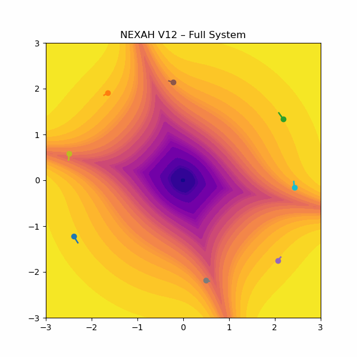

# ⚡ NEXAH — Structural Navigation in Complex Systems

> NEXAH is a framework to understand and control complex systems by how they move within their stability field.


---

## 🧭 NEXAH

**A structural modeling framework for complex dynamical systems.**  
Relational structure. Explicit orientation.

---

## 🧭 Abstract

NEXAH explores complex dynamical systems through **structure, dynamics, and regimes**.

Instead of binary classification (stable / unstable), systems are modeled as evolving within:

> **structured dynamical landscapes**

This enables:

- geometric representation of system dynamics  
- identification of regime transitions  
- trajectory-based interpretation  
- exploration of navigation strategies within stability regions  

NEXAH is designed as a **modular system framework**, with applications to power systems and reference dynamical models.

---

## 🧭 Overview

Classical system analysis focuses on:

→ threshold violations  
→ event detection  

NEXAH provides a complementary perspective:

> systems evolve as **trajectories within structured state spaces**

This shifts the focus from:

→ "Is the system stable?"  

to:

→ **"How does the system move within its stability field?"**

Stability is not static —  
it emerges from **trajectory alignment within structure**.

---

## 🌊 Field Structure (Concept)


This visualization illustrates the **geometry of stability**:

- valleys → low risk (stable regions)  
- slopes → transition zones  
- peaks → instability  

> Systems evolve within this landscape.

---

## ⚡ Real System Example (IEEE Flow Field)


**Observation:**
- trajectories follow structured flow patterns  
- system evolution is directional  

> Even real-world systems exhibit structured dynamics.

---

## 🚀 Start Here

👉 [START HERE — Run your first demo](START_HERE.md)

---

## 🎬 What you will see

- structured dynamics in chaotic systems  
- trajectories evolving in reduced state spaces  
- regime transitions in system behavior  
- geometric interpretations of dynamics  

---

## 🎥 Visual System (Core)

---

## 🎬 Visual System — From Dynamics to Navigation

👉 [Full Lorenz Gallery → APPLICATIONS/core_demos/lorenz/FRAMEWORK_visual_gallery.md](APPLICATIONS/core_demos/lorenz/FRAMEWORK_visual_gallery.md)


This sequence shows the full evolution of NEXAH:

```text
V1 → V4   → Field & Metrics  
V5 → V8   → Multi-Agent & Networks  
V9 → V11  → Navigation & Emergence  
V12       → Field-Level Navigation  
```
**Key idea:**

- systems are not controlled via targets  
- systems are not optimized via rewards  

Instead:

> they are navigated within their stability field  

---

**What emerges:**

- coherence → alignment with dynamics  
- risk → deviation from structure  
- interaction → stabilization  
- navigation → movement within valid regions  

---

👉 This is the first demonstration of:

> field-based navigation without explicit objectives


👉 [Full Visual Gallery → FRAMEWORK_visual_gallery.md](FRAMEWORK_visual_gallery.md)


The visualization pipeline includes:

- Field dynamics (V1)  
- Coherence & alignment (V2)  
- Risk landscapes (V3)  
- Control (V4)  
- Geometry & regimes (V6–V9)  
- Multi-agent systems (V10)  
- Swarm dynamics (V11)  
- Communication & emergence (V12)  

> These visuals form the executable core of the framework.

---

## 🧭 Explore the System

- 🧠 [Framework](FRAMEWORK/README.md) — architecture and layers  
- ⚡ [Applications](APPLICATIONS/README.md) — experiments and use cases  
- 🧭 [Navigator](NAVIGATOR/README.md) — system overview  

---

## 🔁 Core Pipeline

```text
dynamics → structure → field → regimes → navigation
```

## 🔥 Core Insight

Classical control:

→ reacts to deviations  

NEXAH:

→ analyzes trajectory evolution within structure  

👉 Stability becomes a question of:
- regime  
- trajectory  
- structural alignment  

---

## 📊 From Structure → Dynamics

### 🔹 Trajectory-Based Control (Prototype)


**Observation:**
- control influences trajectory evolution  
- stabilization occurs in some scenarios  

**Interpretation:**

> Control acts as **trajectory shaping within system dynamics**

---

## 📊 Experimental Insights

Early experiments explored collapse detection in power systems.

Initial results suggested strong early-warning signals —  
but required further validation.

---

## ⚠️ Early Experiment — Misinterpreted Signal (“MicDrop”)


**Re-evaluation revealed:**

- results were not consistently reproducible  
- sensitivity to signal processing was high  
- lead times could not be confirmed across datasets  
- parts of the signal were artifacts  

> The result is now understood as an **interesting but misleading signal artifact**.

👉 In hindsight:

> “MicDrop” → **MicFlop — but a useful one**

---

## 🔥 Emergent System (V12)



This visualization shows the full system:

- field dynamics  
- trajectory evolution  
- multi-agent interaction  
- network formation  
- emergent coordination  

> Stability emerges through **local interaction within the field**,  
> not centralized control.

---

## ⚖️ Classical vs NEXAH

| Classical | NEXAH |
|----------|------|
| threshold-based | structure-based |
| event detection | regime analysis |
| reactive | trajectory-aware |
| state-focused | dynamics-focused |

---

## 🚀 Run Example

PYTHONPATH=. python APPLICATIONS/power_systems/nexah_ieee9/controller/nexah_closed_loop_ieee9_v6.py

---

## 🧭 Status

| Component | Status |
|----------|--------|
| Structure Discovery | ✅ |
| Field Interpretation | ✅ |
| Regime Detection | ✅ (experimental) |
| Control | ⚠️ prototype |
| Navigation | 🚧 in development |

---

## ⚠️ Limitations

- no validated universal early-warning metric  
- sensitivity to system and dataset  
- limited real-world validation  
- control layer remains experimental  

---

## 🧠 Final Insight

Complex systems are not binary.

They evolve within:

> **structured dynamical regimes**

---

## 🌀 NEXAH

> dynamics → structure → field → regimes → navigation  

---

**Thomas K. R. Hofmann · 2026**
