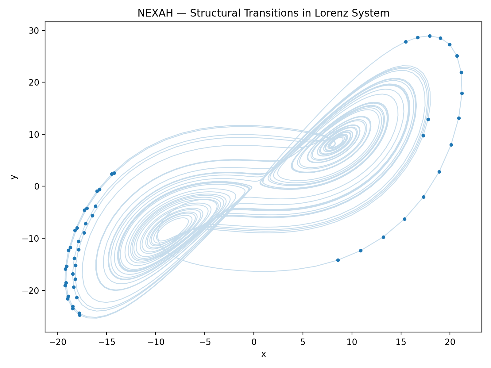
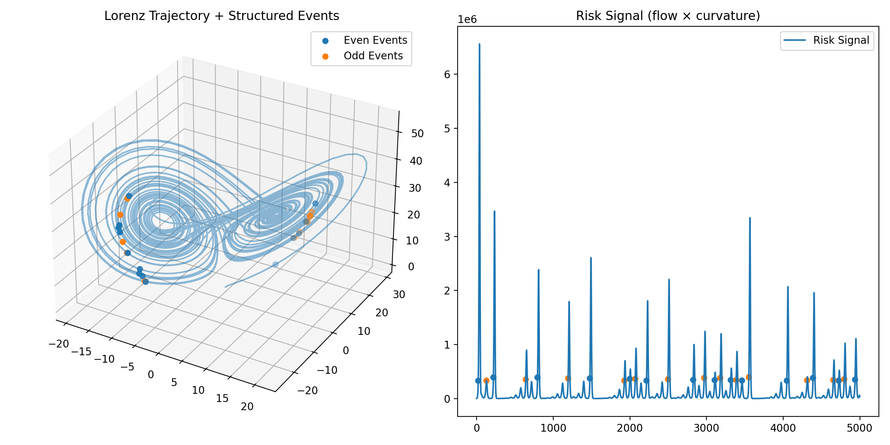

# ⚡ NEXAH — A Geometric Framework for Dynamical Systems

> NEXAH is a computational framework that reveals structure, transitions, and stability directly from system dynamics.

> Complex systems are not random.  
> They evolve within **structured fields that constrain motion, transitions, and outcomes**.


---

## ⚠️ Research Prototype

NEXAH is an experimental framework for exploring structure and transitions in dynamical systems.

Results are promising, but **full validation and reproducibility are ongoing**.  
Feedback and discussion are welcome.

---

# 🚀 Quick Start

Clone and run:

```bash
pip install -e .
# or
pip install -r requirements.txt

python run_nexah_demo.py
```


---

## 📊 Current System State

→ [SYSTEM_STATE.md](ARCHITECTURE/SYSTEM_STATE.md)

Defines:

- what is implemented  
- what works  
- what is validated  
- what is still missing  

---

## 🔬 Methods

→ [METHODS.md](ARCHITECTURE/METHODS.md)

---

## 🌀 Visual Gallery

For a visual introduction to NEXAH:

→ [Visual Gallery](visual_gallery.md)

Shows how structure, transitions, and geometry emerge across different systems.

---


This visualization shows a trajectory from a real IEEE power grid model.

NEXAH reconstructs the local **flow field** around the system state.

What becomes visible:

- directional structure  
- transition channels  
- stability constraints  

→ the system does not move freely  
→ it is **guided by an underlying field geometry**

---

🧪 Reproduce this visualization:

```bash
python APPLICATIONS/power_systems/stability_field_dynamics/ieee_test_cases/analysis/run_ieee_off_manifold_flow_v69.py
```

---

# 🧠 What NEXAH does

NEXAH transforms time-series system data into a **geometric representation**:

- states → field  
- time evolution → trajectories  
- events → regime transitions  

Instead of detecting isolated failures, NEXAH identifies:

> how systems **move within structured dynamical landscapes**  
> and how **stability constrains possible transitions**

---

# ❌ What NEXAH is NOT

NEXAH does not rely on:

- machine learning models  
- predefined control rules  
- purely simulation-based analysis  

It is:

> a **structure–field–geometry framework**  
> that reconstructs and navigates dynamical systems directly from their dynamics

---

# 🔥 Core Principle

dynamics → structure → field → geometry → stability → control → navigation

---

# 🧭 System Architecture

Dynamics  
→ Structure Extraction (Discovery phase)  
→ Field Reconstruction (CORE)  
→ Field Layer (geometry + stability)  
→ Control Layer (CORE)  
→ Navigation  

---

## 🔬 Structure Extraction  
Extracts structure from raw dynamics.

## 🌊 Field Reconstruction (CORE)  
Builds the field from trajectory data:

- density  
- flow  
- boundary structure  
- validity regions  

## 🌐 Field Layer  
Transforms structure into:

- geometry  
- stability  
- interpretable field structure  

## 🎮 Control Layer (CORE)  
Operates on transition structure:

- basin detection  
- separatrix extraction  
- gate detection  
- trajectory steering  

## 🧭 Navigation  
Executes constrained motion through the field:

- transition-aware movement  
- stability-constrained paths  
- convergence to attractors  

---

# 🔥 Key Result — Power Systems (IEEE)

NEXAH has been tested on IEEE grid models (118 → 9241 buses).

Preliminary observation:

> structural transition signals appear **earlier than classical failure detection methods**

⚠️ Note:
Exact timing (e.g. ~43.9s in some runs) depends on setup and is **not yet fully validated across all scenarios**.

---


Interpretation:

- classical methods detect **state failure**  
- NEXAH detects **structural transition**

---

# 🧪 Minimal Demo — Structure inside Chaos

Run:

```bash
python run_nexah_demo.py
```




---

### Interpretation

The highlighted points mark **structural transitions** in the system.

They are not random.

They emerge from the **geometry of the dynamical field**:

- trajectories follow structure  

- transitions occur at specific regions  

- the system reveals where change happens  

---

NEXAH does not detect events.  

It reveals the structure that produces them.  

It does not detect collapse.  

It detects the structure that leads to it.

---

# 🌀 From Chaos to Structure




---

# ⚡ What NEXAH enables

- transition detection  

- geometric interpretation  

- early-warning signals  

- system navigation  

- structure-aware control  

---

# 🧠 Current State

### ✔ Working

- structure extraction  

- regime detection  

- early transition signals  

- control via transition geometry  

---

### ⚠️ Limitations

- no formal proof yet  

- system-dependent performance  

- ongoing validation  

---

# 💡 Core Insight

Stability is not a value.  

It is a **region in a structured field**

---

# 🌀 NEXAH

From dynamics → structure  

From structure → geometry  

From geometry → stability  

From stability → control  

From control → navigation  

---

Thomas K. R. Hofmann · 2026
