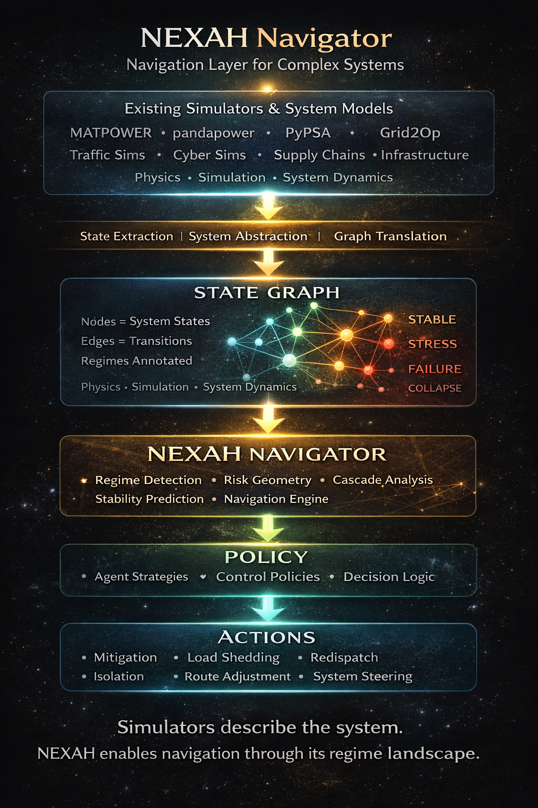
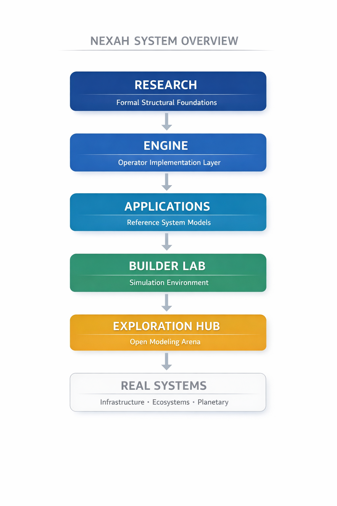
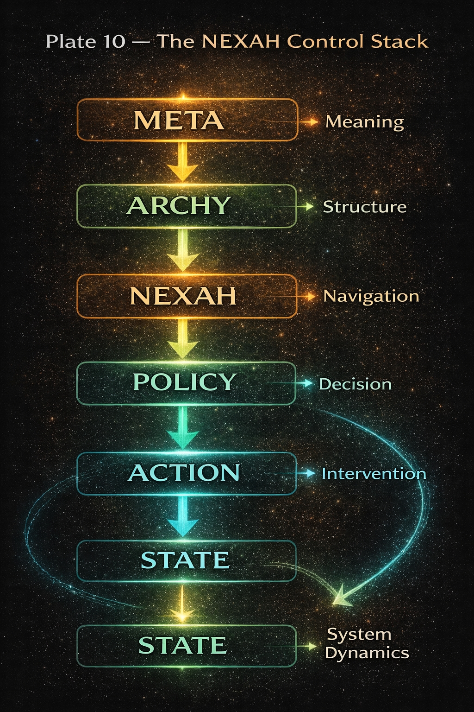
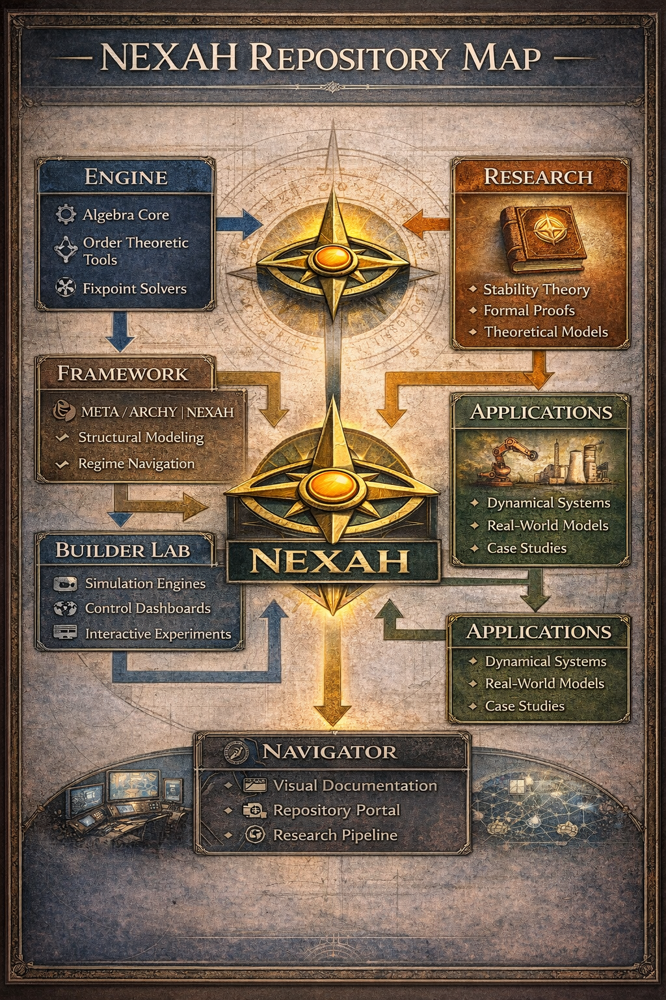
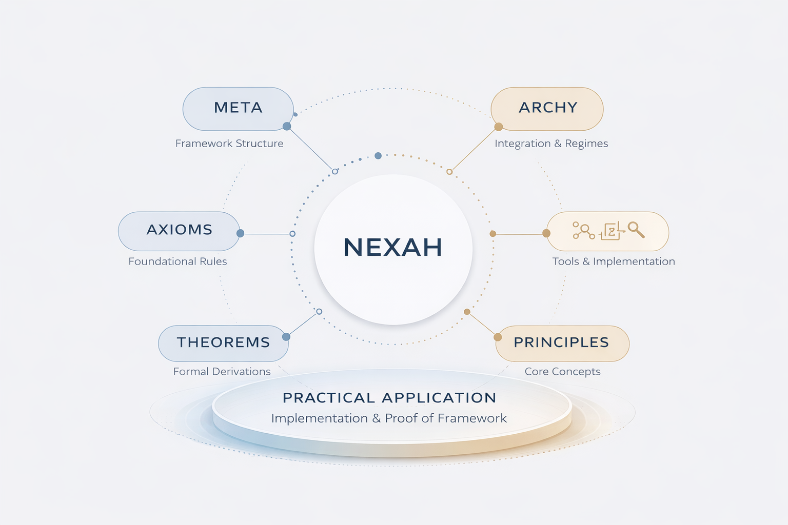

# NEXAH Framework
**Structural navigation for complex dynamical systems.**

A research framework for navigating stability regimes in complex dynamical systems.


---
## Why NEXAH Exists

Modern complex systems — from power grids to ecosystems — can enter unstable regimes where small disturbances trigger cascading failures.

Most tools help us **simulate system evolution**, but few help us **navigate toward stability**.

NEXAH was created to explore a different question:

**How can agents navigate complex dynamical systems toward stable regimes?**
___
## Research Context

## NEXAH is a research framework that converts dynamical system simulations...

While most simulation frameworks focus on **predicting system evolution**, NEXAH focuses on **structural regime navigation**:

- identifying stability basins
- detecting regime transitions
- estimating cascade risks
- computing paths toward stable configurations

The framework builds on ideas from:

- dynamical systems theory
- lattice and order structures
- structural stability analysis
- regime transition modeling
- complex systems research

NEXAH is designed as an **experimental research platform** for exploring structural control and navigation in large-scale systems such as infrastructure networks, ecosystems, and planetary-scale systems.

---

NEXAH is a research framework that converts **dynamical system simulations into navigable regime landscapes**.

Instead of only simulating how systems evolve, NEXAH enables agents to:

- detect **regimes and stability basins**
- estimate **cascade risks**
- compute **navigation paths toward stable states**
- simulate **structural interventions**

Typical applications include:

- power grid stability
- cascading infrastructure failures
- ecological systems
- supply chain networks
- climate regime analysis

---

## Concept in One Sentence

NEXAH converts **dynamical system simulations into navigable regime landscapes**, enabling agents to compute **paths toward stable system states** instead of only observing system evolution.

---

## Quick Example

The NEXAH framework can be used directly through its high-level engine interface.

```python
import nexah

# create framework interface
engine = nexah.Engine()

# simple example system
elements = {"a", "b", "c"}
order = {("a","b"), ("b","c")}

# create a structural model
poset = engine.create_poset(elements, order)

print(poset)
```

This interface exposes the core algebraic structures used by the NEXAH engine:

- Posets
- Lattices
- Structural operators
- Regime navigation primitives

For more complex examples see:

```
BUILDER_LAB/demos/
```
## Core Idea

Traditional simulation frameworks focus on **forward system evolution**.

NEXAH instead extracts a **structural regime landscape** from a system model.

```
System Simulation
      ↓
State Graph
      ↓
Regime Landscape
      ↓
Navigation Strategy
      ↓
Stabilization Action
```

This enables **navigation and intervention in complex dynamical systems**.

## What NEXAH Does

NEXAH converts dynamical system simulations into navigable regime landscapes.

Traditional simulators answer:

```
What happens if the system evolves?
```

NEXAH answers:

```
How can we navigate the system toward stable regimes?
```

NEXAH transforms system models into **navigable regime landscapes**:

```
Simulators
    ↓
State Graph
    ↓
Regime Landscape
    ↓
Navigation
    ↓
Policy
    ↓
Action
```
---
## Kernel Bridge: Exporting Experimental Metrics

The kernel bridge exports concrete metrics from the experiments (vortex density, chimera status, frustration score) directly into the NEXAH kernel.

Example usage:

```python
from ENGINE.nexah_kernel.research.experiments.structured_oscillator_networks.kernel_bridge import get_vortex_metrics

history = np.load('output/phase_history.npy')
phase_ring = history[-1]
metrics = get_vortex_metrics(phase_ring=phase_ring, history=history)
print(metrics)  # {'vortex_count_avg': 1000.0, 'vortex_density': 0.02}
```
This is the direct channel from experiments to NEXAH applications.


### 2. Ergänzung: „Prototype Catalog“  
**Platzierung:** Am besten nach „# Typical Application Domains“ oder ganz am Ende vor „# Quick Start“ – als Brücke zu APPLICATIONS.

```markdown
## Prototype Catalog

The first concrete applications ("houses") are collected here:  
[APPLICATIONS/prototypes/README.md](./APPLICATIONS/prototypes/README.md)

Current prototypes:
- Lorenz Navigation Demo
- Power-Grid Blackout Risk (in planning)
- Ecosystem Tipping Point (in planning)
- Financial Market Crash Indicator (in planning)

More ideas: supply chain cascades, climate tipping points, neural network collapse.
```
---
# NEXAH Navigation Layer



Simulators describe system dynamics.

**NEXAH enables navigation through the regime landscape of those systems.**

The navigation layer identifies:

- regime transitions
- cascade risks
- stability basins
- stabilization strategies

---

# Core Kernel

The **NEXAH Kernel** is the minimal structural navigation engine.

Location:

```
ENGINE/nexah_kernel/
```

The kernel converts system graphs into **navigable regime landscapes** and enables structural interventions.

Core workflow:

```
System Graph
    ↓
Regime Landscape
    ↓
Navigation Analysis
    ↓
Structural Intervention
```

Kernel operations include:

- regime detection  
- navigation trajectory analysis  
- cascade risk estimation  
- structural intervention simulation  

The kernel provides the **core navigation logic of the NEXAH framework**.

---

# NEXAH Engine

The **NEXAH Engine** implements the structural operators and stability analysis systems used by the kernel.

Location:

```
ENGINE/
```

The engine includes:

- finite abstract interpretation  
- fixpoint solvers  
- spectral graph analysis  
- stability landscape computation  
- cascade analysis tools  

It acts as the **computational backbone** of the framework.

---

# Framework Architecture



The NEXAH architecture consists of several layers.

```
RESEARCH
    Formal structural foundations

ENGINE
    Kernel and structural computation layer

APPLICATIONS
    Reference system models

BUILDER_LAB
    Simulation sandbox

EXPLORATION_HUB
    Open modeling environment

REAL_SYSTEMS
    Infrastructure, ecosystems, planetary systems
```

---

# The NEXAH Control Stack



NEXAH follows a layered control architecture.

```
META
    semantic system description

ARCHY
    structural system modeling

NEXAH
    navigation across regime landscapes

POLICY
    decision strategies

ACTION
    system interventions

STATE
    resulting system dynamics
```

This stack separates **meaning, structure, navigation, and control**.

---

# Builder Lab

Location:

```
BUILDER_LAB/
```

The Builder Lab provides a sandbox for experiments with:

- infrastructure simulations  
- cascade failure modeling  
- navigation strategies  
- system stabilization experiments  

Example demo:

```
python BUILDER_LAB/demos/nexah_demo.py
```

---

# Exploration Hub

Location:

```
EXPLORATION_HUB/
```

The Exploration Hub provides an **open modeling environment** for exploring complex systems such as:

- planetary infrastructure  
- ecosystems  
- financial systems  
- cities and logistics networks  

Documentation:

```
EXPLORATION_HUB/README.md
```

---

# Repository Map



| Layer | Description |
|------|-------------|
| ENGINE | Kernel and structural computation |
| RESEARCH | Formal mathematical foundations |
| APPLICATIONS | System models and case studies |
| BUILDER_LAB | Simulation sandbox |
| NAVIGATOR | Visual documentation |
| EXPLORATION_HUB | Open modeling environment |

---

# Research Pipeline



The framework evolves through a structured research pipeline.

```
Axioms
    ↓
Principles
    ↓
Theorems
    ↓
Operators
    ↓
Framework
    ↓
Applications
```

---

# Typical Application Domains

NEXAH can be applied to many complex systems:

- power grid stability  
- cascading infrastructure failures  
- supply chain networks  
- ecological systems  
- climate regime analysis  
- large-scale technological systems  

---

# Quick Start

Clone the repository:

```
git clone https://github.com/Scarabaeus1033/NEXAH.git
cd NEXAH
```

Install the framework in development mode:

```
pip install -e .
```

Run the demo simulation:

```
python BUILDER_LAB/demos/nexah_demo.py
```

Run the test suite:

```
pytest
```

---

# Implementation Status

Current release: **v1.0**

- kernel navigation engine implemented  
- structural graph models operational  
- fixpoint solver validated  
- stability analysis modules functional  
- modular architecture established  

---
## Citation

If you use NEXAH in research or academic work, please cite the project:

```
Hofmann, T. (2026).
NEXAH: Structural Navigation in Complex Dynamical Systems.
GitHub: https://github.com/Scarabaeus1033/NEXAH
```
---
# License

Code: **Apache License 2.0**  
Documentation: **CC BY 4.0**

© 2026 Thomas K. R. Hofmann
