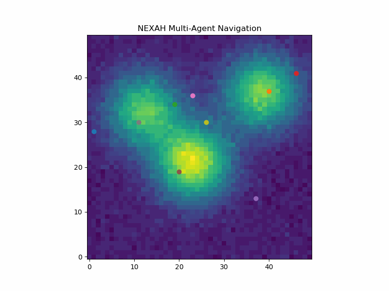
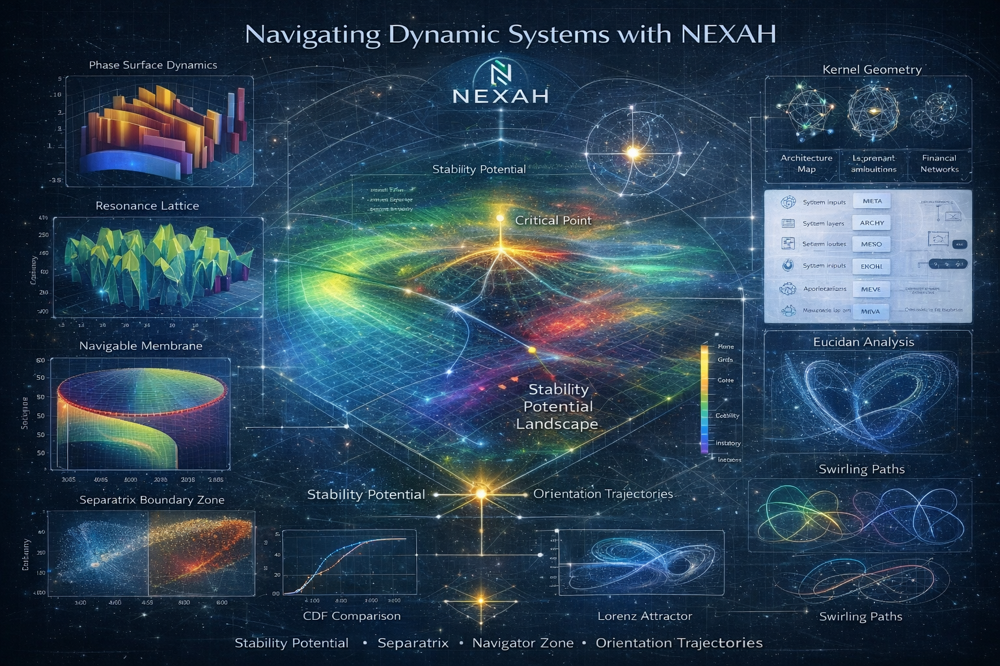

# NEXAH

**From simulation to navigation.**

### What if AI didn’t just simulate chaos — but learned how to navigate it?



*Agents exploring a stability landscape - No reward. No goal. 
Agents converge to stability anyway.*

---

**Use cases:**
- stabilizing power grids  
- navigating chaotic systems  
- autonomous scientific discovery  


---

### Why NEXAH?

Most simulators only tell you **what will happen**.  
NEXAH shows agents **how to steer** the system toward stability.

It works with **any** simulator through a simple adapter layer.

### Quick Start (2 minutes)

```bash
git clone https://github.com/Scarabaeus1033/NEXAH.git
cd NEXAH
pip install -e .
```

### Run your first demo:
```bash
python -m nexah demo kuramoto
```
### Core Features

| Feature                    | What it does                                              | Example use cases                          |
|----------------------------|-----------------------------------------------------------|--------------------------------------------|
| SVWIS Operators            | Knot Proximity, Phase Detection, Decision Anchor, Return Flow | Precise local navigation                   |
| Adapter Layer              | Connect any simulator in minutes                          | PowerGrid, Kuramoto, Supply Chain, Cell Biology |
| Multi-Agent Navigation     | Multiple agents explore the same landscape together       | Coordinated stabilization                  |
| Visual Regime Landscapes   | See stability basins and agent paths live                 | Real-time understanding                    |

---

### Where to go next

- **[Builder Lab Demos](./BUILDER_LAB/demos/)** – ready-to-run examples you can try immediately  
- **[Live Multi-Agent Demo](./ENGINE/research/experiments/nexah_stability_driven_multi_agent_system/)** – multiple agents navigating live in a regime landscape  
- **[Adapter Examples](./APPLICATIONS/adapters/README.md)** – connect your own simulator in minutes  
- **[Discovery Engine](./DISCOVERY_ENGINE/)** – architecture exploration, resilience analysis & structural law discovery tools  
---
### Automated Tests & Validation

- **[Core Test Suite](./tests/)** – 88+ automated tests validating the entire mathematical kernel

---

### Want to go deeper?

→ [Extended Documentation & Full Research Details](./README_nexah_framework_extended.md)

---

### NEXAH Visual Overview

To better understand how **NEXAH** operates across different dynamics and systems, here is an **overview visual** that shows the key components of the framework and how it interacts with different simulation systems.



This visual illustrates how **NEXAH** transforms dynamical systems into navigable stability landscapes, highlighting critical points, transition zones, and agent navigation pathways.

---

## Implementation Status

Current release: **v1.0**

- kernel navigation engine implemented  
- structural graph models operational  
- fixpoint solver validated  
- stability analysis modules functional  
- modular architecture established  

---

## Citation

If you use NEXAH in research or academic work, please cite:

Hofmann, T.K.R. (2026).  
**NEXAH: Structural Navigation in Complex Dynamical Systems**  
GitHub: https://github.com/Scarabaeus1031/NEXAH

---

## License

Code: **Apache License 2.0**  
Documentation: **CC BY 4.0**

© 2026 Thomas K. R. Hofmann
