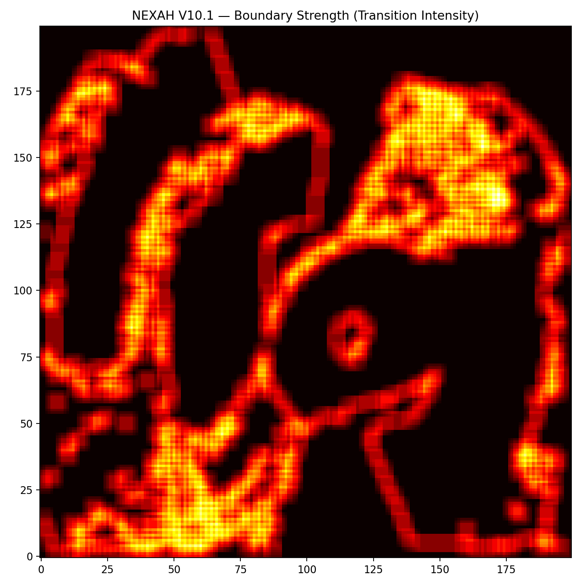

# ⚡ NEXAH — A Geometric Framework for Dynamical Systems

> Complex systems are not random.  
> They evolve within **structured fields that constrain motion, transitions, and outcomes**.

---


This visualization shows a trajectory from a real IEEE power grid model.

NEXAH reconstructs the local **flow field** around the system state.

What becomes visible:

- directional structure  
- transition channels  
- stability constraints  

→ the system does not move freely  
→ it is **guided by an underlying field geometry**

---

🧪 Reproduce this visualization:

    python APPLICATIONS/power_systems/stability_field_dynamics/ieee_test_cases/analysis/run_ieee_off_manifold_flow_v69.py

---

# 🧠 What NEXAH does

NEXAH transforms time-series system data into a **geometric representation**:

- states → field  
- time evolution → trajectories  
- events → regime transitions  

Instead of detecting isolated failures, NEXAH identifies:

> how systems **move within structured dynamical landscapes**  
> and how **stability constrains possible transitions**

---

# 🔥 Core Principle

```text
dynamics → structure → field → regimes → stability → navigation
```

---

# ⚡ Key Result — Power Systems (IEEE)

NEXAH has been tested on real IEEE grid models (118 → 9241 buses).

Result:

> Voltage collapse can be detected **~43.9 seconds earlier**  
> than classical methods — consistently across system sizes.

---


Interpretation:

- classical methods detect **state failure**  
- NEXAH detects **structural transition**

---

# 🧭 System Architecture

```text
Dynamics  
→ Discovery Engine  
→ Field Layer (geometry + stability)  
→ Navigator  
```

---

## 🔬 Discovery Engine
Extracts structure from raw system dynamics.

## 🌊 Field Layer
Constructs a continuous representation of:

- flow (direction)  
- geometry (structure)  
- stability (Lyapunov / boundary)  

## 🧭 Navigator
Operates on trajectories within the field:

- transition detection  
- regime tracking  
- trajectory control  

---

# 🌀 From Chaos to Structure

### Step 1 — Raw Dynamics


---

### Step 2 — Emergent Geometry


→ trajectories follow constrained paths  

---

### Step 3 — Structured Representation


→ system decomposes into states, transitions, regimes  

---

# ⚡ What NEXAH enables

- detection of regime transitions  
- geometric interpretation of instability  
- trajectory-based system analysis  
- early-warning signals based on structure  
- navigation within dynamical systems  

---

# 🧠 Current State

### ✔ Working (Prototype)

- structure extraction (Lorenz, IEEE systems)  
- regime detection  
- trajectory-based analysis  
- early transition signals (validated on IEEE grids)  

---

### ⚠️ Limitations

- no formal theoretical proof yet  
- system-dependent performance  
- ongoing validation on real-world data  
- not a universal predictor  

---

# 💡 Core Insight

> Stability is not a fixed value.  
> It is a **region within a structured dynamical field**

---

# 🔬 Boundary & Stability (V10)



NEXAH identifies:

- regime regions (orbit, escape, drift)  
- boundaries (separatrices)  
- transition intensity (boundary strength)  

→ these define where the system can move — and where it cannot

---

# 🧭 Entry Points

👉 START_HERE.md

---

## 🔬 Core System
- FRAMEWORK/README.md  
- FIELD_LAYER/build_log.md  
- DISCOVERY_ENGINE/discovery_core_log.md  

---

## ⚡ Applications
- APPLICATIONS/core_demos/lorenz/  
- APPLICATIONS/power_systems/  

---

## 🧭 Navigation
- NAVIGATOR/README.md  
- NAVIGATOR/CORE/NAVIGATION_ARCHITECTURE.md  

---

# 🌀 NEXAH

From dynamics → structure  
From structure → geometry  
From geometry → regimes  
From regimes → navigation  

---

**Thomas K. R. Hofmann · 2026**
