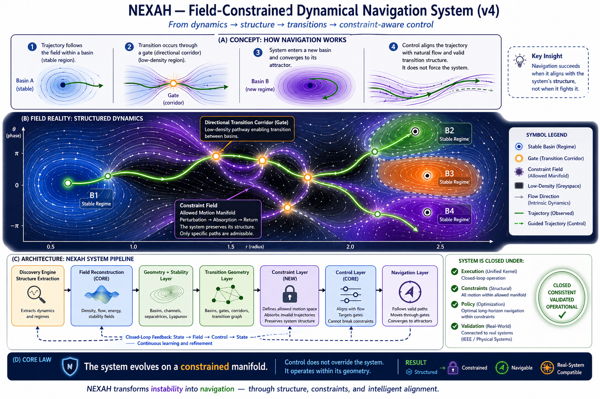

# ⚡ NEXAH — A Geometric Framework for Dynamical Systems

> NEXAH reconstructs structure, transitions, and stability  
> directly from system dynamics.

> Complex systems are not random.  
> They evolve within **structured fields that constrain motion, transitions, and outcomes**.

---

## 🧭 Conceptual Overview



*NEXAH connects continuous dynamics with discrete transition systems through navigable structure.*

---

## 🧠 What NEXAH Does

NEXAH transforms time-series data into a **structured dynamical field**:

```text
dynamics → structure → field → transitions → navigation
```

This enables:

- detection of transition regions (gates, boundaries)  
- identification of stable regimes (basins)  
- reconstruction of system geometry  
- simulation of motion within learned structure  

---

## 🔬 Core Idea

Traditional approaches model:

```text
state → next state
```

NEXAH models:

```text
trajectory within a structured field
```

Where:

- stability = alignment with field structure  
- instability = drift into low-density / conflicting regions  
- transitions = movement through structured corridors  

---

## 🧭 Example


- transitions occur in **specific regions**  
- motion follows **field geometry**  
- instability appears as **structured drift**  

---

## 🧪 Validation (Power Systems)

📂 `APPLICATIONS/power_systems/VALIDATION_LAYER/`

Key results:

- early warning up to **40–50 time units before collapse**  
- instability emerges as **geometric deviation**  
- transition behavior visible in motion metrics  

---

## 🧩 Core Module

```text
NEXAH_CORE/
```

Implements:

- field reconstruction  
- transition detection (gates, basins)  
- probabilistic instability modeling  
- structure-aware trajectory analysis  

---

## 🔷 System Perspective

NEXAH integrates:

```text
Field (continuous)
↔ Geometry (structure)
↔ Graph (transitions)
↔ Control (trajectory shaping)
```

Interpretation:

- field → defines motion  
- geometry → defines constraints  
- graph → defines transitions  
- control → shapes trajectories within structure  

---

## 🔬 Current Capabilities

✔ field reconstruction from data  
✔ stability as spatial structure  
✔ transition detection (gates, basins)  
✔ probabilistic transition modeling  
✔ trajectory simulation within field  

---

## ⚠️ Current Limitations

❌ no unified runtime kernel  
❌ limited large-scale validation  
❌ early-stage control integration  
❌ not production-ready  

---

## 🚀 Quick Start

```bash
pip install -e .
# or
pip install -r requirements.txt

python run_nexah_demo.py
```

---

## 📚 Documentation

- 📊 [System State](ARCHITECTURE/SYSTEM_STATE.md)  
- 🔬 [Methods](ARCHITECTURE/METHODS.md)  
- 🧭 [Architecture](ARCHITECTURE/README.md)  
- 🌀 [Visual Gallery](VISUAL_GALLERY.md)  
- 🧠 [Research Vision](RESEARCH/RESEARCH_VISION.md)

---

## 🧠 Learn More

👉 [START_HERE.md](START_HERE.md)

---

## ⚡ Core Insight

```text
Stability is not a value.
It is a region in a structured field.
```

---

## 🧭 Final Statement

```text
A system does not randomly fail.

It moves through structured transition regions
that define what outcomes are possible.
```

---

**Thomas K. R. Hofmann · NEXAH · 2026**
