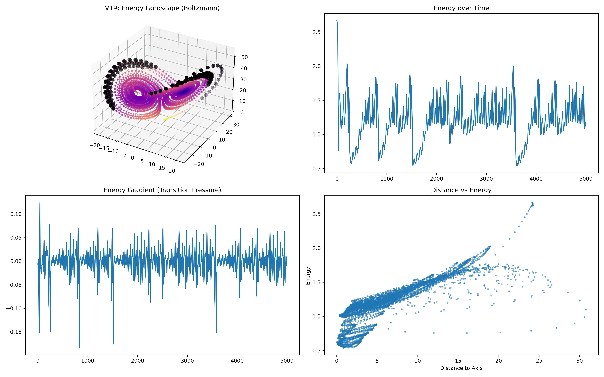

# ⚡ NEXAH — Navigating Structure in Dynamical Systems

> Complex systems are not random.  
> They evolve within **structured fields with direction and destination**.

---


**This is a real system.**

Not chaos.  
Not noise.

👉 This is a **structured flow field**.

---

## 🧠 What NEXAH does

NEXAH reconstructs dynamical systems as:

- **fields** instead of states  
- **trajectories** instead of events  
- **attractors** instead of targets  

It reveals:

> how systems **move, transition, and converge** within their intrinsic structure

---

## 🔥 Core idea

```text
dynamics → structure → field → topology → navigation
```

---

## 🧭 Architecture

```text
Discovery → Field Layer → Navigator
```

- Discovery → extracts structure  
- Field Layer → builds the field  
- Navigator → moves within it  

---

## 🚀 Why this matters

Instead of:

- detecting failure  
- reacting to thresholds  

NEXAH enables:

> **understanding and steering systems before failure occurs**

---

## ⚡ How structure emerges

👉 Start with chaos:


---

👉 Structure appears:


---

👉 Physics emerges:



---

👉 And finally:

Systems become **navigable**


---

## 🧠 What is already working

✔ structure extraction from chaotic dynamics  
✔ symbolic state representation  
✔ pattern detection and short-term prediction  
✔ adaptive control behavior  
✔ regime transition detection  

👉 Result:

> chaotic systems become **locally navigable**

---

## ⚠️ Status

- prototype system  
- locally reliable  
- still under validation  

---

## 🚀 Start here

👉 [START HERE — Run your first demo](START_HERE.md)

---

## 🧭 Explore

- 🧠 Framework → FRAMEWORK/README.md  
- ⚡ Applications → APPLICATIONS/README.md  
- 🧭 Navigator → NAVIGATOR/README.md  

---

## 💡 Final insight

Complex systems are not binary.

They evolve within:

> **structured dynamical regimes**

---

## 🌀 NEXAH

```text
dynamics → structure → field → regimes → navigation
```
Thomas K. R. Hofmann · 2026
