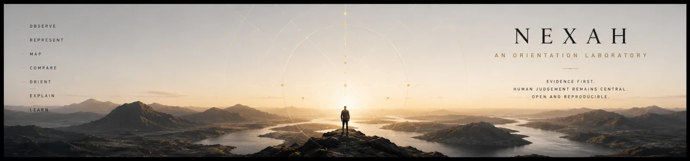
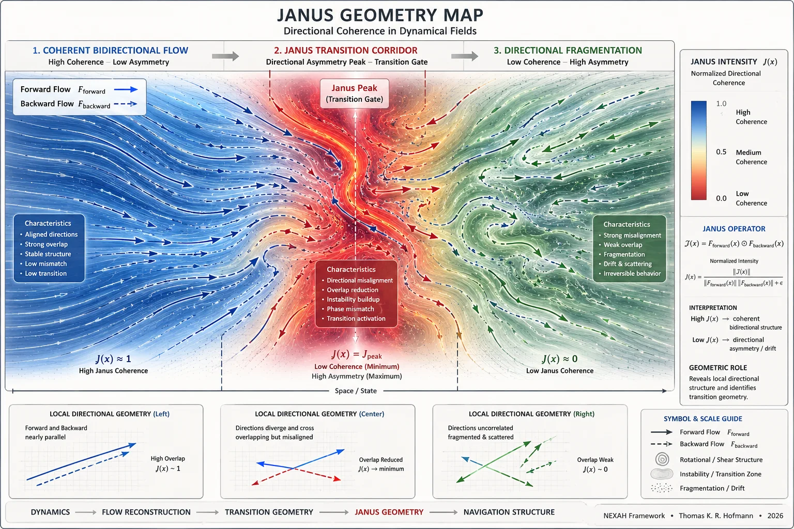

# NEXAH — The Orientation Laboratory

**Understanding before action.**


> **Mapping structure. Preserving evidence. Supporting orientation.**

NEXAH is an open research laboratory and software project for
**evidence-bound orientation in complex systems**.

It turns declared observations into inspectable representations of states,
relationships, transitions, paths, boundaries, and uncertainty.

It is not an oracle, a causal authority, or an autonomous controller.

```text
observe → represent → map → compare → orient → explain → learn
```


> **Current state:** The typed Orientation Layer, Network Orientation,
> IEEE Geometry V1, evidence-bound reporting, episodic-memory safeguards,
> canonical validation paths, and public showcase are implemented.
>
> Real-world operational validation, calibrated uncertainty, causal
> intervention, and autonomous execution are not claimed.

---

## 🧭 Start Here

**New here? Start in under 10 minutes.**

| I want to… | Start here |
|---|---|
| Use the current kernel | **[NEXAH Kernel Start](nexah/START_HERE.md)** |
| Run an application | **[Network Orientation](APPLICATIONS/network_orientation/README.md)** · **[IEEE Geometry V1](APPLICATIONS/power_systems/ieee_geometry_v1/showcase/README.md)** |
| Understand the research | **[Research Portal](RESEARCH/README.md)** |
| Inspect maturity and boundaries | **[Architecture & System State](ARCHITECTURE/SYSTEM_STATE.md)** |
| Understand the editorial-orientation architecture | **[Editorial Operating System](EDITORIAL_OPERATING_SYSTEM/README.md)** |
| Browse the canonical visual-library registry | **[NEXAH Library](LIBRARY/README.md)** |
| Browse the full repository | **[Repository Map](REPOSITORY_MAP.md)** |

Recommended first path:

```text
choose a question
→ run a canonical case
→ inspect the Orientation Report
→ examine evidence and limits
→ continue into Research or Architecture
```

---

## 🧭 What NEXAH Can Do Today

The current kernel transforms ordered observations and declared relationships
into inspectable orientation artifacts.

| Input | Current capability | Output |
|---|---|---|
| Numerical trajectories | local representation and empirical transition analysis | scoped state and transition map |
| Directed networks | reachability, paths, components and bottlenecks | Network Orientation Report |
| IEEE/Pandapower campaigns | sampled path geometry and solver-visible boundaries | IEEE Geometry Orientation Brief |
| Multiple perspectives | five read-only evidence probes | agreements, disagreements and limits |
| Admitted outcomes | append-only episodic storage and retrieval | prior contextual episodes |
| Frozen experiments | deterministic replay and claim audit | validation record |

Every result remains scoped to its input representation, context, provenance,
method, and evidence class.

Passing a software contract does not automatically establish scientific,
causal, or operational validity in a new domain.

---

## 🚀 Quick Start

Install the current research kernel:

```bash
python -m venv .venv
source .venv/bin/activate
python -m pip install -e .
```

On Windows:

```powershell
.venv\Scripts\activate
```

### Orient a declared network

```bash
nexah orient-network APPLICATIONS/datasets/supply_chain.json \
  --focus normal_operation \
  --target system_disruption \
  --domain supply-chain \
  --recorded-at 2026-07-13T22:45:00+00:00 \
  --format brief
```

This produces an evidence-bound report of the supplied graph: reachable and
blocked nodes, declared paths, structural sensitivities, missing information,
limitations, and next questions.

It does not establish a real supply-chain risk or issue an intervention.

### Replay the frozen IEEE Geometry case

```bash
python validation/ieee_geometry_v1/run_validation.py
```

This rebuilds the frozen IEEE-14 benchmark evaluation, applies the unchanged
IEEE-9 development method, reproduces the canonical artifacts, and audits the
declared claim boundary.

For the guided entry, use the
**[10-minute IEEE Geometry walkthrough](APPLICATIONS/power_systems/ieee_geometry_v1/showcase/QUICKSTART_10_MINUTES.md)**.

### Run the visual reference Demonstrator

```bash
python PROTO_CORE/NEXAH_DEMONSTRATOR/scripts/run_demo.py
```

The Demonstrator remains the preferred visual introduction to field
construction, transition structure, and geometry-aware navigation.

---



---

## 🧪 Applications

### Network Orientation

**[Network Orientation](APPLICATIONS/network_orientation/README.md)** reads a
declared directed graph from an explicit focus.

It can report:

- reachable and blocked nodes
- shortest declared paths
- components and dead ends
- articulation points and sensitive edges
- structural differences between two snapshots
- five read-only perspectives
- evidence, uncertainty, and claim boundaries

Typical exploratory domains include dependency graphs, supply chains,
infrastructure maps, knowledge systems, and ecological networks.

The current fixtures demonstrate technical contract portability. They do not
establish real-world domain validity.

### IEEE Geometry V1

**[IEEE Geometry V1](APPLICATIONS/power_systems/ieee_geometry_v1/showcase/README.md)**
reads ordered power-system benchmark campaigns.

It provides:

- typed physical frames
- bus and line provenance
- sampled displacement and drift
- direction and curvature records
- solver-visible boundaries
- five evidence probes
- Orientation Briefs
- frozen IEEE-9 to IEEE-14 evaluation
- reproducible scientific figures

This is benchmark and simulation evidence. It is not operational-grid
measurement, a voltage-stability certificate, or a production controller.

---

## 🌀 Visual Atlas


The repository contains the computational, documentary, and empirical layers of
NEXAH. The companion **[NEXAH Atlas on Are.na](https://www.are.na/nexah-scarabaeus1031/channels)**
contains visual essays, system atlases, research notebooks, and orientation
paths.

The **[canonical Library Registry](LIBRARY/README.md)** assigns stable identity,
classification, Edition state, controlled Operators, and curated relationships.

Current Atlas entry points include:

- Core Orientation
- The Visitor’s Guide
- The Operator’s Handbook
- System Atlases
- historical NEXAH Atlas volumes
- Design Orientation

The two surfaces have different roles:

```text
GitHub
→ code, methods, evidence, status, reproducibility

Are.na
→ visual orientation, editorial sequence, conceptual exploration
```

The long-term goal is not to make them identical, but to connect them through
explicit mappings between repository modules and Atlas channels.

---

## 🛡️ Evidence and Authority Boundary

Orientation is dual-use.

A map of paths, bottlenecks, and sensitive relationships can support protection
and learning. The same map can expose targets or optimize disruption.

NEXAH therefore separates:

```text
orientation
≠ recommendation
≠ authorization
≠ execution
≠ observed outcome
```

The current public kernel:

- has no execution authority
- uses read-only probes
- preserves disagreement rather than voting a truth
- reports unknown uncertainty as unknown
- keeps simulation, scenario, observation, and outcome distinct
- does not silently convert structural sensitivity into a target or command

> **NO OBSERVED OUTCOME → NO EPISODIC MEMORY UPDATE**

Before connecting sensitive, personal, or operational data, read the normative
**[Safety and Misuse Boundaries](nexah/SAFETY_AND_MISUSE.md)**.

---

## 🗺️ From Cartography to Orientation

NEXAH began as a cartography laboratory.

Cartography remains its method for reconstructing and communicating structure.
Orientation is the broader purpose of those maps.

> **Cartography constructs the map. Orientation asks what may legitimately be
> inferred from a declared position, representation, context, evidence state,
> uncertainty, and boundary structure.**

NEXAH investigates whether complex systems can be represented as navigable
structures containing:

- states and transitions
- paths and corridors
- components and relationships
- basins and attractors
- boundaries and bottlenecks
- evidence gaps and unresolved regions

This is not a claim that all systems share one geometry or universal law.

It is an open investigation into which structural descriptions remain useful,
reproducible, and honest across representations and domains.

---

## 🔬 Research and Evidence

The **[Research layer](RESEARCH/README.md)** organizes questions, concepts,
validation material, findings, and theoretical extensions.

Its major areas are:

| Area | Role |
|---|---|
| `FOUNDATION/` | Structural assumptions and vocabulary |
| `CORE_CONCEPTS/` | Field, phase, mismatch, geometry, and JANUS |
| `VALIDATION/` | Empirical and cross-system tests |
| `FINDINGS/` | Condensed observations with scoped claims |
| `APPLIED_CASES/` | System-specific research indexes and studies |
| `THEORETICAL_EXTENSIONS/` | Exploratory formalization |
| `NEXAH_TRANSLATIONS/` | Connections to adjacent disciplines |

Current validation material includes synthetic dynamical systems,
synchronization models, transition-control experiments, fractal parameter
studies, and grid-inspired benchmark work.

The repository uses three broad interpretation levels:

```text
validated
→ reproducible evidence within a stated scope

experimental
→ implemented or observed, but not yet generalized

theoretical
→ conceptual extension requiring further formalization
```

Historical and exploratory material is retained when it helps reconstruct how a
method or hypothesis developed. It is not automatically treated as current
evidence.

Recommended research path:

1. **[Research Portal](RESEARCH/README.md)**
2. **[Research Abstract](RESEARCH/ABSTRACT.md)**
3. **[Core Concept Map](RESEARCH/CORE_CONCEPT_MAP.md)**
4. **[Validation Portal](RESEARCH/VALIDATION/)**
5. **[Findings](RESEARCH/FINDINGS/)**

---

## 🔥 Highlight: Janus Operator

The **[Janus Operator](RESEARCH/CORE_CONCEPTS/JANUS_OPERATOR/)** is a central
exploratory mechanism in NEXAH.



It compares forward and backward local flow structure within a reconstructed
representation:

```text
high directional coherence
→ locally aligned motion

low directional coherence
→ candidate transition sensitivity or aperture
```

Experiments investigate whether transition samples cluster around structured
geometric regions such as corridors, shell crossings, spines, or recursive
apertures.

The Janus directory contains mathematical notes, code, visuals, and validation
experiments. It remains an experimental mechanism rather than a generalized
transition law.

---

## 🧱 Architecture Overview

NEXAH now has a maintained Orientation Kernel and applications, while the
repository remains a broader research ecosystem rather than one runtime for
every historical and experimental module:

```text
NEXAH/
├── START_HERE.md                 guided conceptual entry
├── VISUAL_GALLERY.md             curated visual entry
├── nexah/                        kernel start, contracts, package, CLI, safety
├── PROTO_CORE/                   reference and prototype implementations
├── RESEARCH/                     questions, evidence, and findings
├── APPLICATIONS/                 tools and system-specific programs
├── ARCHITECTURE/                 relationships and maturity mapping
├── EXPERIMENTAL/                 active labs and historical lineages
└── REPOSITORY_MAP.md             complete navigation map
```

The areas relate approximately as follows:

```text
research question
→ experimental exploration
→ reference implementation
→ validation and findings
→ system-specific application
```

This is a development path, not a guarantee that every experiment progresses
through every stage.

### Kernel

**[nexah/](nexah/START_HERE.md)** contains the current installable kernel,
typed Orientation contracts, representation backends, reporting, memory,
domain components, CLI, and safety boundary. This is the preferred entry for
someone who wants to use the current software.

### Proto Core

**[PROTO_CORE/](PROTO_CORE/)** contains the verified Demonstrator, experimental
Field Layer, and an older NEXAH Core development lineage. The Demonstrator is
the preferred visual reference; the other modules are method-development areas.

### Applications

**[APPLICATIONS/](APPLICATIONS/)** presents concrete tools, demonstrations, and
system-specific studies. “Application” means that a method is applied to a
particular system or user task; it does not automatically mean production-ready
software.

### Experimental

**[EXPERIMENTAL/](EXPERIMENTAL/)** preserves active laboratories, prototypes,
and historical development trees. Its portal distinguishes active labs,
experimental systems, historical references, archives, and promotion
candidates.

For the directory-by-directory view, use the
**[Repository Map](REPOSITORY_MAP.md)**.

---

## 📊 Status and Boundaries

| Area | Current status |
|---|---|
| Reference Demonstrator | Verified executable entry |
| Python package and CLI | Installable research kernel; typed public contracts |
| Orientation Layer | Implemented from source adapter to report and bounded memory |
| Network Orientation | Verified illustrative graph application with V1/V2 gates |
| IEEE Geometry V1 | Phase V complete; frozen IEEE-9/IEEE-14 benchmark path |
| Orientation Brief | Implemented in JSON and human-readable Markdown |
| Episodic memory | Append-only and retrieval-capable; observed-outcome firewall required |
| Observed-evidence bridge | Documented; no external operational dataset admitted |
| Field reconstruction | Implemented in reference and experimental forms |
| Transition representation | Demonstrator-level and experiment-dependent |
| Gate Operator | Implemented as continuous local-instability measure |
| General geometry extraction | Experimental and representation-dependent |
| Navigation beyond supplied representations | Exploratory prototypes |
| Control and execution | Outside the public kernel; no execution authority |
| Cross-system comparison | Available in selected studies; not generalized |
| Power systems | Maintained IEEE Geometry case plus extensive experiment archive |
| Unified runtime for all repository concepts | Not available |
| Stable API across historical modules | Not available |
| Production readiness | Not claimed |

NEXAH currently provides:

- a typed, evidence-bound Orientation path
- maintained graph and IEEE benchmark applications
- reproducible Orientation Reports and Briefs
- explicit provenance, uncertainty, failure, and claim boundaries
- guarded episodic storage and retrieval
- reproducible reference demonstrations
- selected scoped empirical and computational observations
- geometry-oriented interpretations
- semi-formal structural models
- a large visual and experimental archive

It does not yet provide:

- universal proofs or generalized physical laws
- a closed mathematical formalization
- broad independent reproduction
- operational-grid validation
- production deployment guarantees
- autonomous action or causal intervention guarantees
- one integrated implementation of every conceptual layer

The authoritative maturity overview is
**[ARCHITECTURE/SYSTEM_STATE.md](ARCHITECTURE/SYSTEM_STATE.md)**.

---

## 🤝 How to Explore and Contribute

NEXAH benefits from collaboration across:

- dynamical systems
- topology and geometry
- synchronization research
- control theory
- network science
- scientific visualization
- statistical modeling
- scientific computing

Useful contributions include:

- reproducing a scoped experiment
- testing a representation under changed parameters
- comparing a method with an established baseline
- formalizing an experimental definition
- documenting failed or negative results
- improving a user-facing application
- connecting visual claims to exact evidence paths

Good starting points:

- **New visitor:** [START_HERE.md](START_HERE.md)
- **Kernel user:** [nexah/START_HERE.md](nexah/START_HERE.md)
- **Researcher:** [RESEARCH/README.md](RESEARCH/README.md)
- **Developer:** [ARCHITECTURE/SYSTEM_STATE.md](ARCHITECTURE/SYSTEM_STATE.md)
- **Applied-systems reader:** [APPLICATIONS/README.md](APPLICATIONS/README.md)
- **Experimental explorer:** [EXPERIMENTAL/README.md](EXPERIMENTAL/README.md)
- **Safety reviewer:** [nexah/SAFETY_AND_MISUSE.md](nexah/SAFETY_AND_MISUSE.md)

---

## ⚡ Final Perspective

**Orientation begins with observation.**

Explore the Demonstrator.

Inspect the evidence.

Question the map.

Build your own orientation.

---

**Thomas K. R. Hofmann**

NEXAH Orientation Laboratory · 2026
