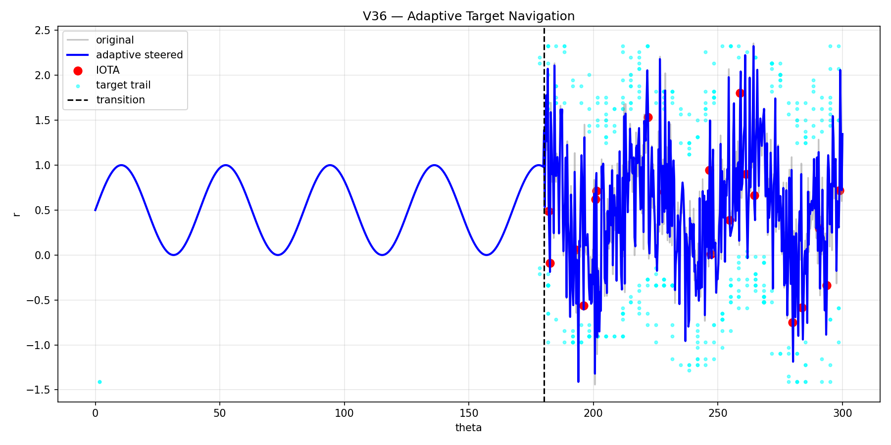

# 🧭 NEXAH — Field-Based Stability Navigation

---

## 🌍 What is NEXAH?

NEXAH is a system for:

```text
detecting, understanding, and navigating
transitions in complex dynamical systems
```

---

## 🧠 Core Idea

A system does not fail randomly.

```text
It moves through a structured state space
and becomes unstable only in specific regions.
```

NEXAH maps this space and enables:

```text
→ early detection of instability  
→ structural understanding  
→ active navigation toward stability  
```

---

## 🔥 What makes NEXAH different?

Traditional approaches:

```text
thresholds → alerts → reaction
```

NEXAH:

```text
state space → structure → fields → navigation
```

---

## 🎯 System Capability

### Today

```text
✔ detect transitions early  
✔ identify instability regions  
✔ explain system behavior structurally  
```

---

### With navigation layer

```text
✔ steer system away from instability  
✔ guide trajectories through stable regions  
✔ reduce collapse probability  
```

---

## 🧬 Conceptual Model

```text
Signal
→ Phase space (r, θ)
→ Density field
→ Greyspace (instability regions)
→ Structural ridges (stable manifolds)
→ IOTA events (transition points)
→ Risk field P(IOTA)
→ Navigation field
```

---

## 🧭 Core Insight

```text
Instability is not noise

Instability is geometry
```

---

## 📁 Project Structure

```text
NEXAH/
│
├── README.md                 ← this file
│
├── NEXAH_CORE/              ← main system
│   │
│   ├── mathematics/
│   │   └── nexah_foundation.md
│   │
│   ├── scripts/
│   │   ├── ieee_gate_detection_v27_iota_state_model.py
│   │   ├── ieee_gate_detection_v28_yugo_flow_iota_coupling.py
│   │   ├── ieee_gate_detection_v29_yugo_iota_predictor.py
│   │   ├── ieee_gate_detection_v30_iota_typing.py
│   │   ├── ieee_gate_detection_v31_shape_extraction.py
│   │   ├── ieee_gate_detection_v32_mini_transition_model.py
│   │   ├── ieee_gate_detection_v33_probalistic_iota_field.py
│   │   ├── ieee_gate_detection_v34_gradient_steering.py
│   │   ├── ieee_gate_detection_v35_target_navigation.py
│   │   ├── ieee_gate_detection_v36_adaptive_target_navigation.py
│   │   └── ieee_gate_detection_v37_structure_aware_steering.py
│   │
│   ├── outputs/
│   │   └── ieee_gates/
│   │       ├── v36_adaptive_target_trajectory.png
│   │       ├── v37_structure_trajectory.png
│   │       └── ...
│   │
│   └── findings.md
│
├── BUILDER_LAB/             ← experimental / legacy
│   └── zeta_legacy/
│
```

---

## 📊 Example Output

### Adaptive Navigation (V36)



---

### Structure-Aware Navigation (V37)


---

## 🔬 Mathematical Foundation

Core definitions:

- state: $begin:math:text$ s\(t\) \= \(r\, \\theta\) $end:math:text$
- density: $begin:math:text$ \\rho\(r\, \\theta\) $end:math:text$
- greyspace: $begin:math:text$ G \= 1 \/ \\rho $end:math:text$
- risk field: $begin:math:text$ P\(\\text\{IOTA\} \| r\, \\theta\) $end:math:text$

Full formulation:

```text
NEXAH_CORE/mathematics/nexah_foundation.md
```

---

## 🧭 Navigation Layer

The system defines a control field:

```math
u =
- ∇P(IOTA)
+ ∇T
+ ∇ρ
```

Interpretation:

```text
avoid instability
+ move toward stable regions
+ follow structural geometry
```

---

## 🌍 Applications

- power grid stability  
- financial systems  
- climate tipping points  
- biological dynamics  

---

## 🚀 Status

```text
✔ Field model
✔ Transition detection
✔ Structural analysis
✔ Navigation (prototype)

→ Next: Control layer
```

---

## 🧠 Final Statement

```text
We are not analyzing signals.

We are mapping and navigating
the field in which collapse occurs.
```

---

© Thomas K. R. Hofmann  
NEXAH — 2026
