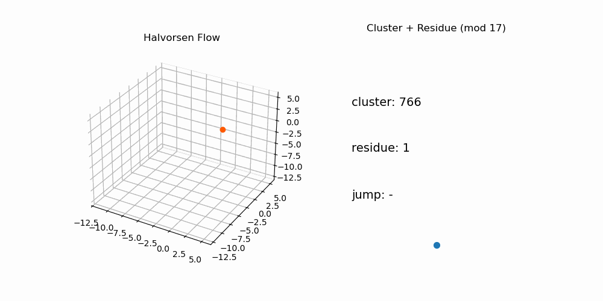

# 🔬 NEXAH — Lorenz vs Halvorsen

## 🧭 Purpose

This document compares the Lorenz system and the Halvorsen system  
within the NEXAH framework.

Its purpose is to demonstrate that:

```text
NEXAH captures structural principles that persist
across fundamentally different dynamical systems
```

---

# 🧠 Core Hypothesis

```text
Dynamical systems do not evolve randomly.

They move through structured fields,
with transitions governed by geometry and connectivity.
```

---

# 🔷 1. System Overview

| Property | Lorenz | Halvorsen |
|----------|--------|----------|
| Structure | dual-lobe attractor | fragmented multi-region |
| Symmetry | partial symmetry | weak / broken symmetry |
| Dynamics | switching between lobes | multi-directional interaction |
| Complexity | medium | high |

---

# 🌀 2. Field Structure

## 🖼️ Visual Comparison — State / Residue


---

## Lorenz

- clearly separated density regions  
- strong attractor cores  
- well-defined transition zones  

```text
structured, globally visible geometry
```

---

## Halvorsen

- irregular density distribution  
- no dominant global structure  
- multiple interacting regions  

```text
structure emerges locally, not globally
```

---

## 🔑 Insight

```text
Structure exists in both systems,
but global coherence differs
```

---

# 🧩 3. Sheet Structure

## Lorenz

- two dominant sheets (lobes)  
- strong separation  
- high coherence  

## Halvorsen

- fragmented sheets  
- overlapping regions  
- weak separation  

---

## 🔑 Insight

```text
Sheets generalize from clean separation
to fragmented layering
```

---

# 🚪 4. Gate Structure

## Lorenz

- single dominant transition corridor  
- stable geometry  

## Halvorsen

- multiple distributed gates  
- irregular placement  

---

## 🔑 Insight

```text
Gates are universal,
but geometry scales with complexity
```

---

# 🔁 5. Transition Dynamics

## Lorenz

- discrete switching  
- binary structure  

```text
clear regime transitions
```

---

## Halvorsen

- multi-path transitions  
- distributed switching  

```text
distributed transition dynamics
```

---

## 🖼️ Visual — Flow Behavior


---

## 🔑 Insight

```text
Transitions are always structured,
but can be discrete or distributed
```

---

# 🧠 6. Connectivity & Graph Structure

## Lorenz

- simple graph  
- few dominant nodes  

## Halvorsen

- complex connectivity  
- multiple components  
- non-trivial reachability  

---

## 🔑 Insight

```text
Continuous systems collapse into discrete graphs
```

---

# ⚡ 7. Control & Navigation

## Lorenz

- phase-aligned control  
- low-dimensional steering  

## Halvorsen

- policy-based control  
- path planning required  

---

## 🔑 Insight

```text
Control complexity scales with structural complexity
```

---

# 🔷 8. Topology

## Lorenz

```text
Möbius-like switching topology
```

## Halvorsen

```text
irregular connectivity topology
```

---

## 🔑 Insight

```text
Topology emerges from transitions,
not from geometry alone
```

---

# 🌐 9. Structural Invariants (Critical)

Both systems exhibit:

```text
✔ density structure
✔ coherent flow regions
✔ gate-like transitions
✔ constrained transitions
✔ navigable pathways
```

---

# 🔥 Core Result

```text
These properties are NOT system-specific.

They are structural invariants of continuous dynamics.
```

---

# 🧠 10. Unified Interpretation

```text
Lorenz:
→ structured, low-dimensional switching system

Halvorsen:
→ high-dimensional, fragmented transition system
```

BUT:

```text
both obey the same structural principles
```

---

# 🧠 11. Dynamic Comparison

## 🖼️ Dual System Animation


---

## Interpretation

- Lorenz → discrete switching  
- Halvorsen → continuous rotational transport  

```text
Different geometry — same underlying logic
```

---

# 🔬 12. Implication for NEXAH

```text
NEXAH is not tied to a specific attractor type.

It generalizes from:
simple → complex systems
```

---

# 🌀 13. Residue Flow Dynamics



## Observation

- cyclic flow patterns emerge  
- transitions align with residue structure  
- local periodicity within global chaos  

## Insight

```text
Even irregular systems contain hidden structured cycles
```

---

# 🔥 Final Insight

```text
Structure governs motion across all levels of complexity.

Only its expression changes.
```

---

# 🚀 Conclusion

```text
Lorenz demonstrates that structure exists.

Halvorsen demonstrates that structure persists
even under high complexity.
```

---

**NEXAH Comparative Study — Lorenz vs Halvorsen**  
Thomas K. R. Hofmann · 2026
