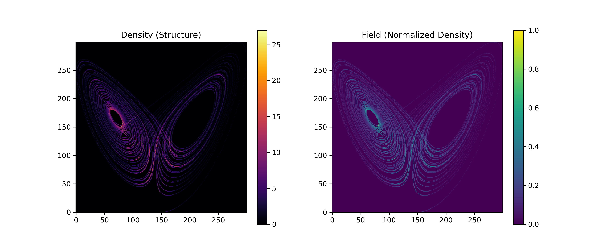

# 🔁 NEXAH — Lorenz vs Rössler vs Halvorsen

## 🧭 Purpose

This document compares three canonical dynamical systems to demonstrate:

```text
structure is invariant
→ only its expression changes
```

---

# 🧠 Systems Overview

| System | Role | Behavior |
|--------|------|--------|
| **Lorenz** | Reference | discrete switching |
| **Rössler** | Intermediate | continuous transport |
| **Halvorsen** | Stress test | distributed complexity |

---

# 🔁 Shared Structural Pipeline

```text
Dynamics → Density → Structure → Sheets → Regimes → Gates → Transitions → Topology
```

---

# 🔬 1. Raw Dynamics



---

# 🔬 2. Density Field


---

# 🔬 3. Structure


---

# 🔬 4. Sheets


---

# 🔬 5. Transition Structure


---

# 🔬 6. Gate Structure


---

# 🔬 7. Cross-System Geometry


---

# 🔬 8. Navigation


---

# 🔬 9. Rotation


---

# 🔬 10. Topology (Emergent)

| System | Effective Topology |
|--------|------------------|
| Lorenz | Möbius-like switching |
| Rössler | Spiral / disc |
| Halvorsen | Graph-like |

---

# 🔥 Core Insight

```text
Structure persists across systems.
Only its expression changes.
```

---

**NEXAH — Cross-System Comparison**  
Thomas K. R. Hofmann · 2026
