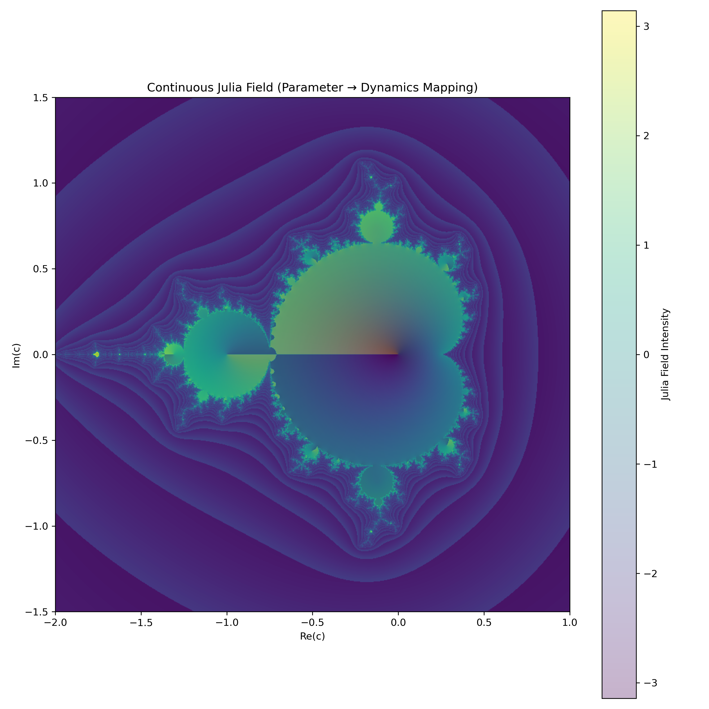

# 🌀 NEXAH — Fractal Transition Dynamics

---

## 🌌 Overview




---

## 🧭 Purpose

This module applies the NEXAH framework to classical fractal systems:

- Mandelbrot set (parameter space)
- Julia sets (dynamical space)

The goal is **not visual reinterpretation**.

Instead:

> fractals are treated as **dynamical transition systems**

---

# 🔷 Core Idea

```text
Mandelbrot → defines possible dynamics  
Julia → realizes local dynamics  
NEXAH → describes transition structure between both
```

---

# 🔬 Key Perspective

Classically:

- Mandelbrot = classification
- Julia = behavior

NEXAH introduces:

```text
transition = process  
phase = coordinate  
mismatch = trigger  
```

---

# ⚡ Hypothesis

```text
Fractal systems contain latent transition dynamics
that are not visible in static representations.
```

---

# 🔁 Interpretation Layer

| Object         | NEXAH Interpretation              |
|---------------|----------------------------------|
| Mandelbrot     | invariant structure (global)      |
| Julia          | local dynamical realization       |
| External rays  | transition pathways               |
| Escape         | phase-driven release (IOTA)       |

---

# 🧠 Key Result

From animation and Δ-analysis:

- discrete transition events detected
- symmetric recurrence across path
- measurable instability spikes

👉 Example:

```text
Frame 13 → transition  
Frame 47 → mirrored transition
```

---

# 🧭 Parameter Path


We treat:

```math
c(t)
```

as a trajectory through parameter space.

👉 This turns fractals into **time-dependent systems**

---

# ⚡ Transition Detection


- Δ measures structural change between frames
- spikes = phase transitions

👉 This is the first step toward **regime detection**

---

# 🌊 Field Perspective


Fractals reveal:

- flow structures
- attractor regions
- transition corridors

👉 Not just geometry — **dynamics encoded spatially**

---

# 🔁 Phase Mismatch


When internal iteration ≠ parameter evolution:

- instability emerges
- structure breaks
- chaos propagates

👉 General principle: **phase mismatch drives transition**

---

# 🧬 NEXAH Interpretation

Fractals are not static sets.

They are:

```text
response maps of a dynamical system under parameter motion
```

---

# 🧭 Goal

Transform fractals from:

```text
static sets
```

into:

```text
dynamic transition systems
```

---

# 🚀 Next Steps

- phase-resolved Mandelbrot
- Julia flow dynamics
- transition probability maps
- cross-system comparison
- integration into NEXAH field layer

---

# 🧩 Status

✔ Visualization layer complete  
✔ Transition detection working  
✔ Field interpretation emerging  

→ ready for integration into **NEXAH**

---
