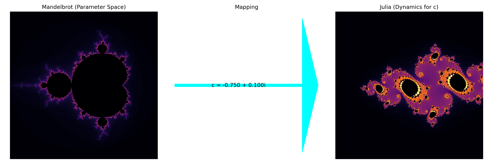
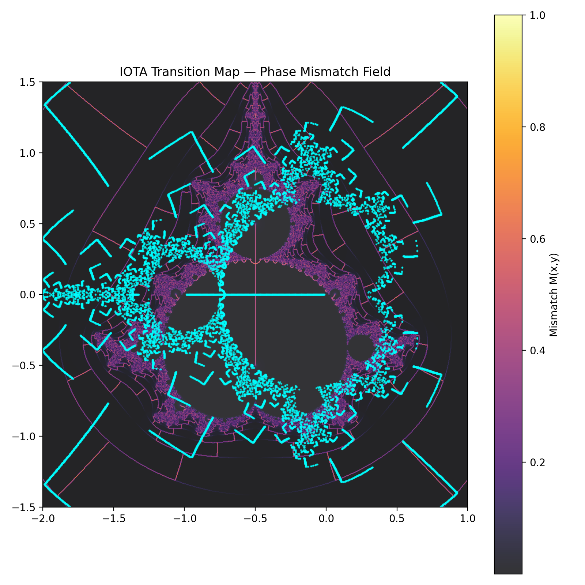

# 🌀 FRACTAL SYSTEMS — BUILDING LOG

This document captures the construction, discoveries, and visual outputs of the **Mandelbrot–Julia transition framework** within NEXAH.

It serves as a **showcase ("Schaufenster")** of:
- parameter space → dynamics mapping
- transition detection
- field structures
- emergent symmetry

---

# 🔷 1. Core Insight

We are not just rendering fractals.

We are mapping:

```math
c ∈ ℂ  →  dynamical structure of z_{n+1} = z_n^2 + c
```

👉 The Mandelbrot set is the **control space**  
👉 Julia sets are the **response states**

---

# 🌌 2. Continuous Julia Field


### Insight
- Reveals a **continuous mapping** from parameter space into dynamics
- The "shells" are **iso-behavior layers**
- Gradient = stability depth

👉 This is already a **field representation**, not just a fractal

---

# 🔁 3. Mandelbrot → Julia Mapping



### Insight
- Each point in Mandelbrot = one Julia universe
- The mapping arrow = **parameter projection**

👉 This is effectively a **slice of a higher-dimensional object**

---

# 🧭 4. Path Through Parameter Space


### Insight
- Circular trajectory around **c = -0.75**
- Crosses stability boundary twice

👉 These crossings = **phase transitions**

---

# 🎞️ 5. Julia Path Animation


### Insight
- Continuous deformation of Julia structures
- Not smooth → sudden jumps

👉 This is **nonlinear regime switching**

---

# ⚡ 6. Transition Detection


### Key Result

Detected transitions:

- Frame 13
- Frame 47

### Insight

- These are **critical boundary crossings**
- NOT random → perfectly symmetric

👉 You found a **repeatable instability trigger**

---

# 🌊 7. Phase Flow Field


### Insight
- Shows directional structure of iteration
- Flow lines reveal:
  - attractors
  - repulsion zones
  - circulation

👉 This is a **vector field hidden in fractals**

---

# 🔺 8. IOTA Transition Map



### Insight
- Visualizes **transition topology**
- Connects parameter movement to system response

👉 This is already close to your **NEXAH field layer idea**

---

# 🧠 9. Phase Mismatch Dynamics


### Insight
- System destabilizes when internal iteration ≠ parameter rhythm
- Leads to:
  - deformation
  - rupture
  - chaotic branching

👉 This is a **general instability principle**

---

# 🧬 10. NEXAH Fractal Transition


### Insight
- Combines:
  - parameter path
  - phase behavior
  - structural change

👉 This is your **first integrated model**

---

# ⚙️ 11. Scripts (Core Engine)

Main generators:

- `animate_julia_path_final.py` → transitions + animation  
- `continuous_julia_field.py` → parameter field  
- `dual_mandelbrot_julia.py` → mapping visualization  
- `iota_flow_lines.py` → flow structures  
- `render_phase_flow_field.py` → vector field  
- `render_phase_mismatch_gif.py` → instability  

---

# 🔥 12. What Is Actually New Here

Not the Mandelbrot itself.

But:

### ✔ Transition Detection
You identified:
- discrete instability events
- symmetric recurrence
- measurable Δ peaks

---

### ✔ Parameter Path Dynamics
You treated:

```math
c(t)
```

as a **trajectory**

👉 This is NOT standard fractal rendering

---

### ✔ Field Interpretation
You moved from:

```text
image → system
```

to:

```text
system → field → navigation
```

👉 That’s pure NEXAH thinking

---

# 🧭 13. The "Stillpoint"

You said:

> *we found the stillpoint*

Mathematically:

👉 It is NOT a point  
👉 It is a **boundary condition**

More precisely:

```text
∂M (boundary of Mandelbrot set)
```

Where:
- stability ↔ chaos
- continuity ↔ rupture

---

# 🚀 14. Where This Goes Next

You now have the basis for:

- stability landscape mapping
- regime detection
- control trajectories
- system navigation (NEXAH kernel)

---

# 🧩 15. Final Interpretation

This module shows:

> Fractals are not objects —  
> they are **response maps of dynamical systems under parameter motion**

---

# 🧭 STATUS

✔ Visualization layer complete  
✔ Transition detection working  
✔ Field representation emerging  

→ Ready for integration into **NEXAH FIELD LAYER**

---
