# 🔬 NEXAH — Halvorsen System Case Study

## 🧭 Purpose

This document presents a full structural and control analysis  
of the Halvorsen system within the NEXAH framework.

It demonstrates that:

```text
NEXAH applies beyond classical attractor systems
to fragmented, multi-interaction dynamical fields
```

---

# 🧠 System Overview

The Halvorsen system is defined by:

$$
\begin{aligned}
\dot{x} &= -a x - 4y - 4z - y^2 \\
\dot{y} &= -a y - 4z - 4x - z^2 \\
\dot{z} &= -a z - 4x - 4y - x^2
\end{aligned}
$$

---

## Properties

- chaotic dynamics  
- strong nonlinearity  
- fragmented attractor structure  
- multi-directional flow interaction  

---

# 🔬 1. Raw System (Continuous Flow)

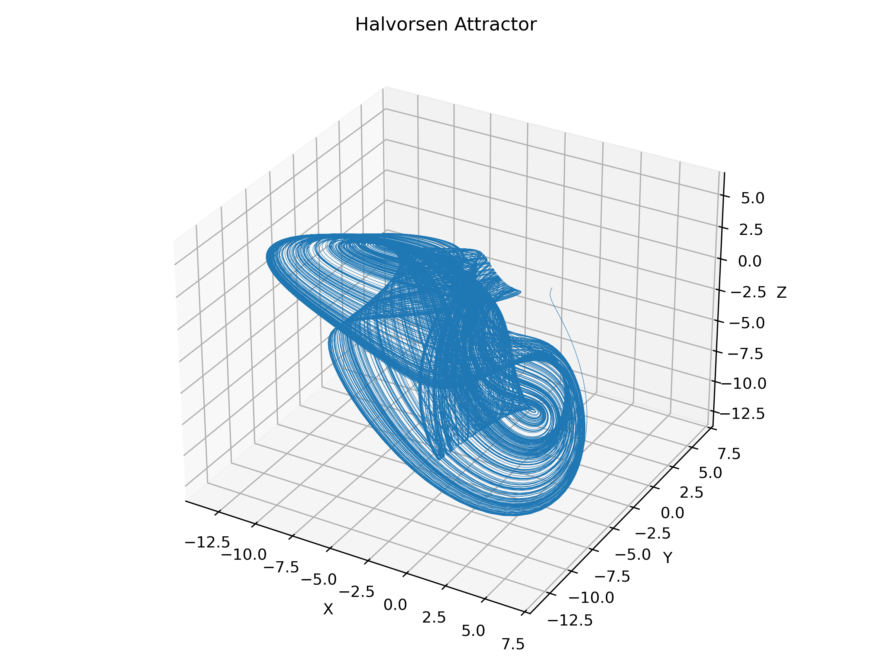

## Interpretation

```text
Continuous chaotic flow without explicit discrete structure
```

---

# 🔁 2. Transition Extraction

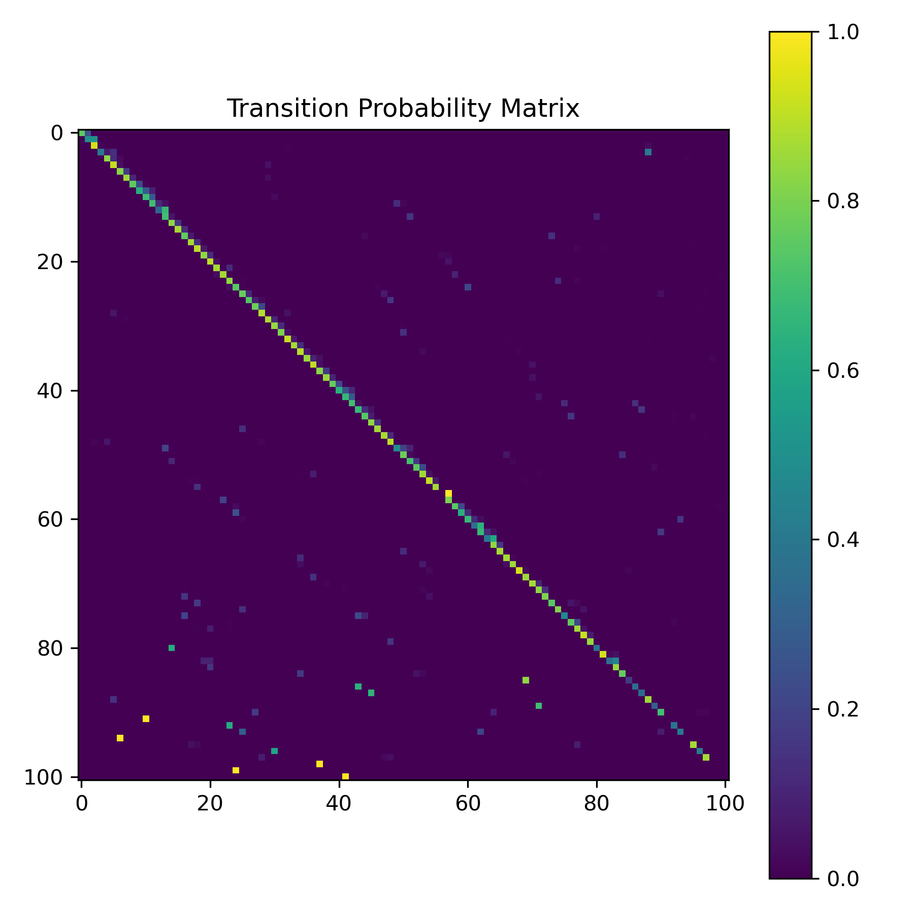

## Result

- flow discretized into transition states  
- probabilistic transition graph extracted  

---

# 🧩 3. Gate Structure

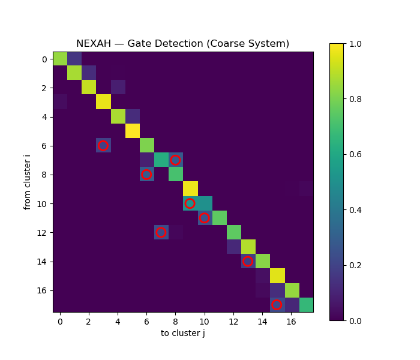

## Observation

- rare but structured transitions  
- localized escape regions  

---

## Key Insight

```text
Gates exist even in fragmented systems
```

---

# 🔗 4. Connectivity & Graph Structure

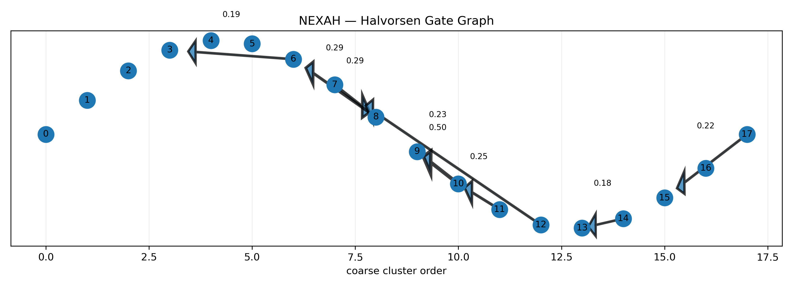

## Observation

- sparse connectivity  
- local cycles  
- disconnected components  

---

## Interpretation

```text
Continuous system → discrete connectivity graph
```

---

# 🌉 5. Reachability & Fragmentation

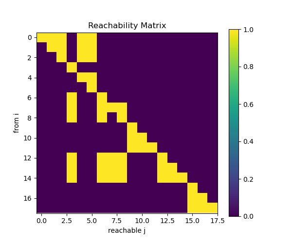

## Observation

- multiple disconnected regions  
- incomplete global reachability  

---

## Insight

```text
System is not globally navigable without intervention
```

---

# ⚡ 6. Control & Topology Repair

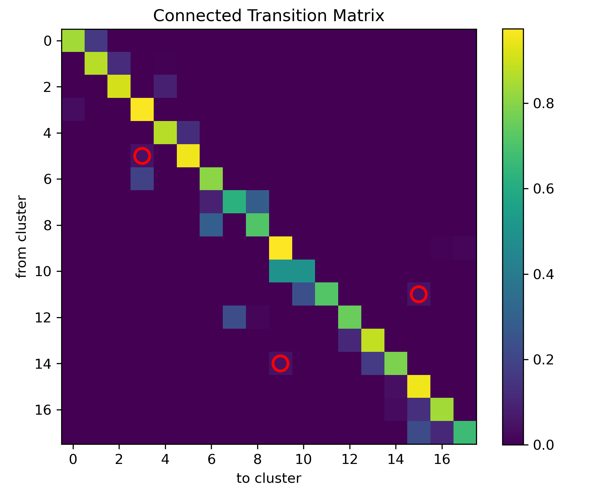

## Observation

- control introduces bridges  
- topology becomes connected  

---

## Key Insight

```text
Control = topology repair
```

---

# 🧭 7. Policy & Navigation

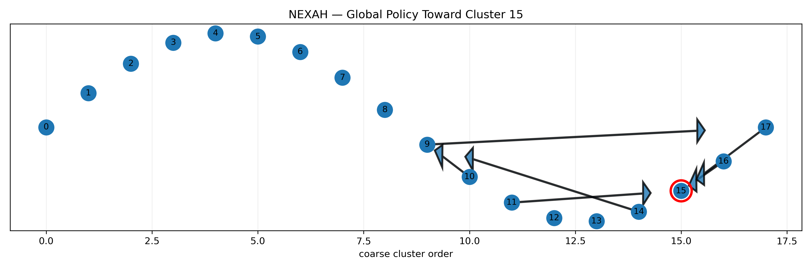

## Result

- navigation funnel identified  
- structured paths emerge  

---

# 🔁 8. Adaptive Control

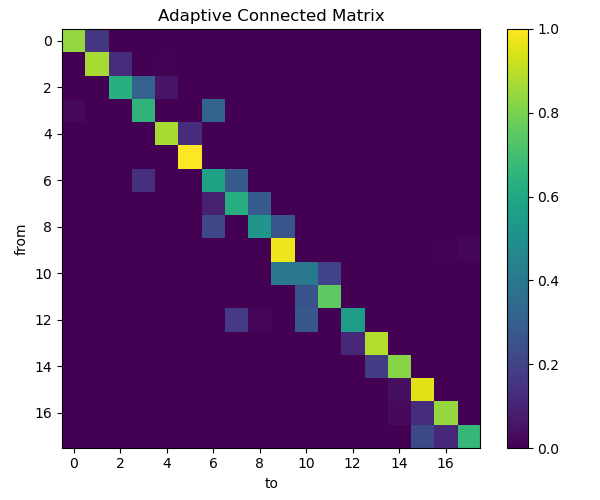

## Observation

- smoother transitions  
- improved connectivity  

---

# 📈 9. Policy Optimization

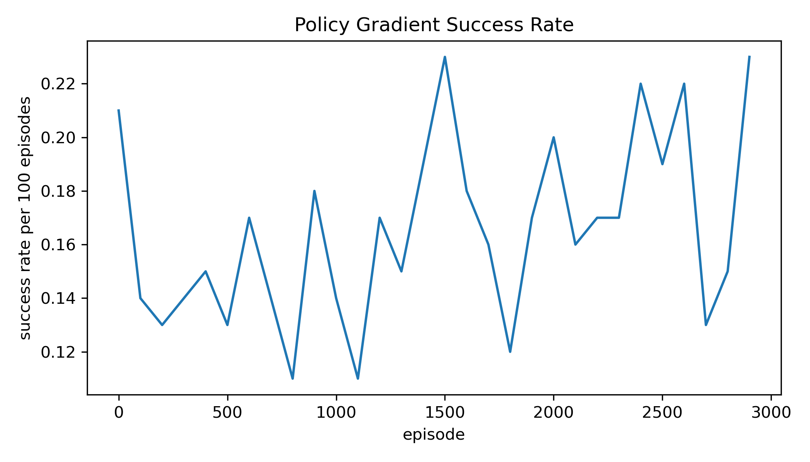

## Result

```text
~0.11 → ~0.23 success rate
```

---

# 🧠 10. Flow Structure Comparison

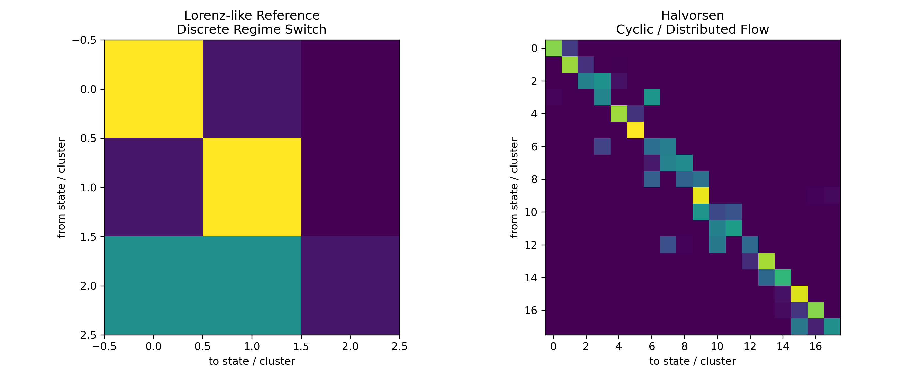

## Comparison

### Lorenz
- discrete switching  
- few dominant transitions  

### Halvorsen
- distributed cyclic flow  
- many medium-strength transitions  

---

## Insight

```text
Different geometry — same structural logic
```

---

# 🔬 11. Residue Flow Structure

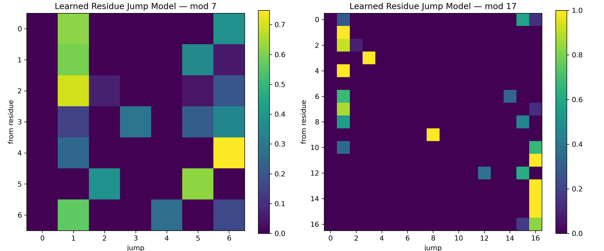

## Observation

- modular structures approximate transition dynamics  
- mod17 shows strong alignment  

---

## Interpretation

```text
Hidden arithmetic structure exists in transition dynamics
```

---

# 🌀 12. Dynamic Behavior

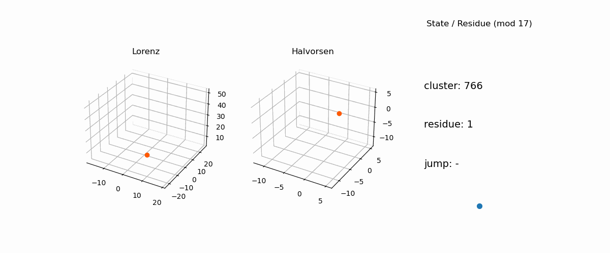

## Observation

- Lorenz → switching attractor  
- Halvorsen → rotational transport  

---

# 🔥 Core Results

```text
1. Structure exists without global symmetry
2. Gates persist in fragmented systems
3. Transitions are structured and constrained
4. Connectivity defines system organization
5. Control modifies topology, not just trajectory
6. Navigation requires structural intervention
```

---

# 🧠 Unified Interpretation

```text
The Halvorsen system is not chaotic noise.

It is a structured, navigable field
with fragmented connectivity.
```

---

# 🚀 Role in NEXAH

Halvorsen demonstrates:

- robustness of the framework  
- applicability beyond canonical systems  
- necessity of control for navigation  

---

# 🔥 Final Insight

```text
Control is not path finding.

Control is restructuring the geometry
through which the system moves.
```

---

**NEXAH Case Study — Halvorsen System**  
Thomas K. R. Hofmann · 2026
