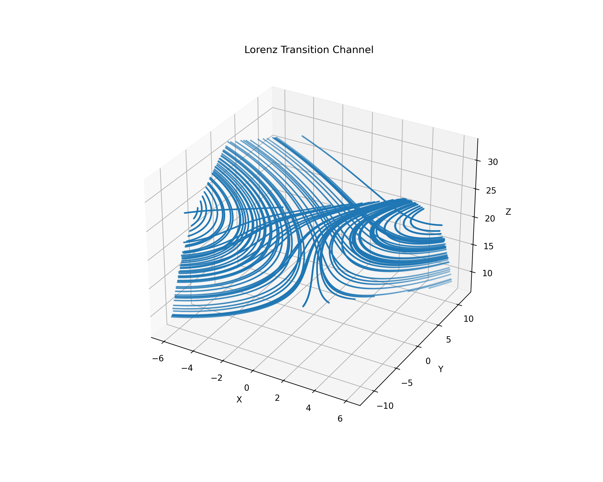
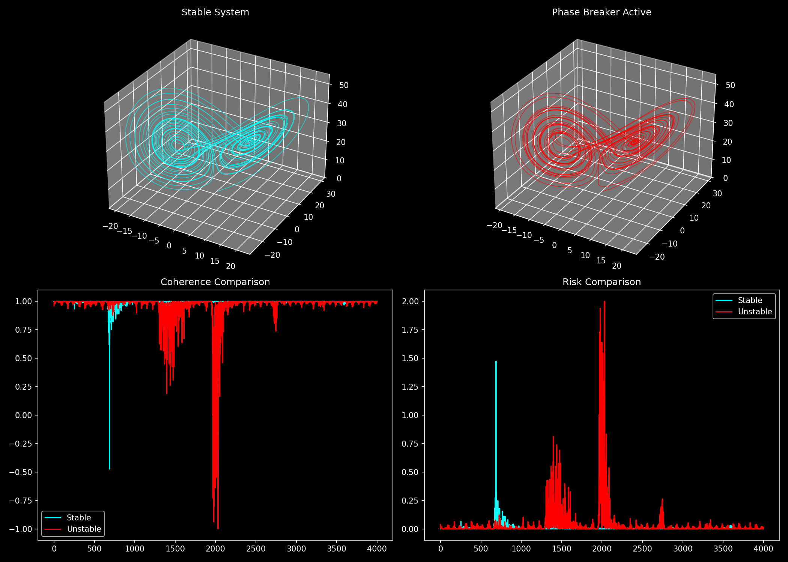

# 🔬 NEXAH — Lorenz System Case Study

## 🧭 Purpose

This document presents the **primary reference case study** of the NEXAH framework  
based on the Lorenz system.

It demonstrates that:

```text
structure, transitions, and control mechanisms
emerge directly from system dynamics
```

and are:

- reproducible  
- noise-robust  
- geometrically structured  
- causally controllable  

---

# 🧠 System Overview

The Lorenz system is defined by:

$$
\begin{aligned}
\dot{x} &= \sigma (y - x) \\
\dot{y} &= x(\rho - z) - y \\
\dot{z} &= xy - \beta z
\end{aligned}
$$

---

## Properties

- chaotic dynamics  
- bounded attractor  
- dual-lobe structure  
- sensitive dependence on initial conditions  

---

## Role in NEXAH

```text
Lorenz is the primary experimental backbone of the NEXAH framework
```

All core mechanisms were first identified and validated on this system.

---

# 🔬 1. Empirical Structure

From trajectory data:

```text
trajectory → density → flow → structure
```

Observed:

- two dominant regions (lobes)  
- stable circulation within lobes  
- switching between lobes  

---

## 🖼️ Figure A — Field Structure


**Interpretation**

```text
The system does not move randomly.

It moves within a structured field.
```

High-density regions correspond to stable motion,  
while low-density regions indicate transition corridors.

---

# 🌀 2. Field Structure

From density and flow estimation:

- density field ρ(x)  
- flow field F(x)  
- gradient structure ∇ρ(x)  

---

## Observations

- high-density regions → stable motion  
- low-density regions → transition corridors  
- smooth vector field → directional flow  

---

## Interpretation

```text
The attractor is a structured field, not just a trajectory set.
```

---

# 🧩 3. Gate Structure

Observed:

- transition regions between lobes  
- low-density, low-coherence zones  
- directional entry behavior  

---

## Key Insight

```text
Transitions occur through structured gates
```

---

# 🔁 4. Transition Dynamics

Observed:

- transitions are:
  - continuous  
  - directional  
  - localized  

NOT:

```text
random jumps
```

---

## 🖼️ Figure B — Transition Geometry



**Interpretation**

```text
Transition dynamics are geometry-constrained
```

Transitions occur along structured corridors between coherent regions,  
not arbitrarily in state space.

---

# 🧠 5. Phase Dynamics & Mismatch

Core quantities:

- phase: φ  
- phase velocity: ω  
- expected phase: ω̂  
- mismatch: M = |ω − ω̂|  

---

## 🖼️ Figure C — Phase Mismatch Mechanism



**Observation**

```text
IOTA events occur when mismatch is high
```

NOT when instability alone is high.

---

## Key Insight

```text
Transitions are triggered by phase mismatch,
not by instability magnitude alone
```

---

# ⚡ 6. Control Mechanism

Control applied as:

```text
s = s*(φ)
```

---

## Observations

- control is:
  - phase-dependent  
  - non-linear  
  - localized  

- optimal control region exists:

```text
s ≈ 0.3 – 0.4
```

---

## Effects

- improved trajectory alignment  
- faster convergence (~5.6×)  
- increased target reach (~+55%)  

---

## Limitation

```text
Phase-only control does not suppress transitions
```

---

## Required Extension

```text
s = f(φ, instability)
```

---

# 🔬 7. Validation Summary

The Lorenz system was tested across:

---

## Reproducibility

- multiple runs  
- different initial conditions  

→ structure remains stable  

---

## Noise Robustness

- trajectory noise  
- transition noise  

→ no structural collapse  

---

## Partition Invariance

- KMeans  
- PCA + KMeans  
- random projection  

→ consistent transition structure  

---

## Cross-System Comparison

- Lorenz  
- Rössler  
- Duffing  

→ similar transition structures  

---

## Key Result

```text
Transition structure is not system-specific
```

---

# 🌊 8. Field-Level Geometry

Constructed fields:

- instability field  
- transition field  
- navigation field  

---

## Observation

```text
Transitions occur in structured regions of the flow
```

---

## Interpretation

```text
System behavior is geometrically organized
```

---

# 🔗 9. Causality

From gate-based interventions:

Observed:

- localized modifications  
- predictable changes in transition behavior  

---

## Key Insight

```text
Transition structure is causally controllable
```

---

# 🧠 10. Topology

Observed:

- two-sheet switching structure  
- repeated crossing pattern  

---

## Interpretation

```text
Effective topology is Möbius-like
```

---

## Insight

```text
Topology emerges from motion,
not from space itself
```

---

# 🔥 11. Core Results

```text
1. Structure emerges from trajectories
2. Transitions occur through gates
3. Transition dynamics are stable and non-random
4. Control operates through phase alignment
5. Transitions are driven by phase mismatch
6. Structure is robust across noise and systems
```

---

# 🧠 Unified Interpretation

```text
The Lorenz system is not chaotic noise.

It is a structured, navigable dynamical field.
```

---

# 🚀 Role in NEXAH

The Lorenz system provides:

- the first complete validation  
- the primary experimental reference  
- the foundation for all higher-level concepts  

---

# 🔥 Final Insight

```text
A chaotic system does not evolve randomly.

It moves through a structured field,
and transitions occur when phase coherence breaks.
```

---

**NEXAH Case Study — Lorenz System**  
Thomas K. R. Hofmann · 2026
