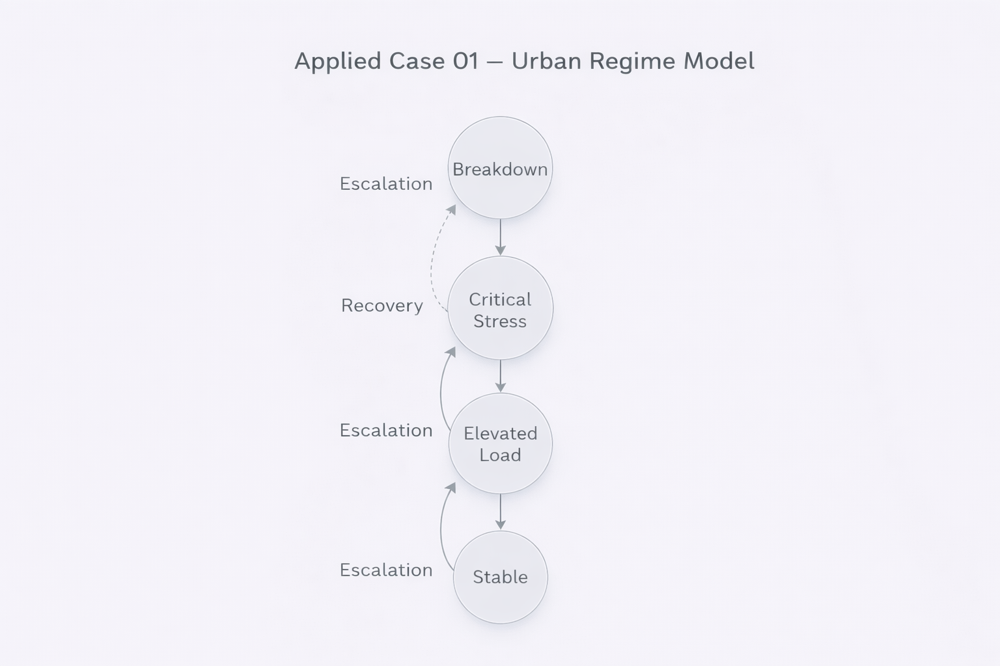

# Applied Case 01 — Urban Stability Regime Model

---

## 1. Problem Context

Urban systems exhibit:

- Infrastructure load
- Traffic density
- Resource distribution
- Governance response
- Social stability thresholds

These systems undergo regime shifts:

- Stable operation
- Strained condition
- Critical overload
- Structural breakdown

We model this using the NEXAH framework.

---

## 2. Structural Modeling (META Layer)

Define a finite partially ordered set:

\[
Q = \{ S_0, S_1, S_2, S_3 \}
\]

Where:

- \(S_0\) = Stable
- \(S_1\) = Elevated Load
- \(S_2\) = Critical Stress
- \(S_3\) = Breakdown

Define partial order:

\[
S_0 \preceq S_1 \preceq S_2 \preceq S_3
\]

No metric required.  
Only ordinal structural relation.

---

## 3. Regime Operator (ARCHY Layer)

Define regime operator:

\[
\Delta : Q \rightarrow Q
\]

Example rule:

- If demand increases → move upward
- If intervention stabilizes → remain fixed
- If no intervention → escalate

Possible transitions:

\[
\Delta(S_0) = S_1
\]
\[
\Delta(S_1) = S_2
\]
\[
\Delta(S_2) = S_3
\]
\[
\Delta(S_3) = S_3
\]

Because Q is finite:

- Escalation stabilizes at S₃
- S₃ is fixpoint under stress escalation

---

## 4. Basin Interpretation

Different initial states converge differently under different Δ definitions.

If stabilization mechanisms are introduced:

\[
\Delta'(S_2) = S_1
\]

Then:

- New fixpoint emerges
- Basin geometry changes
- Urban regime architecture shifts

This demonstrates structural sensitivity to operator design.

---

## 5. Frame Dependence (NEXAH Layer)

Frame F₁:  
Linear reading from stability to collapse.

Frame F₂:  
Policy-oriented reading emphasizing recovery potential.

Structural order unchanged.  
Interpretation differs.

This is crucial in:

- Urban planning
- Political communication
- Risk assessment

---

## 6. Structural Insight

This applied case demonstrates:

- Finite-order modeling of urban states
- Explicit regime definition
- Predictable stabilization under defined operator
- Clear separation between structure and interpretation

No metric simulation required.

---

## 7. Validation Perspective

To validate in practice:

- Map real urban indicators to discrete state classification
- Define regime operator based on measurable thresholds
- Track stabilization paths over time
- Compare predicted fixpoints with observed outcomes

This forms the bridge from formal research to real application.

---

Status: First structural application prototype.
