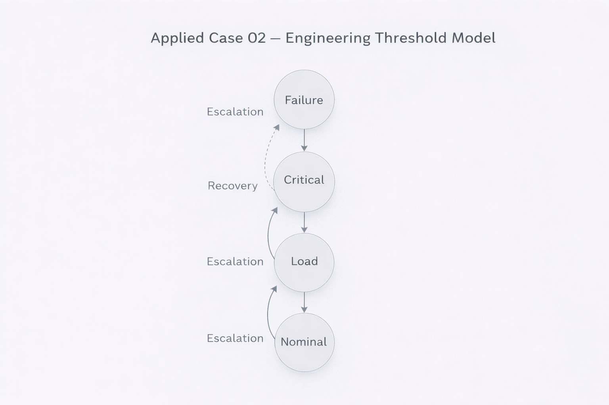

# Applied Case 02 — Engineering Threshold System

---

## 1. Problem Context

Engineering systems often operate under threshold constraints:

- Load capacity
- Temperature tolerance
- Voltage limits
- Material stress
- Structural fatigue

These systems exhibit regime shifts when thresholds are crossed.

We model this using discrete structural states.

---

## 2. Structural Modeling (META Layer)

Define a finite partially ordered set:

\[
Q = \{ N, L, C, F \}
\]

Where:

- \(N\) = Nominal operation
- \(L\) = Load approaching limit
- \(C\) = Critical threshold exceeded
- \(F\) = Failure state

Define order:

\[
N \preceq L \preceq C \preceq F
\]

This is a structural classification — not a metric model.

---

## 3. Regime Operator (ARCHY Layer)

Define:

\[
\Delta : Q \rightarrow Q
\]

Escalation under increasing stress:

\[
\Delta(N) = L
\]
\[
\Delta(L) = C
\]
\[
\Delta(C) = F
\]
\[
\Delta(F) = F
\]

Because Q is finite:

- Escalation stabilizes at F
- Failure is fixpoint under overload

---

## 4. Recovery Operator Variant

Introduce modified regime:

\[
\Delta'(C) = L
\]

representing intervention or cooling.

Now:

- F may no longer be the only terminal state
- System exhibits dual-basin structure
- Stability depends on operator definition

---

## 5. Structural Insight

The framework cleanly separates:

- Structural state definition (META)
- Regime dynamics (ARCHY)
- Interpretation / reporting (NEXAH)

No differential equation required.

No simulation required.

Only explicit operator definition.

---

## 6. Practical Validation

To apply in real engineering systems:

1. Define discrete classification thresholds
2. Map sensor data to Q
3. Define regime operator rules
4. Track stabilization patterns
5. Compare predicted regime evolution to real outcomes

This enables structural monitoring without continuous modeling.

---

## 7. Why This Matters

This case demonstrates:

- Threshold systems are naturally finite-ordered
- Escalation dynamics are operator-driven
- Stability analysis does not require continuous modeling
- NEXAH provides structural clarity in engineering design

---

Status: Threshold regime modeling validated.
