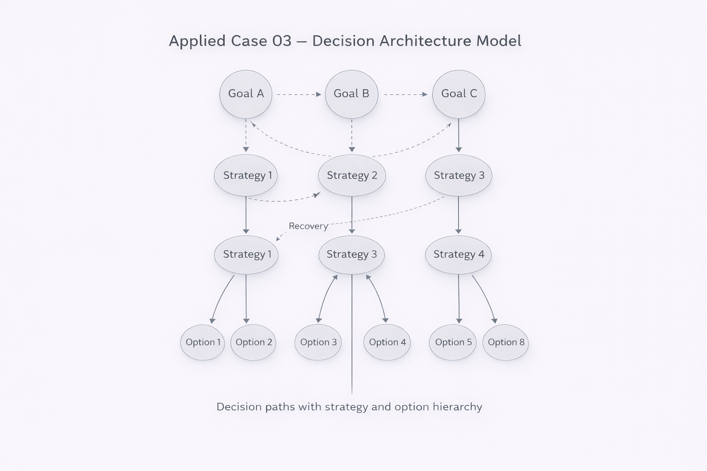

# Applied Case 03 — Decision Architecture (Goal → Strategy → Option)

This case demonstrates how NEXAH structures decision-making as a finite relational system:
Goals generate admissible strategies, strategies generate viable options, and regimes restrict the space to stable, interpretable choices.

---

## 1) Problem Type

We model **decision-making under constraints**:

- multiple competing goals
- a set of strategies that partially satisfy goals
- a set of options that implement strategies
- constraints and thresholds that eliminate unstable / invalid paths

NEXAH converts this into a **finite poset-based structure** with explicit regime restriction and frame selection.

---

## 2) Minimal Formal Model (Finite)

Let:

- **Q** be a finite set of decision elements (goals, strategies, options)
- **⪯** be a partial order (“depends on”, “refines”, “dominates”, “is admissible under”)

We work strictly in **finite order theory**.

Typical interpretation:

- Goal ⪯ Strategy ⪯ Option

---

## 3) NEXAH Mapping (META → ARCHY → NEXAH)

### META (Relational Structure)
- Build the relational graph/poset:
  - Goals, Strategies, Options
  - edges = admissibility / dependency
- Detect:
  - incomparable elements (conflicts, trade-offs)
  - dominance relations (stronger/weaker strategies)

### ARCHY (Regime Restriction)
Define a **regime restriction** that removes invalid/unwanted regions:

- budget constraints
- safety constraints
- policy constraints
- feasibility constraints
- minimum performance thresholds

Result: a restricted substructure **Q_R ⊆ Q** where navigation is meaningful.

### NEXAH (Frame Selection / Orientation)
Select a frame that makes decisions readable:

- prioritize a goal (frame weights)
- choose a “dominance rule”
- choose what counts as “acceptable trade-off”

Different frames can yield different “best” options — that is expected.

---

## 4) Operator Workflow (Γ, τ, Δ, Ω)

This case uses the operator chain in a simple, demonstrable way:

1. **τ (Threshold)**  
   Define acceptance thresholds (e.g., cost ≤ X, risk ≤ Y, performance ≥ Z).

2. **Δ (Update / Transition)**  
   Apply new evidence or changed constraints; update admissibility edges.

3. **Γ (Closure / Stabilization)**  
   Close the system under chosen inference rules (keep consistent derived relations).

4. **Ω (Fixpoint / Equilibrium)**  
   Find stable option-sets that remain valid after iterative updates.

Output: a small set of stable candidates (“basin of acceptable decisions”).

---

## 5) Output Artifacts

This applied case should produce:

- a small poset diagram (goals → strategies → options)
- a “regime filter” list (what was removed and why)
- a frame statement:
  - “Under Frame F, the preferred option set is …”
- a stable candidate set:
  - option basin(s) after Ω

---

## 6) Success Criteria (Proof-of-Use)

The case is considered successful if:

- the model remains finite and explicit
- constraints are transparent and reproducible
- the same input yields the same restricted set (ARCHY)
- changing the frame produces explainable differences (NEXAH)
- the final set is stable under iteration (Ω)

---

## 7) Optional Extensions

- multi-step strategies (Strategy → Sub-strategy → Option)
- conflict visualization (incomparability clusters)
- score-based frames (still expressed as explicit frame choice, not as “objective truth”)
- log of regime changes (Δ history)

---

Status: Draft case structure complete (needs real example data).
Next: attach a concrete scenario and instantiate Q, ⪯, τ, and one update step Δ.
