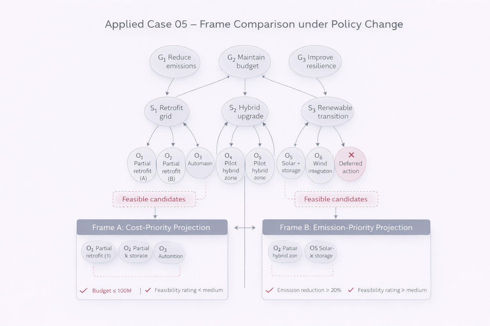

# Applied Case 05 – Frame Comparison under Policy Change

---

## 1. Context

Complex systems often remain structurally stable while interpretations of feasibility change.

This does not necessarily imply a regime shift.
Instead, different evaluation frames produce different admissible subsets.

NEXAH distinguishes:

- Regime change (Δ modifies structure)
- Frame change (F modifies projection)

This applied case demonstrates frame-induced variation without structural modification.

---

## 2. Structural Setup

Let:

- \( Q \) be a finite partially ordered set
- \( \Gamma \) a stabilization operator
- \( F_1, F_2 \) admissible frames

We assume:

\[
\Gamma(Q) = Q
\]

The structure is stable.

However:

\[
F_1(Q) \neq F_2(Q)
\]

The admissible region depends on frame selection.

---

## 3. Policy Example

Consider a decision system with:

- Budget constraint
- Emission constraint
- Resilience objective

Frame A prioritizes cost minimization.  
Frame B prioritizes emission reduction.  

No regime operator is applied.  
The structure remains identical.

Yet:

- Feasible candidate sets differ
- Ranking order changes
- Stabilization preference changes

---

## 4. Mechanism

### Same Structure:

\[
(Q, \preceq)
\]

### Same Stabilization:

\[
\Gamma
\]

### Different Frames:

\[
F_1 \circ \Gamma \neq F_2 \circ \Gamma
\]

Thus:

\[
x^*_{F_1} \neq x^*_{F_2}
\]

Different interpretations arise without structural mutation.

---

## 5. What NEXAH Provides

The framework distinguishes clearly:

- Structural regime instability
- Frame-dependent interpretation

This prevents false detection of regime shifts.

Not every change in decision outcome implies structural reconfiguration.

---

## 6. Validation Criteria

This applied case is validated if:

- Structure remains unchanged
- Fixpoints differ under frame projection
- Basin partition remains constant
- Admissible subsets vary

Frame plurality is confirmed.

---

## 7. Boundary

This case does not introduce:

- New operators
- Structural modification
- Dynamic time modeling

It demonstrates projection-induced variability only.

---

Status: Frame-induced structural reinterpretation  
Next stage: Comparative operator hierarchy across multi-frame systems
