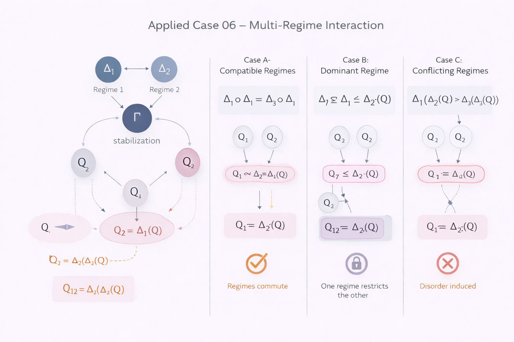

# Applied Case 06 – Multi-Regime Interaction

---

## 1. Context

Real-world systems rarely operate under a single regime.

Instead, multiple regimes may:

- coexist
- overlap
- compete
- partially constrain each other

NEXAH formalizes this interaction through compositional regime operators.

---

## 2. Structural Setup

Let:

- \( Q \) be a finite partially ordered set
- \( \Gamma \) stabilization operator
- \( \Delta_1, \Delta_2 \) two regime operators

Each regime induces a restriction:

\[
Q_1 = \Delta_1(Q)
\]

\[
Q_2 = \Delta_2(Q)
\]

The system under dual regime influence becomes:

\[
Q_{12} = \Delta_2(\Delta_1(Q))
\]

---

## 3. Types of Regime Interaction

### Case A – Compatible Regimes

\[
\Delta_1 \circ \Delta_2 = \Delta_2 \circ \Delta_1
\]

Order of application does not change the admissible region.

### Case B – Dominant Regime

\[
\Delta_1(Q) \subseteq \Delta_2(Q)
\]

One regime strictly constrains the other.

### Case C – Conflicting Regimes

\[
\Delta_1(\Delta_2(Q)) \neq \Delta_2(\Delta_1(Q))
\]

Non-commutativity produces structural instability.

---

## 4. Stabilization Under Multi-Regime Constraint

After regime composition:

\[
\Gamma(Q_{12}) = x^*_{12}
\]

Stabilization basin may:

- shrink
- split
- disappear
- relocate

Multi-regime interaction may produce:

- new fixpoints
- no admissible fixpoint
- unstable oscillation under operator iteration

---

## 5. Practical Interpretation

Examples:

- Urban system: environmental + fiscal constraint
- Energy grid: safety + load regulation
- Policy system: emission target + social stability requirement
- Engineering: stress tolerance + cost constraint

The framework distinguishes structural incompatibility from interpretational disagreement.

---

## 6. Validation

To validate:

1. Define two regime operators
2. Test commutativity
3. Compare admissible region size
4. Observe fixpoint relocation

Structural interaction becomes observable.

---

Status: Composite regime modeling  
Next stage: Executable operator simulation
