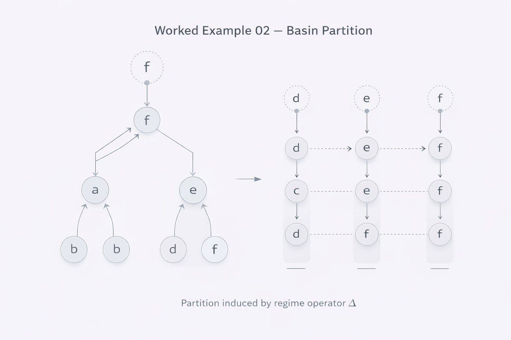

# Worked Example 02 — Multiple Basins & Regime Partition

---

## 1. Setup

Let \( (Q, \preceq) \) be a finite partially ordered set.

Let:

\[
\Delta : Q \rightarrow Q
\]

be monotone and extensive.

Unlike Example 01, assume that:

- Multiple fixpoints exist.
- The operator does not collapse the entire structure into a single terminal element.

---

## 2. Existence of Multiple Fixpoints

Because \(Q\) is finite and \(\Delta\) is monotone:

\[
\exists x^*_1, x^*_2, \dots, x^*_k
\]

such that:

\[
\Delta(x^*_i) = x^*_i
\]

and

\[
x^*_i \neq x^*_j \quad \text{for } i \neq j
\]

These fixpoints need not be comparable.

---

## 3. Basin Definition

Define the basin of a fixpoint:

\[
B(x^*) = \{ x \in Q \mid \exists n: \Delta^n(x) = x^* \}
\]

Then:

- Each element belongs to exactly one basin
- Basins partition Q
- Basin structure depends on operator design

---

## 4. Structural Interpretation

**META**  
Underlying order remains unchanged.

**ARCHY**  
The regime operator induces basin geometry.

**NEXAH**  
Frame selection determines interpretation of basin structure.

Different admissible frames may yield different linearizations of basin relations.

---

## 5. Emergent Regime Geometry

The structure now exhibits:

- Stabilization regions  
- Regime domains  
- Threshold boundaries  
- Operator-induced hierarchy  

This is the first non-trivial structural geometry produced by the framework.

---

## 6. Why This Matters

This example shows:

- NEXAH does not merely stabilize.
- It differentiates structural regions.
- Regimes can coexist.
- Structural partition emerges without added ontology.

This is directly applicable to:

- Threshold systems  
- Stability modeling  
- Decision domains  
- Urban system segmentation  
- Engineering state classification  

---

Status: Regime partition validated under finite-order constraints.
