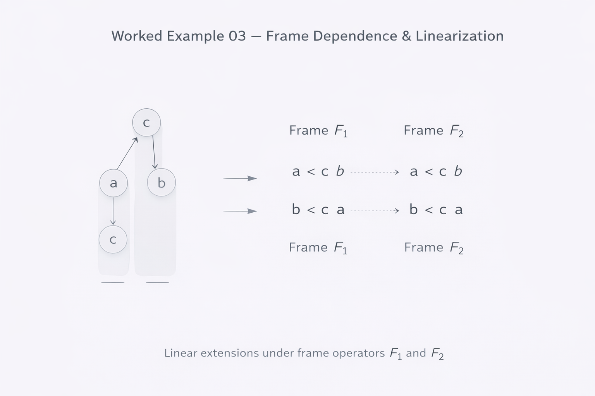

# Worked Example 03 — Frame Dependence & Linearization

---

## 1. Setup

Let \( (Q, \preceq) \) be a finite partially ordered set.

Assume that:

- \(Q\) contains incomparable elements.
- A regime operator \(\Delta\) induces basin structure.
- Multiple admissible linear extensions exist.

We now introduce a frame operator:

\[
F : (Q, \preceq) \rightarrow (Q, \leq_F)
\]

such that:

- \( \leq_F \) is a total order (linear extension)
- If \( x \preceq y \), then \( x \leq_F y \)

---

## 2. Multiple Admissible Frames

Because the original order is partial:

\[
\exists F_1, F_2
\]

such that:

\[
\leq_{F_1} \neq \leq_{F_2}
\]

while both remain admissible linear extensions.

Thus:

- Structural relations remain invariant.
- Readability changes.

---

## 3. Example Situation

Assume two incomparable elements:

\[
a \parallel b
\]

Under Frame \(F_1\):

\[
a < b
\]

Under Frame \(F_2\):

\[
b < a
\]

No structural contradiction arises.

The difference is interpretive, not ontological.

---

## 4. Structural Invariance

The following remain invariant under frame selection:

- Regime basins
- Fixpoints
- Operator semantics
- Closure properties

The following are frame-dependent:

- Linear reading
- Hierarchical interpretation
- Sequential narrative
- Interface presentation

---

## 5. Why This Matters

This example shows:

- Linear order is not intrinsic.
- Orientation is an explicit act.
- Navigation depends on declared frame.
- Interpretation must be distinguished from structure.

This is crucial for:

- Urban modeling
- Decision systems
- Interface architecture
- Multi-perspective analysis

---

## 6. Core Insight

META defines structure.  
ARCHY defines regime dynamics.  
NEXAH defines admissible projection.

Linear readability is produced — not discovered.

---

Status: Frame-dependence validated without structural modification.
