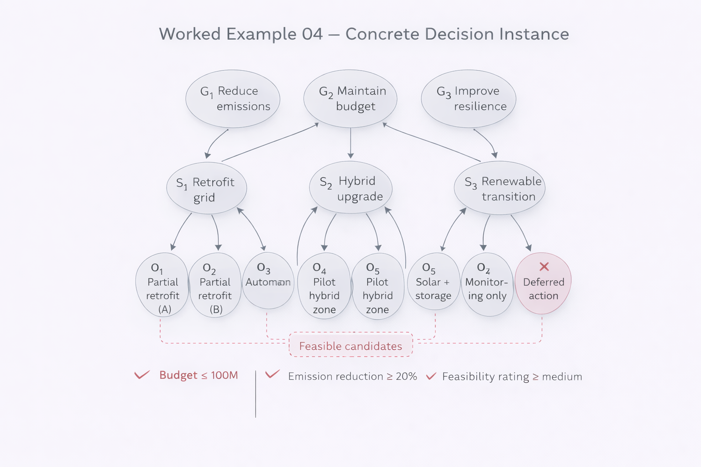

# Worked Example 04 — Concrete Decision Instance

This example instantiates the Decision Architecture model with explicit data.

We remain strictly within finite order theory.

---

## 1. Scenario

A municipality must decide on an energy infrastructure upgrade.

Constraints:

- Budget limit
- Emission reduction target
- Implementation feasibility

---

## 2. Finite Structure (META)

Define:

### Goals

G₁ = Reduce emissions  
G₂ = Maintain budget  
G₃ = Improve resilience  

### Strategies

S₁ = Retrofit existing grid  
S₂ = Hybrid upgrade  
S₃ = Full renewable transition  
S₄ = Minimal maintenance  

### Options

O₁ = Partial retrofit (sector A)  
O₂ = Partial retrofit (sector B)  
O₃ = Grid automation upgrade  
O₄ = Hybrid pilot zone  
O₅ = Solar + storage district  
O₆ = Wind integration  
O₇ = Monitoring only  
O₈ = Deferred action  

---

## 3. Partial Order (⪯)

Define order relation:

Goal ⪯ Strategy ⪯ Option  

Admissibility mapping:

G₁ ⪯ S₂, S₃  
G₂ ⪯ S₁, S₄  
G₃ ⪯ S₂, S₃  

Strategies refine into options:

S₁ ⪯ O₁, O₂  
S₂ ⪯ O₃, O₄  
S₃ ⪯ O₅, O₆  
S₄ ⪯ O₇, O₈  

This defines finite poset Q.

---

## 4. Threshold Operator (τ)

Define regime filter:

- Budget ≤ 100M
- Emission reduction ≥ 20%
- Feasibility rating ≥ medium

Apply τ:

Removed:

- O₆ (too expensive)
- O₈ (fails emission target)

Remaining set Q_R:

O₁, O₂, O₃, O₄, O₅, O₇

---

## 5. Update Operator (Δ)

New information:

Storage costs decrease.

Δ modifies admissibility:

O₅ becomes budget-admissible under S₃.

Thus basin under S₃ expands.

---

## 6. Stabilization (Ω)

Iterate admissibility under τ and Δ until no further changes.

Stable candidate set:

{ O₃, O₄, O₅ }

These satisfy:

- Emission reduction
- Budget constraint
- Feasibility
- Structural admissibility

This is the Ω-fixpoint candidate set.

---

## 7. Frame Selection (NEXAH)

Frame F₁: Cost-priority  
→ O₃ preferred.

Frame F₂: Emission-priority  
→ O₅ preferred.

Structure unchanged.  
Interpretation differs.

---

## 8. Why This Matters

This example demonstrates:

- Finite structural modeling
- Explicit constraint filtering
- Update sensitivity
- Stabilization under iteration
- Frame-dependent interpretation

No simulation.  
No continuous optimization.  
Only explicit operator semantics.

---

Status: Decision architecture structurally instantiated.
