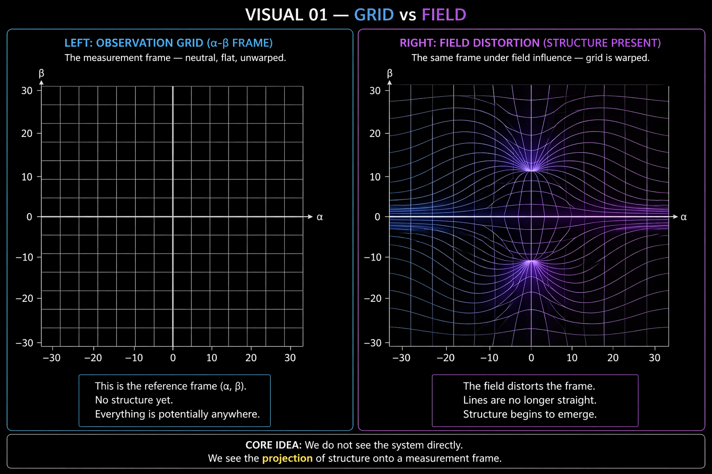
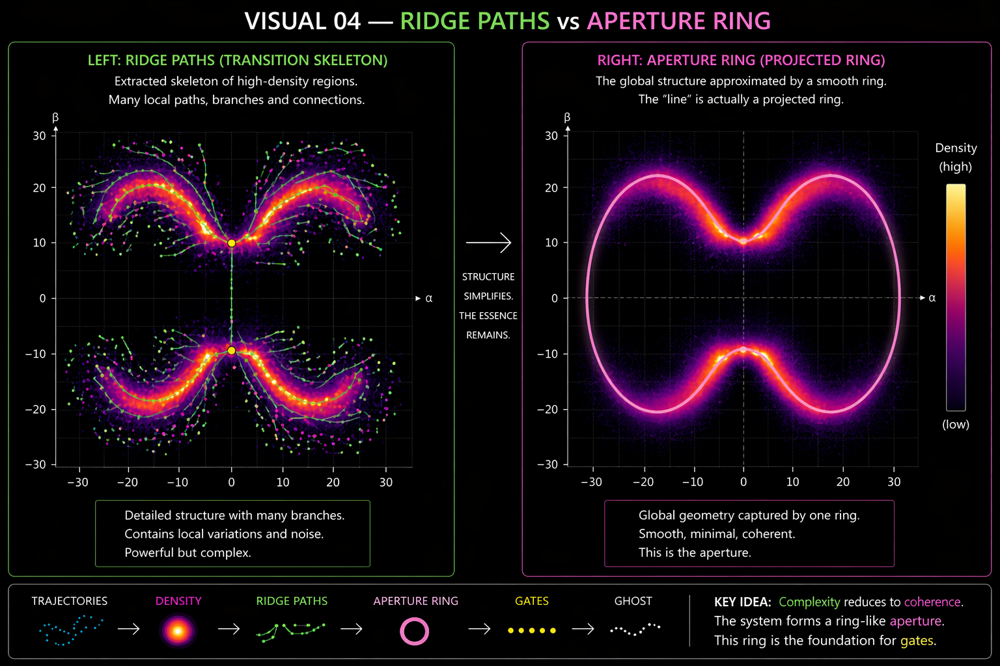
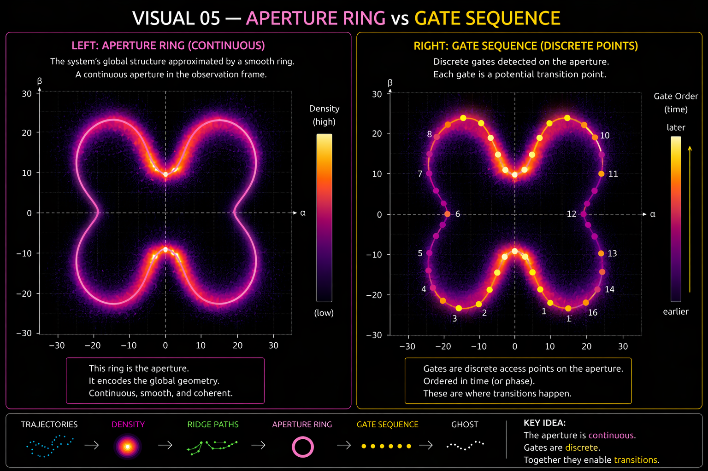

# 🧠 NEXAH — Aperture Geometry System (Exploratory)

This document describes a **visual and structural pipeline**  
for extracting transition structure from dynamical systems.

It is based on empirical observations and visualization methods  
developed during NEXAH experiments.

---

## ⚠️ Scope

This is:

- not a physical theory  
- not a formal mathematical framework  
- not a claim of universality  

It is:

> a **practical visual system** for revealing structure, transitions,  
> and organization in complex dynamics

---

# 🔁 Pipeline Overview

```text
Grid → Density → Ridge → Aperture → Gate → Phase → Transition
```

Each step reveals one layer of the same underlying system.

---

# 🧩 1. Grid vs Field — The Observation Frame



---

# 🧩 2. Trajectory vs Density — Emergence of Structure


---

# 🧩 3. Density vs Ridge Paths — Extracting the Skeleton


---

# 🧩 4. Ridge Paths vs Aperture Ring — Hidden Geometry



---

# 🧩 5. Aperture Ring vs Gate Structure — Transition Locations



---

# 🧩 6. Gate vs Phase Dynamics — Transition Activation

*(Validated in VALIDATION/causality)*

### Idea

- Phase evolves along trajectory:

```text
φ(t),  ω = dφ/dt
```

- Expected phase defines baseline  
- Deviation creates mismatch  

### Key quantity

```text
mismatch = |ω - expected(ω)|
```

### Insight

> Geometry defines where transitions can occur  
> Phase defines when they occur

---

# 🧩 7. Full Structure vs Ghost Snake — Minimal Representation


---

# 🧩 8. The NEXAH Lens — Multi-Perspective View


---

# 🧠 Core Principle

```text
What looks like a line → may be a projected ring
What looks like a channel → may be an aperture
What looks like a point → may be a gate

What looks like a transition trigger →
is a phase mismatch event
```

---

# 🔬 Interpretation (Updated)

```text
trajectory → density → structure → geometry → phase → mismatch → transition
```

---

# 🔬 Key Insight (Updated)

> Structure defines where transitions can occur.  
> Phase dynamics determine when they occur.

---

# 🚧 Limitations

- based on specific systems (e.g. Lorenz-like)  
- dependent on projection  
- partially heuristic  
- phase model currently empirical  

---

# 🔗 Relation to Other Research Modules

## → field_model.md

Interprets systems as **fields of transitions**

## → theory_to_field_mapping.md

Maps structure to operators (Γ, Δ, Ω)

## → ../VALIDATION/causality/

Provides empirical evidence for:

- phase mismatch  
- control alignment  
- transition triggering  

---

# 🚀 Role in NEXAH

### DISCOVERY ENGINE
- structure extraction  
- gate detection  

### FIELD_LAYER
- geometric representation  
- phase-aware interpretation  

### NAVIGATION
- movement between regimes  
- control via phase alignment  

---

# 🧭 Summary

The Aperture Geometry System is:

- a **visual pipeline**
- a **structure extraction method**
- a **geometry + phase integration layer**

---

## Status

Exploratory  
Visually validated  
Causally extended (phase layer)  

---

**NEXAH Research Layer**  
From dynamics → to structure → to phase → to transition
