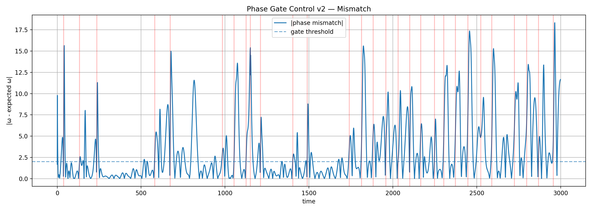

# 🧠 NEXAH — Aperture Geometry System

> Exploratory structural pipeline for revealing transition corridors, gates, shells and navigation geometry in nonlinear dynamical systems.

Status:  

`Exploratory / Empirically Supported / Linked to JANUS_OPERATOR`

---

# 🧭 Purpose

This document describes the Aperture Geometry layer inside NEXAH.

It explains how dynamical systems can be analyzed as:

```text

trajectory

→ density

→ field

→ instability

→ gate

→ phase mismatch

→ transition

→ navigation

```

The central idea is:

```text

transitions do not occur everywhere equally.

They appear to concentrate inside

structured geometric corridors,

apertures and gate regions.

```

---

# ⚠️ Scope

This is:

- not a physical law

- not a completed mathematical theory

- not a universal claim

It is:

```text

a practical geometry layer

for detecting and interpreting

transition structure in complex dynamics.

```

---

# 🔁 Pipeline Overview

```text

Trajectory

→ Density

→ Field Structure

→ Instability Geometry

→ Gate / Aperture

→ Phase Mismatch

→ Transition

→ Navigation / Control

```

---

# 🧩 1. Trajectory vs Density — Emergence of Structure


Individual trajectories may appear chaotic.

But aggregated motion reveals:

- density basins

- preferred regions

- repeated corridors

- non-uniform occupation

```text

Structure does not appear clearly in one path.

It appears through collective motion.

```

---

# 🧩 2. Density vs Structure — Extracting the Skeleton


Density shows where the system spends time.

Structural fields show how the system moves.

```text

Density tells us where.

Structure tells us how.

```

---

# 🧩 3. Field Geometry — Hidden Transition Structure


The reconstructed field reveals that motion is not diffuse.

It organizes into:

- corridors

- shells

- gradients

- transition lanes

- compressed exchange regions

```text

Observed channels reflect deeper geometric structure.

```

---

# 🧩 4. Gate Regions — Localized Transition Points


Gate regions are localized areas where transition probability rises.

They behave like:

- structural bottlenecks

- transition apertures

- instability corridors

- routing points between regimes

```text

Transitions occur at specific structural locations,

not randomly across the whole field.

```

---

# 🧩 5. Phase Mismatch — Activation Timing


Aperture geometry helps identify where transitions can occur.

Phase mismatch helps identify when they activate.

Key quantity:

```text

mismatch = |ω - smooth(ω)|

```

Interpretation:

```text

Geometry defines possible transition access.

Phase mismatch triggers actual transition activation.

```

---

# 🧩 6. Phase-Gated Control — Sparse Activation




Control should not be continuous.

The experiments suggest that effective intervention is:

- sparse

- phase-aware

- gate-localized

- cooldown-limited

- state-dependent

```text

Control succeeds when intervention is aligned

with intrinsic phase and gate geometry.

```

---

# 🧩 7. Multi-System Structure — Consistency


Different systems show related transition structures.

This suggests that aperture geometry may describe a broader class of transition behavior.

Current tested systems include:

- Lorenz

- Rössler

- Halvorsen

- Kuramoto

- fractal systems

- control validation runs

```text

The geometry is not merely equation-specific.

It appears as a reusable transition-analysis layer.

```

---

# 🌀 JANUS Extension — Orientation Bias Geometry

Recent JANUS Operator experiments extend

the aperture geometry framework from

localized transition detection toward

directionally organized transition geometry.

Observed structures include:

- transition spines

- shell crossing layers

- recursive quadrants

- basin transfer gates

- orientation bias manifolds

- coherence corridors

These structures suggest that transitions

are not purely local instability events,

but occur along organized geometric pathways.

The JANUS Operator measures local coherence

between forward and backward flow structure,

revealing preferred transition directions

and transport asymmetries.

---

# 🪞 Relation to JANUS_OPERATOR

The JANUS_OPERATOR module extends aperture geometry by asking:

```text

Do transition gates correspond to

localized breakdowns of directional coherence?

```

JANUS compares:

```text

forward local flow

↔ backward local flow

```

and studies whether transitions appear where this local directional coherence weakens.

See:

```text

JANUS_OPERATOR/

JANUS_OPERATOR/README.md

JANUS_OPERATOR/janus_operator_foundations.md

JANUS_OPERATOR/janus_geometry.md

JANUS_OPERATOR/janus_vs_transition_gates.md

JANUS_OPERATOR/findings.md

```

---

# 🔷 Aperture Geometry vs JANUS Geometry

| Layer | Question | Output |

|---|---|---|

| Aperture Geometry | Where can transitions occur? | gates, corridors, shells |

| Phase Mismatch | When do transitions activate? | mismatch peaks |

| JANUS Geometry | How does directional coherence break? | forward/backward asymmetry |

| Navigation Layer | How can systems move through gates? | routing, prediction, steering |

Together:

```text

Aperture Geometry detects transition access.

JANUS explains directional coherence breakdown.

Navigation uses this structure for routing.

```

---

# 🔥 Updated Core Principle

```text

Geometry defines where transitions can occur.

Phase mismatch defines when they activate.

JANUS coherence reveals how directional structure destabilizes.

Navigation uses these structures to predict or steer transitions.

```

---

# 🌌 Current Structural Picture

The current NEXAH/JANUS experiments suggest repeated motifs:

- shells

- spines

- apertures

- transition corridors

- coherence gates

- directional bottlenecks

- basin-transfer nodes

- recursive phase quadrants

- predictive routing paths

- steerable transition structures

The emerging interpretation is:

```text

transition dynamics are not fully diffuse.

They appear to organize through

structured geometric infrastructure.

```

---

# 🚧 Limitations

Current limitations:

- still exploratory

- projection-dependent

- not yet formalized as a theorem

- validation is empirical

- system coverage is growing but incomplete

- quantitative comparison to established methods remains necessary

NEXAH does not yet claim:

```text

universality

new physics

complete predictability

formal transition laws

```

---

# 🔗 Relation to Other Research Modules

## → field_model.md

Systems as structured dynamical fields.

## → structure_quantities.md

Core measurable quantities.

## → theory_to_field_mapping.md

Mapping operators to field geometry.

## → JANUS_OPERATOR/

Directional coherence, transition gates and navigation geometry.

## → ../VALIDATION/

Empirical validation layer.

## → ../VALIDATION/causality/

Phase-gated intervention and causal control tests.

---

# 🚀 Role in NEXAH

## DISCOVERY ENGINE

- structure extraction

- gate detection

- aperture localization

## FIELD LAYER

- geometric representation

- shell/corridor mapping

- transition-field reconstruction

## JANUS LAYER

- forward/backward coherence comparison

- directional asymmetry detection

- transition-gate interpretation

## NAVIGATION LAYER

- regime movement

- routing prediction

- sparse intervention

- controlled steering

---

# 🧭 Summary

The Aperture Geometry System is:

```text

a transition-structure detection layer

inside NEXAH.

```

It connects:

```text

dynamics

→ geometry

→ gates

→ phase activation

→ directional coherence

→ navigation

```

Its current role is to make hidden transition organization visible.

---

## Status

Exploratory  

Empirically supported  

Causally extended  

Transition-geometry linked  

JANUS-extended

---

**NEXAH Research Layer**  

From dynamics → to structure → to aperture → to transition → to navigation
