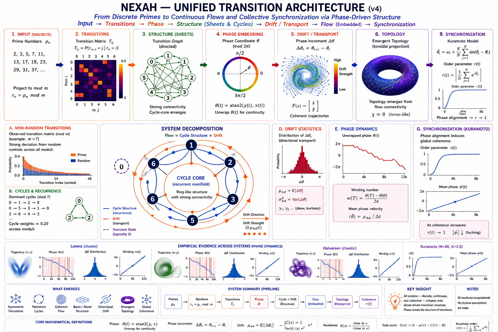

# 🧠 NEXAH — Core Concept Map

NEXAH investigates how structure emerges from dynamics,
how transitions become geometrically organized,
and how navigation becomes possible inside nonlinear systems.

This document integrates the major conceptual layers
of the NEXAH research framework
into a unified operational system view.

---

# 🌌 Core Research Perspective

NEXAH does not interpret systems
as isolated sequences of states.

Instead, it studies motion inside structured dynamical geometry:

```text
dynamics
→ flow
→ structure
→ coherence
→ transitions
→ transport geometry
→ connectivity
→ topology
→ navigation
```

---

# 🌊 Structural Navigation Perspective


This visualization summarizes the current operational perspective of NEXAH:

- density structure
- coherence fields
- transport corridors
- gates and apertures
- directional flow
- admissible movement
- navigable trajectories
- emergent topology

It represents the transition from:

```text
raw dynamics
→ structured geometry
→ navigable topology
```

---

# 🔷 Unified Transition Architecture



This diagram summarizes the larger NEXAH transition architecture.

It illustrates:

- how dynamics generate structure
- how coherence emerges
- how transitions localize
- how phase organizes activation
- how topology emerges through connectivity
- how navigation becomes possible

---

# 🪞 JANUS Transition Geometry Layer


The JANUS layer introduces:

- directional coherence
- forward/backward flow compatibility
- aperture geometry
- shell crossings
- recursive transition organization
- orientation bias structure

This currently represents
the deepest geometric reconstruction layer
inside the NEXAH framework.

---

# 🔷 Unified Structural Pipeline

The current NEXAH framework operates approximately through:

```text
Dynamics
↓
Flow Reconstruction
↓
Density Structure
↓
Coherence
↓
Transition Geometry
↓
Phase Dynamics
↓
Directional Organization
↓
Connectivity
↓
Emergent Topology
↓
Navigation
```

---

# 🔷 Core Concept Stack

The NEXAH framework consists of interacting conceptual layers.

---

# 1. 🌀 Field (Structure from Dynamics)

→ `CORE_CONCEPTS/field_model.md`

> Structure emerges directly from dynamical motion.

---

## Core Ideas

- trajectories → density → flow
- aggregation produces geometry
- fields encode motion tendencies
- coherent motion generates structure
- geometry emerges from repeated dynamics

---

## Interpretation

```text
system = trajectory moving
inside structured flow geometry
```

---

# 2. 🧪 Vessel (Containment & Persistence)

→ `CORE_CONCEPTS/vessel_geometry.md`

> Structure persists only where motion remains contained.

---

## Core Ideas

- boundaries define viable regions
- interfaces enable transitions
- containment enables recurrence
- persistence enables topology
- capacity limits complexity

---

## Interpretation

```text
field defines possibility

vessel defines persistent structure
```

---

# 3. 🔁 Multi-Layer Interaction (Composite Dynamics)

→ `CORE_CONCEPTS/multi_layer_interaction.md`

> Complex behavior may emerge from interacting dynamical layers.

---

## Core Ideas

- regimes interact
- layers exchange structure
- phase-shifted responses emerge
- delayed interactions appear
- global behavior emerges from coupling

---

## Interpretation

```text
system = interacting structural processes
```

---

# 4. 🧩 Aperture & Transition Geometry

→ `CORE_CONCEPTS/aperture_geometry.md`

> Transitions emerge through structured geometric corridors.

---

## Transition Structure

```text
density
→ ridge
→ aperture
→ gate
→ transport corridor
```

---

## Observed Transition Features

Transitions localize in regions of:

- low density
- low coherence
- competing directional flow
- instability concentration
- directional asymmetry

---

## Interpretation

```text
transitions are geometry-constrained motion
```

---


---

# 🔁 Geometry → Activation

NEXAH currently separates:

---

## Geometry

defines:

```text
where transitions are possible
```

---

## Phase Dynamics

defines:

```text
when transitions activate
```

---

# 🧪 Parameter-Driven Transition Activation

Transitions may also emerge
through parameter-space motion.

Observed in fractal systems:

```text
c(t)
→ structural evolution
→ observable Δ
→ transition activation
```

Empirical relation:

```text
Δ(t) ≈ M(t)
```

with:

```text
P(\text{transition})
=
f(\Delta,\text{context})
```

where:

- $\Delta$ = local structural change
- context = global parameter-space geometry

---

## Interpretation

```text
geometry constrains transitions

mismatch activates them
```

---

# 5. 🧭 Phase Dynamics & Mismatch

→ `CORE_CONCEPTS/equations.md`

> Transitions correlate with breakdown of phase consistency.

---

## Core Variables

| Variable | Meaning |
|---|---|
| φ | phase |
| ω | phase velocity |
| ω̂ | expected phase velocity |
| M | phase mismatch |
| I | instability |

---

## Operational Mechanism

```text
φ → ω → ω̂ → M → transition
```

---

## Core Observation

Transitions occur when:

```text
phase mismatch >> 0
```

NOT necessarily when instability is maximal.

---

## Observed Transition Features

Transition events exhibit:

- angular organization
- directional asymmetry
- winding behavior
- coherent drift
- recursive phase structure

Dominant empirical modes:

```text
[4, 32, 34, 2, 0]
```

---

## Interpretation

```text
transitions emerge from
loss of coherent phase organization
```

---

# 🪞 6. JANUS Directional Geometry

→ `CORE_CONCEPTS/JANUS_OPERATOR/`

> Directional coherence appears geometrically structured.

---

## Core JANUS Concepts

- forward/backward transport overlap
- aperture activation
- shell crossings
- recursive orientation geometry
- transport manifolds
- orientation bias fields

---

## Core Hypothesis

```text
transitions correlate with
breakdown of directional coherence
```

rather than purely stochastic switching.

---

## Emerging Geometry

Observed structures include:

- transport spines
- recursive gates
- aperture roots
- orientation manifolds
- directional attractors

---

## Orientation Bias Geometry

Recent exploratory findings suggest:

```text
flow may align along preferred directional roots
```

including recurring attractor-like orientation axes.

---

# 🌌 Winding & Emergent Topology

Observed across multiple systems:

```text
local drift
→ accumulated winding
→ emergent topology
```

Persistent winding appears associated with:

- cyclic organization
- long-term coherence
- directional asymmetry
- transport persistence

---

## Core Principle

```text
topology emerges
from accumulated structured motion
```

---

# 🔷 Emergent Topology & Connectivity

→ `FOUNDATION/topology_structure.md`


NEXAH interprets topology
as an emergent consequence
of structured connectivity.

Topology appears to arise from:

- coherent transport
- transition connectivity
- admissible motion paths
- recursive organization
- directional persistence

---

## Interpretation

```text
topology is a property
of allowed motion
inside structured geometry
```

---

# 🔬 Fractal Transition Validation

→ `VALIDATION/fractal_tests/`

Fractal transition experiments demonstrated:

- localized transition regions
- structured bifurcation corridors
- parameter-dependent activation
- non-random transition organization

Observed relation:

```text
P(\text{transition})
=
f(\Delta,\text{distance})
```

---

## Key Observation

```text
local instability alone
is insufficient
```

Transitions depend on:

```text
local structure
+
global geometric context
```

---

# 7. 🔗 Structural Operators (Theory → Field Mapping)

→ `CORE_CONCEPTS/theory_to_field_mapping.md`

Minimal operators formalize observed structure.

---

## Core Operators

| Operator | Meaning |
|---|---|
| Γ | closure / basin structure |
| Δ | transition activation |
| Ω | stabilization / convergence |

---

## Interpretation

```text
operators
→ geometry
→ fields
→ transitions
→ behavior
```

---

# 🔁 Unified System Flow

```text
Dynamics
↓
Field
↓
Structure
↓
Coherence
↓
Transition Geometry
↓
Directional Organization
↓
Connectivity
↓
Topology
↓
Navigation
```

---

# 🔬 Stability & Transition (Unified View)

---

## Stability

Associated with:

- coherent directional flow
- high-density organization
- containment persistence
- phase consistency
- transport alignment

---

## Instability

Associated with:

- directional conflict
- coherence weakening
- low-density corridors
- mismatch accumulation
- competing transport directions

---

## Transition

Associated with:

- aperture activation
- shell crossings
- mismatch peaks
- directional asymmetry
- movement across structural boundaries

---


---

# 🧭 Navigation Perspective

NEXAH does not interpret control
as external forcing alone.

Control is increasingly interpreted as:

- structural alignment
- geometry-aware intervention
- directional steering
- mismatch suppression
- admissible transport navigation

---

# 🧠 Central Principle

> Systems are not defined
> by isolated states,
> but by the structured geometry
> constraining their motion.

---

# 🔗 Relation to System Architecture

```text
RESEARCH
↓
DISCOVERY ENGINE
↓
FIELD LAYER
↓
TRANSITION GEOMETRY
↓
TOPOLOGY
↓
NAVIGATION
```

---

# ⚠️ Scope

NEXAH is currently:

```text
empirical
semi-formal
geometry-oriented
navigation-centered
transition-focused
```

It is NOT yet:

- a finalized mathematical theory
- universally validated
- analytically closed
- formally complete

---

# 🚀 Role in NEXAH

This document serves as:

- conceptual integration layer
- navigation map across modules
- bridge between theory and implementation
- structural overview of the research stack

---

# 🔥 Core Structural Insight

```text
dynamics generate structure

structure generates coherence

loss of coherence generates transitions

transitions generate connectivity

connectivity generates topology

topology enables navigation
```

---

# 🌌 Current Interpretation

```text
systems do not evolve randomly.

they move through structured geometry,
lose coherence,
cross transition corridors,
and reorganize into new dynamical regimes.
```

---

# 🧭 Final Perspective

NEXAH currently explores whether nonlinear systems possess:

- structured transport geometry
- coherence-driven organization
- directional transition structure
- navigable topology

that can be reconstructed empirically
from observed dynamics.

---

**NEXAH — Core Concept Map**  
Transition Geometry · Coherence · Directional Structure · Navigation  
Thomas K. R. Hofmann · 2026
