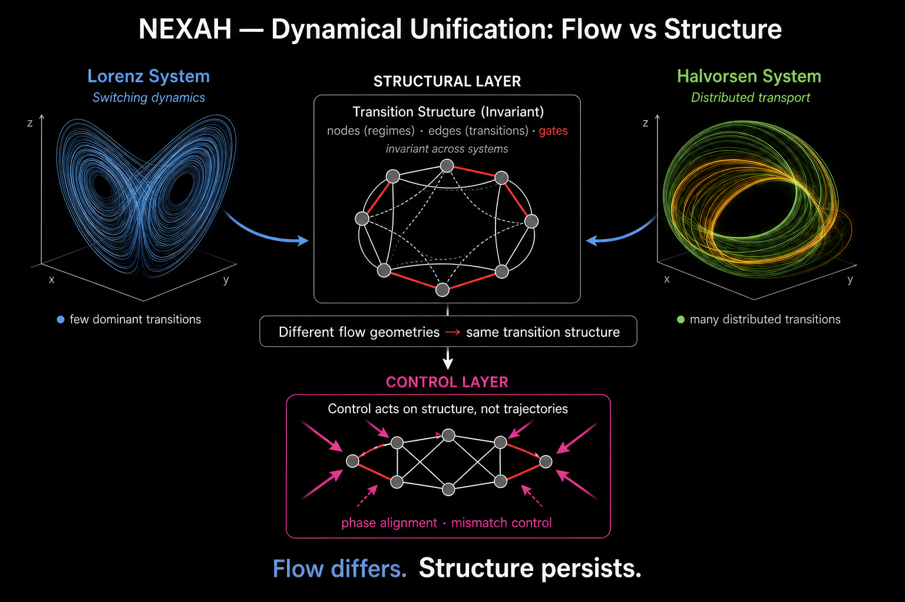
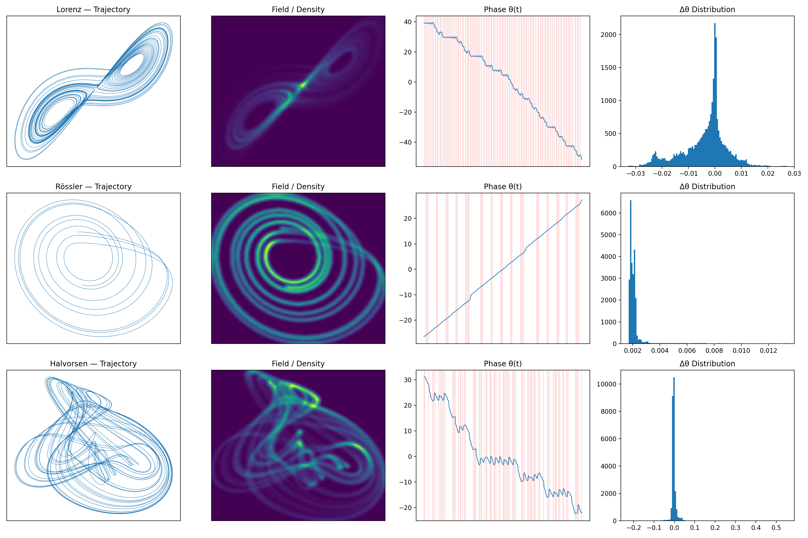

# ⚡ NEXAH — Findings (Overview)

This section summarizes the **core empirical findings** of the NEXAH framework.

It provides a **high-level entry point** into the structural behavior observed  
in dynamical systems.

---

## ⚠️ Scope

This document is a **summary**, not the full result set.

For structured findings at different levels:

→ [core_findings.md](./core_findings.md)  
→ [dynamical_unification.md](./dynamical_unification.md)  
→ [TRANSITION_PHASE_DYNAMICS/](./TRANSITION_PHASE_DYNAMICS/)  
→ [../NEXAH_CORE/findings.md](../../NEXAH_CORE/findings.md)

---

# 🧠 Core Idea

NEXAH shows that:

> complex dynamical systems can be reconstructed as  
> **structured fields with geometry, flow, and convergence behavior**

This enables a shift from:

- state-based analysis  
- threshold-based control  

to:

> **trajectory-aware navigation within a structured field**

---

# 🔷 Cross-System Insight (NEW)

A key result of recent experiments:

→ [dynamical_unification.md](./dynamical_unification.md)

Different systems (Lorenz, Halvorsen) exhibit different flow geometries,  
but share the same transition structure.

---

# 🔷 Discrete System Insight (NEW)

A complementary result extends this perspective beyond continuous systems:

→ [PRIME_MODULAR_RESONANCE/](./PRIME_MODULAR_RESONANCE/)

Prime residue sequences (mod m) generate:

- non-uniform transition structure  
- emergent phase dynamics  
- persistent rotational behavior  
- directional drift across states  

Key observation:

> Even purely discrete systems induce **continuous-like structure, flow, and topology**  
> when interpreted through transition dynamics.

---

# 🔷 Phase Dynamics Insight (NEW)

→ [TRANSITION_PHASE_DYNAMICS/](./TRANSITION_PHASE_DYNAMICS/)

A new layer introduces **phase as a structural coordinate** across systems.

Defined as:

θ(t) = atan2(y, x)

Observed in:

- Lorenz  
- Rössler  
- Halvorsen  
- Kuramoto  

We observe:

- continuous phase evolution  
- directional drift (Δθ ≠ 0)  
- winding accumulation  
- plateau regions (low phase velocity)  
- structured Δθ distributions  

---

## 🧭 Structural Role of Phase

Phase reveals hidden structure:

- phase = **local coordinate on the structure**
- drift = **directional transport**
- winding = **global topology**
- plateaus = **transition slow zones (gate candidates)**

---

## 🔬 Key Observation

> Phase structure emerges independently of system type.

Now observed in:

- continuous systems  
- discrete systems  
- collective systems (Kuramoto synchronization)

---

## 🧭 Structural Implication

This extends the NEXAH hypothesis:

Structure is not dependent on the underlying system type.

It emerges from transition dynamics.

Now observed in:

- continuous dynamical systems (Lorenz, Halvorsen, power grids)  
- discrete systems (prime modular transitions)  
- collective synchronization systems (Kuramoto)

---

# 🧭 Structural Unification (Visual Summary)

**Interpretation:**

- Flow geometry differs across systems  
- Transition structure remains invariant  
- Control operates on structure, not trajectories  

---

# 🔁 Phase Structure (Cross-System View)

**Interpretation:**

- phase evolves smoothly even in chaotic systems  
- drift direction persists  
- plateau regions mark slow transition zones  
- Δθ is structured, not random  

---

# 🔬 What was observed

Across multiple systems (continuous + discrete):

- transitions are **not discrete events**, but structured processes  
- transition regions form **geometric channels**  
- continuous dynamics collapse into **discrete state structures**  
- discrete systems generate **continuous-like flow behavior**  
- system motion follows an **implicit structural constraint**  
- systems converge toward **stable structural configurations**  
- phase evolves with **drift, winding, and plateau structure**  
- synchronization emerges as **phase alignment (Kuramoto)**  

---

# 🚀 Why this matters

This changes how complex systems can be understood and controlled.

Instead of:

- detecting failure  
- reacting to instability  

NEXAH enables:

> understanding where the system is  
> and **steering how it moves**

---

# 🧭 Core Perspective

Classical question:

→ *Is the system stable?*

NEXAH asks:

> **Where is the system in its structure — and where is it going?**

---

# 🔗 Visual Example (Real System)

This is a trajectory from a real IEEE power grid model.

NEXAH reconstructs the local field structure, revealing:

- transition regions  
- directional flow  
- stability constraints  

---

# 🧠 Key Insight

> Complex systems are not random.  
>  
> They evolve within **structured dynamical fields**  
> that constrain motion, transitions, and outcomes.

---

# 🔬 Next Steps

### Core empirical findings  
→ [core_findings.md](./core_findings.md)

### Cross-system structure (Lorenz ↔ Halvorsen)  
→ [dynamical_unification.md](./dynamical_unification.md)

### Phase dynamics layer  
→ [TRANSITION_PHASE_DYNAMICS/](./TRANSITION_PHASE_DYNAMICS/)

### Discrete transition systems (prime modular resonance)  
→ [PRIME_MODULAR_RESONANCE/](./PRIME_MODULAR_RESONANCE/)

### Full system architecture / kernel  
→ [../../NEXAH_CORE/findings.md](../../NEXAH_CORE/findings.md)

---

**Status:** Summary  
**Role:** Entry point to empirical findings  
