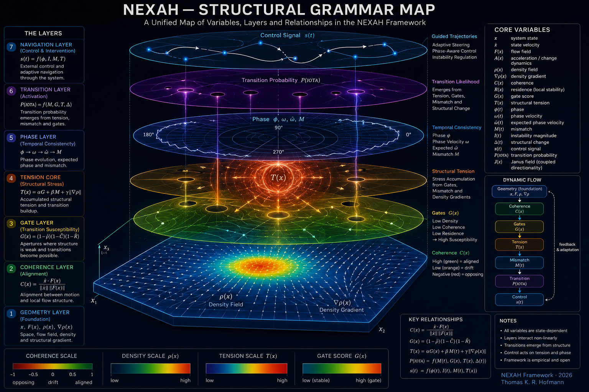

# 🔬 NEXAH — FOUNDATION Layer

NEXAH studies how structure emerges from dynamics,
how transitions form,
and how navigation becomes possible inside structured fields.

This directory contains the current foundational layer of the NEXAH framework.

## Current framework note

**[Evidence-Bound Orientation over Heterogeneous State–Transition Systems —
Mathematical Framework Note v0.1](STATE_TRANSITION_ORIENTATION_FRAMEWORK_V0_1.md)**
defines candidate objects for representation-indexed states, typed transitions,
paths, boundaries, evidence, uncertainty, representation maps, and contextual
orientation.

The note is non-normative. It does not claim mathematical novelty, a universal
geometry, or approved kernel contracts. Its corresponding static repository
assessment is the
**[State–Transition–Orientation Architecture Review](../../ARCHITECTURE/orientation_layer/STATE_TRANSITION_ORIENTATION_REVIEW.md)**.

It defines:

- the structural variable system  
- geometric assumptions  
- transition mechanisms  
- navigation principles  
- emergent topology  
- empirical operational structure  

---

# 🧭 Foundation Overview


---

## 🧠 Core Principle

NEXAH does not treat systems as isolated equations.

Instead, it studies:

```text
motion
→ structure
→ coherence
→ transitions
→ navigation
```

The framework explores how dynamical systems generate:

- coherent regions  
- transition corridors  
- structural gates  
- navigable manifolds  
- directional constraints  

---

# 🔤 Structural Grammar

The NEXAH variable system defines the operational grammar
used across all modules.

Core quantities include:

| Variable | Meaning |
|---|---|
| $x$ | system state |
| $F(x)$ | flow field |
| $\rho(x)$ | structural density |
| $\nabla \rho(x)$ | structural drift |
| $C(x)$ | coherence |
| $G(x)$ | gate susceptibility |
| $M(t)$ | mismatch |
| $T(x)$ | transition tension |
| $s(t)$ | navigation / control |

---



---

## 📘 Reference

See:

```text
core_variable_map.md
```

for the full operational variable system.

---

# 🧭 Axiomatic Layer

The axioms define the minimal structural assumptions of NEXAH.

They describe:

- field-based evolution  
- coherent motion  
- gate formation  
- transition geometry  
- controllability  

---

## Core Perspective

```text
Systems move within structured fields.

Transitions occur when coherence weakens
and trajectories enter low-density interface regions.
```

---

## 📘 Reference

See:

```text
axioms.md
```

---

# 🔷 Structural Theorems

The structural theorems formalize the current operational propositions of NEXAH.

They describe:

- coherence stability  
- transition regions  
- gate intersections  
- density-driven structure  
- navigation dynamics  
- field-aligned control  

---

## Key Idea

```text
Stability emerges from coherent motion within structured geometry.

Transitions emerge from structural misalignment.
```

---

## 📘 Reference

See:

```text
structural_theorems.md
```

---

# 🌌 Emergent Topology

NEXAH treats topology as an emergent property of structured motion.

Topology is not imposed externally.

It arises from:

- sheet connectivity  
- transition structure  
- flow organization  
- navigation constraints  

---

## Core Principle

```text
Topology emerges from how systems are allowed to move.
```

---

## 📘 Reference

See:

```text
topology_structure.md
```

---

# 🧪 Empirical Validation

The framework has been tested across multiple systems and operational layers.

Current experiments include:

- Lorenz systems  
- Rössler systems  
- Duffing systems  
- IEEE-inspired navigation experiments  
- gate detection  
- mismatch analysis  
- transition geometry  
- navigation fields  

---

# 🧭 System Atlas


---

## Validation Focus

The current validation stack explores:

```text
dynamics
→ density structure
→ coherence
→ transition fields
→ navigation behavior
→ control interaction
```

---

# 🔥 Current Insight

The present NEXAH framework suggests:

```text
Dynamics generate structure.

Structure generates constraints.

Constraints generate transitions.

Transitions generate navigable geometry.
```

---

# 🧠 Operational Perspective

NEXAH is currently:

```text
empirical
semi-formal
geometry-oriented
navigation-centered
```

It is NOT yet:

- a complete mathematical theory  
- a universal physical model  
- a formally proven framework  

---

# 🧭 Repository Structure

```text
FOUNDATION/
│
├── README.md
├── core_variable_map.md
├── axioms.md
├── structural_theorems.md
├── topology_structure.md
│
├── visuals/
│   ├── interactive_navigation_map.png
│   ├── NEXAH_STRUCTURAL_GRAMMAR_MAP.png
│   ├── NEXAH_SYSTEM_ATLAS.png
│   └── ...
│
└── scripts/
```

---

# 🔬 Status

```diff
+ Structural grammar established
+ Transition geometry operational
+ Navigation layer implemented
+ Visual semantics consolidated
+ Cross-system consistency observed
- Formal mathematical closure incomplete
```

---

# 🔥 Final Perspective

```text
NEXAH studies how systems become structurally navigable.

The framework does not seek to suppress dynamics.

It seeks to understand how motion organizes itself
into coherent geometry, transitions, and admissible paths.
```

---

**NEXAH — FOUNDATION Layer**  
Thomas K. R. Hofmann · 2026
