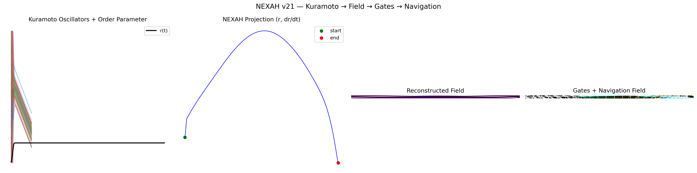
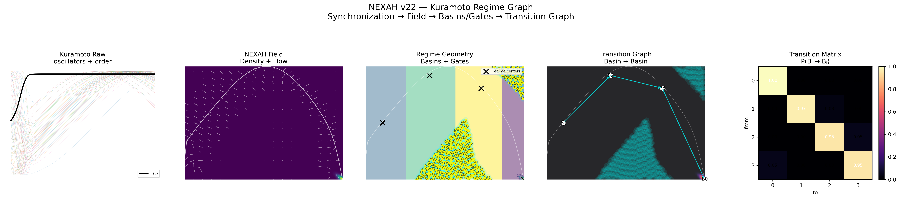

# 🖼️ NEXAH — Visual Discovery Log (v1–v25)

This gallery is not a collection of images.

It is a **record of discovery**:

```text
how structure was extracted from dynamics
```

---

# 🧭 Core Pipeline

```text
Dynamics → Density → Structure → Gates → Navigation → Control
```

---

# 🔥 KEY INNOVATIONS (READ FIRST)

## 1. Gate is NOT a threshold

```text
Gate =
low density
+ low coherence
+ rotation breakdown
```

---

## 2. π → Rotation Principle

```text
Stable systems → coherent rotation  
Transitions → rotation collapse
```

---

## 3. Slice ≠ Structure

```text
2D channel = projection of higher-dimensional geometry
```

---

## 4. Cross-System Invariance

```text
Lorenz, Kuramoto, Rössler → same geometry
```

---

## 5. Navigation is structural

```text
Not shortest path → structure-following motion
```

---

# 🧩 PHASE 1 — Field Emergence (v1–v4)


```text
Discovery:
structure emerges from density, not equations
```

---

# 🧩 PHASE 2 — Structure & Pathways (v5–v9)


```text
Discovery:
systems form navigable pathways (ridges)
```

---

# 🧩 PHASE 3 — Transition Geometry (v10–v12)


```text
Discovery:
transitions are regions, not points
```

---

# 🧩 PHASE 4 — Navigation (v13–v20)


```text
Discovery:
navigation = alignment with structure
```

### 🔥 Highlight: Janus Field

```text
Forward + backward flow simultaneously
→ bidirectional stability awareness
```

---

# 🧩 PHASE 5 — Slice Problem (v15–v17)


```text
Discovery:
channels are projections of higher-dimensional objects
```

---

# 🧩 PHASE 6 — Cross-System (v21–v23)





```text
Discovery:
structure persists across fundamentally different systems
```

---

# 🧩 PHASE 7 — Rotation Field (v24)


```text
Discovery:
rotation encodes stability
```

---

# 🧩 PHASE 8 — Unified Gate Operator (v25)


```text
G(s) = (1-ρ)(1-C)(1-R)
```

```text
Discovery:
gates emerge from combined structural weakness
```

---

# 🧠 FINAL INSIGHT

```text
Systems do not randomly evolve.

They move through structured fields,
lose coherence,
and transition through geometry.
```

---

# 📌 Notes

- Not a final theory  
- Empirical + structural  
- Cross-system consistent  

---

# 🚀 Next

→ `docs/gate_operator.md`  
→ Navigation kernel  
→ formalization
