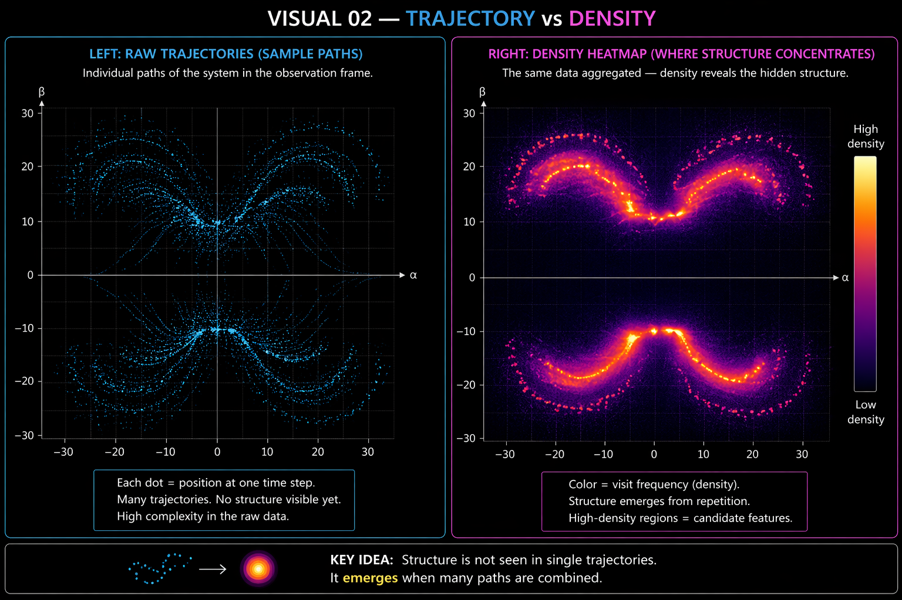
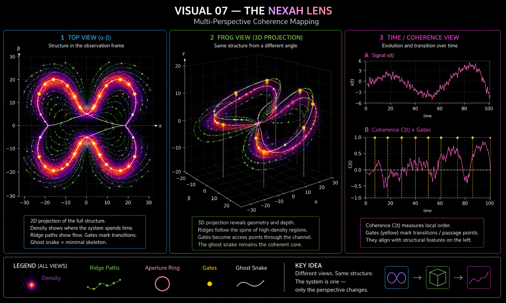
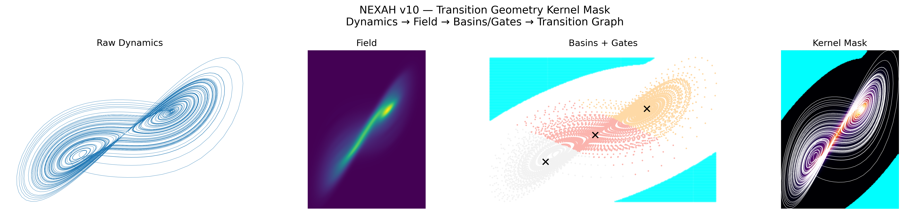
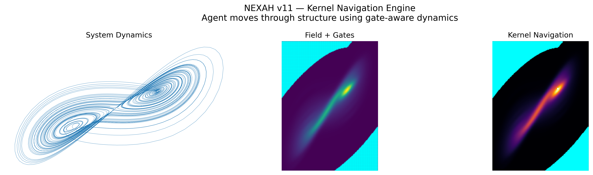
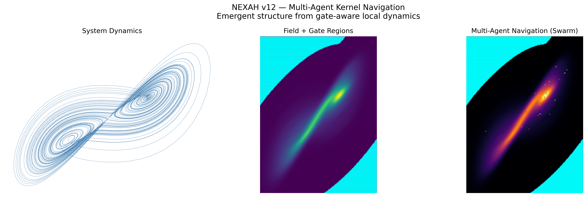
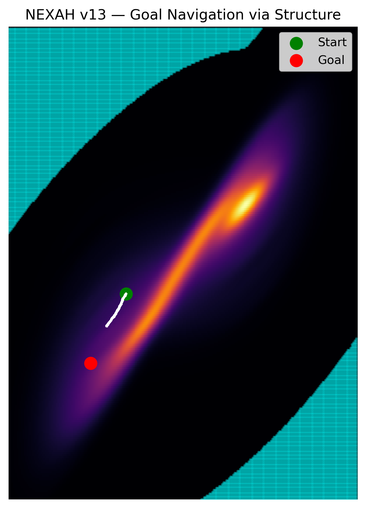
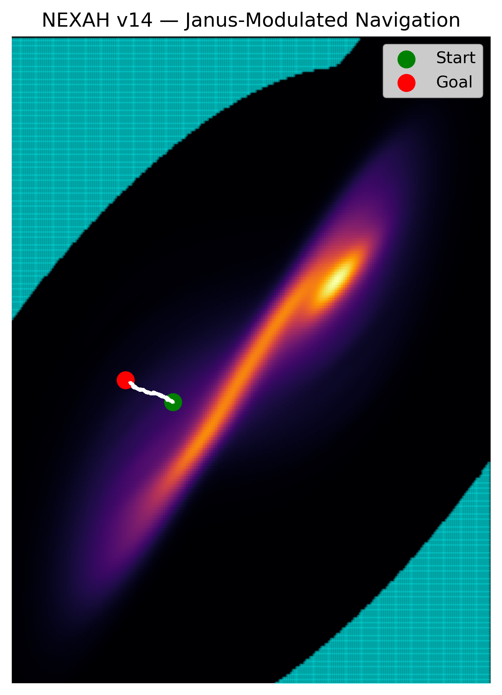
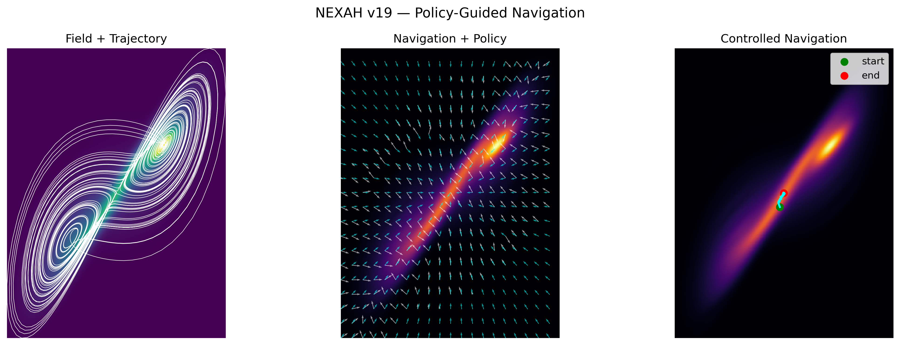

# 🖼️ NEXAH — Visual Discovery Gallery

This gallery documents the **progression of structure discovery** in NEXAH.

It is not just a collection of images.

It is a **step-by-step emergence of a structural model**:

```text
dynamics → structure → geometry → transitions → navigation
```

---

# 🧭 Reading Guide

The visuals are grouped into conceptual stages:

1. Field emergence  
2. Structure extraction  
3. Transition geometry  
4. Navigation  
5. Cross-system validation  
6. Rotation & stability  
7. Unified gate operator  

---

# 🔷 1. Field Emergence (Core)

### From trajectories to structure



```text
Raw motion → density → structure appears
```

---

### Ridge formation


```text
Structure organizes into pathways
```

---

### Aperture & gates


```text
Transitions concentrate in geometric regions
```

---

# 🧩 2. Structure Extraction

### Full structural field


```text
System becomes a navigable geometry
```

---

### NEXAH lens



```text
Observation depends on projection
```

---

# 🔁 3. Transition Geometry

### Kernel mask (early)



```text
Gates begin to appear as structured regions
```

---

### Kernel refinement



```text
Transition geometry stabilizes
```

---

### Multi-agent interaction



```text
Multiple agents interact through the same structure
```

---

# 🧭 4. Navigation

### Goal-directed navigation



```text
Navigation follows structure, not shortest path
```

---

### Janus control



```text
Forward + backward field interaction
```

---

### Policy navigation



```text
Control reshapes transition probabilities
```

---

# 🔄 5. Slice vs Structure

### Slice illusion


```text
2D channel = projection of higher-dimensional structure
```

---

### Manifold view


```text
True structure is embedded, not flat
```

---

# 🌐 6. Cross-System Invariance

### Multi-system extraction


```text
Lorenz, Rössler, Kuramoto → same structural patterns
```

---

# 🔁 7. Rotation & Stability

### Rotation field


```text
Stable regions → coherent rotation  
Transitions → rotation breakdown
```

---

# 🧠 8. Unified Gate Operator

### Final integration


```text
Gate = low density + low coherence + low rotation
```

---

# 🧠 Final Insight

```text
A system does not randomly evolve.

It moves through a structured field,
loses coherence,
and transitions through geometric gates.
```

---

# 🧭 Interpretation

This gallery shows:

- structure emerges from data  
- transitions are geometric  
- control is structural  
- patterns persist across systems  

---

# 🚀 Next Step

Formalization of:

- gate operator  
- transition dynamics  
- navigation kernel  

See:

→ `docs/gate_operator.md`
