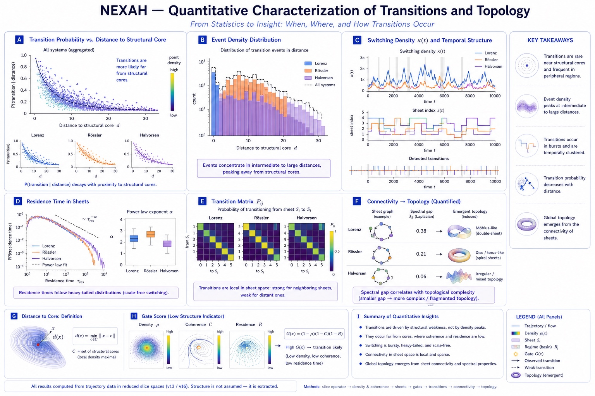
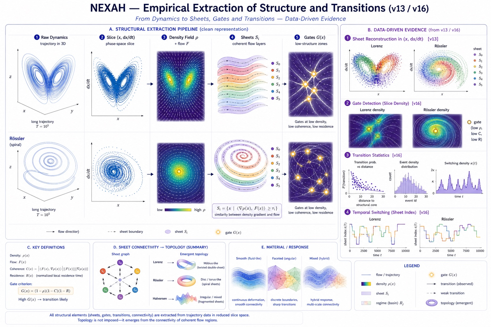
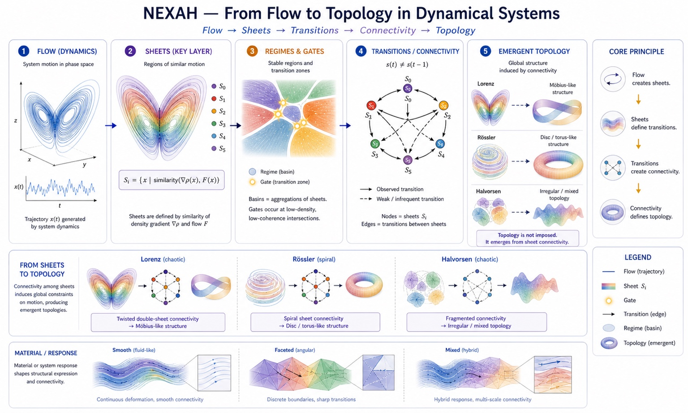
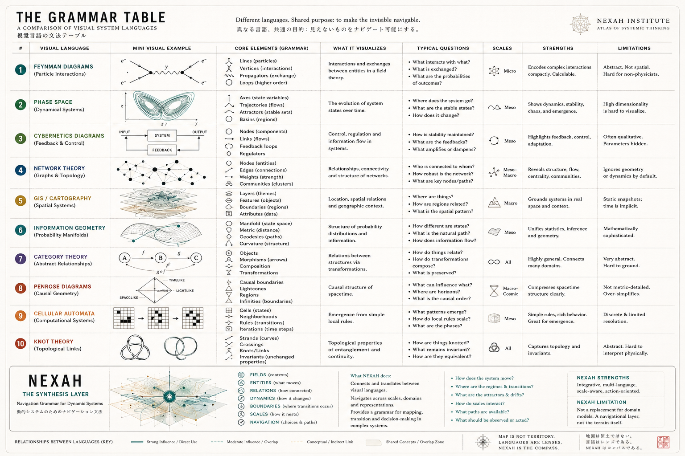

# 🧠 NEXAH — Translation Layer

## 🧭 Purpose

This directory provides **domain-specific translations** of the NEXAH framework.

NEXAH is not tied to a single discipline.

Instead, it explores whether complex systems can be interpreted through a shared structural perspective based on:

- geometry  
- transitions  
- flow structure  
- stability regions  
- coherence  
- phase dynamics  
- topology  
- navigation within dynamical fields  

The goal is not to replace existing disciplines,
but to create an exploratory orientation layer between them.

---

# 🌐 Translation Philosophy

Different scientific fields often describe related phenomena using entirely different languages.

NEXAH investigates whether these languages may still encode:

```text
comparable structural behavior
```

through different representations.

The translation layer therefore acts as:

```text
a comparative navigation grammar
across scientific representations
```

rather than a universal reduction framework.

---

# 🔁 Core Idea

At its core, NEXAH proposes:

```text
Dynamical systems generate structure.

That structure constrains motion.

Transitions occur where structure weakens or breaks down.
```

Extended operational interpretation:

```text
geometry defines where transitions are possible

phase dynamics defines when they activate
```

---

# 🔷 Structural Framework (Visual Reference)



This pipeline represents the core transformation:

```text
Flow
→ Sheets
→ Regimes & Gates
→ Transitions
→ Connectivity
→ Topology
```

It serves as the shared conceptual backbone across all translations.

---

# 🔷 Data-Driven Extraction



All structural elements are reconstructed from trajectory data:

- sheets → coherent motion regions  
- gates → low-density / low-coherence intersections  
- transitions → switching between structures  

This keeps the framework:

```text
data-driven
non-assumptive
empirically grounded
```

---

# 🔷 Quantitative Structure



Observed transition behavior appears structured rather than purely random.

Examples include:

- transition clustering  
- geometry-dependent switching  
- local transition corridors  
- density-dependent motion  
- phase-linked activation behavior  

---

# 🌌 Structural Navigation Perspective


This visual summarizes one of the broader goals of the translation layer:

```text
making structure navigable across representations
```

It connects:

- geometry
- topology
- transitions
- synchronization
- flow
- control
- navigation
- scientific abstraction layers

within a shared structural perspective.

---

# 🗺️ Comparative Visual Grammar



NEXAH also explores relationships between different visual languages used across:

- physics  
- dynamical systems  
- control theory  
- topology  
- GIS / cartography  
- information geometry  
- machine learning  
- causal diagrams  
- computation  

The central question is not:

```text
"Can all disciplines be unified?"
```

but rather:

```text
"Do different representations reveal overlapping structural behaviors?"
```

Within this interpretation,
NEXAH functions as a possible:

```text
navigation grammar
between specialized representations
```

---

# 🧠 Why a Translation Layer?

Different disciplines often describe similar systems using entirely different conceptual languages.

Examples:

| Domain | Representation |
|---|---|
| Physics | fields & interactions |
| Dynamical Systems | attractors & manifolds |
| Control Theory | feedback & regulation |
| ML / RL | state spaces & policies |
| GIS | layered spatial relations |
| Topology | connectivity & invariants |

NEXAH explores whether these may sometimes describe related structural phenomena from different viewpoints.

---

# 🔬 Current Structural Perspective

NEXAH increasingly interprets systems as:

```text
motion inside structured dynamical geometry
```

Within this interpretation:

- fields encode motion tendencies
- density organizes persistence
- coherence stabilizes trajectories
- mismatch activates transitions
- topology emerges from connectivity
- navigation becomes geometry-aware

---

# 🔁 Phase & Transition Layer

One of the central recent additions is the role of:

```text
phase mismatch
```

Operationally:

$$
M(t)=|\omega(t)-\hat{\omega}(t)|
$$

where:

- $\omega(t)$ = observed phase evolution
- $\hat{\omega}(t)$ = expected local phase behavior

Observed empirically:

```text
high mismatch
⇒ increased transition probability
```

This introduces a two-layer interpretation:

```text
geometry → where transitions can occur

phase mismatch → when transitions activate
```

---

# 🔷 Directional Control Interpretation

NEXAH also explores whether stabilization depends on:

```text
direction relative to intrinsic system dynamics
```

Observed experimentally:

- aligned control may amplify transitions
- inverse control may suppress transitions
- damping alone is insufficient

This reframes control as:

```text
geometry-aware directional intervention
```

rather than magnitude suppression alone.

---

# 📂 Structure

## 🔹 Core

- `00_core_claims_short.md`  
  → Minimal discipline-independent formulation  

---

## 🔹 Domain Translations

- `01_for_dynamical_systems.md`  
  → phase space, manifolds, transitions  

- `02_for_control_theory.md`  
  → feedback, stabilization, navigation  

- `03_for_ml_rl.md`  
  → policies, state geometry, exploration  

- `04_for_physics.md`  
  → fields, flow, geometric stability  

---

## 🔹 Visual Layer

- `05_visual_explanations.md`  
  → intuitive image-driven explanations  

- `06_visual_grammar_table.md`  
  → comparative visual language framework  

- `06_open_problems.md`  
  → limitations, unresolved questions, research directions  

---

# 🔬 Key Concepts (Shared Across Domains)

## 1. Density Field

```text
ρ(x) = KDE({x_t})
```

Represents where the system tends to exist.

---

## 2. Flow Field

```text
ẋ = F(x)
```

Defines how the system moves.

---

## 3. Gate Operator

```text
G(x) ∝ low density × low coherence × low residence
```

Measures structural instability and transition susceptibility.

---

## 4. Navigation Kernel

```text
ẋ = F(x) - λ∇G(x) + μ∇ρ(x)
```

Defines structure-aware motion.

---

# 🔁 Conceptual Shift

Traditional view:

```text
systems evolve according to equations
```

NEXAH view:

```text
systems move within emergent geometric structure
```

---

# 🌐 Cross-Domain Mapping

| Concept | Dynamical Systems | Control | ML / RL | Physics |
|---|---|---|---|---|
| ρ(x) | invariant measure | occupancy | state distribution | density |
| G(x) | separatrix region | instability field | uncertainty / risk | instability |
| sheets | manifolds | operating regimes | latent structure | layered flow |
| transitions | switching | control boundary | policy shift | phase transition |
| mismatch | phase drift | control error | prediction deviation | coherence breakdown |

---

# 🧠 How to Read This Layer

Recommended order:

1. `00_core_claims_short.md`  
2. domain-specific translation  
3. `05_visual_explanations.md`  
4. `06_visual_grammar_table.md`  
5. `06_open_problems.md`  

---

# 🔬 Current Role Inside NEXAH

The translation layer serves as:

- a bridge between disciplines
- a conceptual comparison layer
- a visual interpretation framework
- a terminology mapping system
- an orientation layer for collaboration

It is especially important because NEXAH currently spans:

- empirical validation
- geometry
- synchronization
- control
- topology
- navigation
- visualization
- computational experimentation

without fully belonging to any single established domain.

---

# ⚠️ Scope

This layer is:

```text
exploratory
interpretive
translational
```

It does NOT:

- replace existing theory  
- provide complete proofs  
- claim universal validity  
- establish a finalized mathematical framework  

Many ideas remain:

- empirical  
- heuristic  
- incomplete  
- under active investigation  

---

# 🚀 Goal

The purpose of this layer is:

```text
to make structural system thinking
more translatable across disciplines
without collapsing disciplinary rigor
```

---

# 🧠 Final Insight

Different disciplines may speak different visual languages.

Yet they may still observe related structural behaviors.

NEXAH explores whether these languages can become:

```text
partially translatable
structurally navigable
and comparatively interpretable
```

while preserving their differences.

---

# 🌌 Final Perspective

```text
NEXAH does not attempt to erase disciplinary boundaries.

It attempts to build navigational bridges
between structural representations.
```

---

**NEXAH — Translation Layer**  
Thomas K. R. Hofmann · 2026
