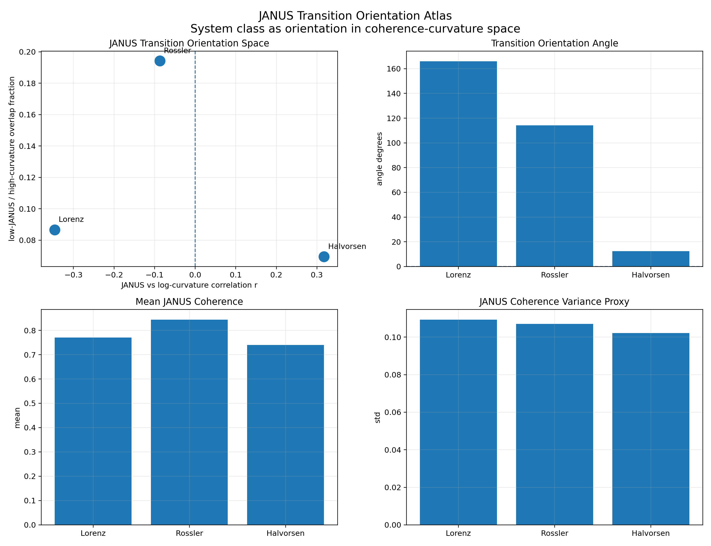
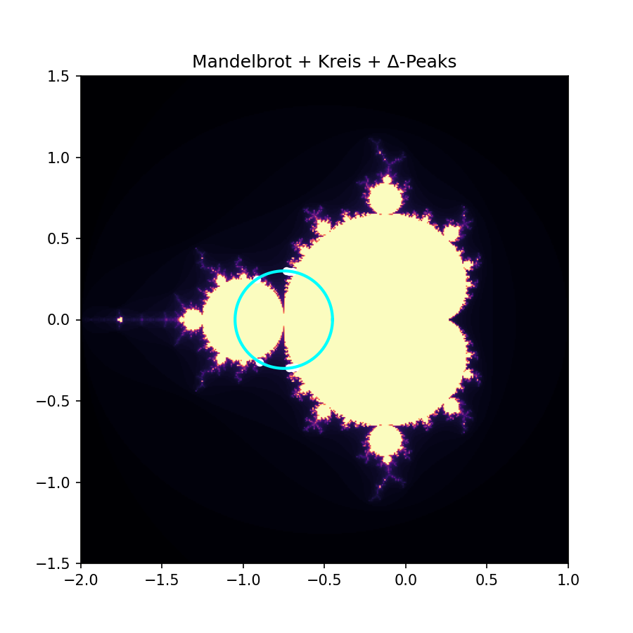

# 🧠 NEXAH: Phase-Driven Transition Geometry in Dynamical Systems

## Abstract

NEXAH is a geometry-oriented framework for reconstructing, analyzing,
and navigating transitions in complex dynamical systems.

Rather than treating systems as isolated sequences of states,
NEXAH interprets dynamics as motion inside structured transport geometry,
within which trajectories become constrained by:

- flow organization
- density structure
- directional coherence
- transport corridors
- aperture geometry
- recursive transition pathways
- and emergent topology

Across multiple investigated systems
—including Lorenz, Rössler, Halvorsen, Duffing, Kuramoto,
and parameter-driven fractal systems—
we observe that transitions are not uniformly random events.

Instead, transitions repeatedly emerge inside:

```text
structured regions of reconstructed dynamical geometry
```

A central empirical observation of the framework
is that transition activation correlates more strongly
with phase mismatch than with instability magnitude alone.

Mismatch is operationally defined as:

$$M(t) = |\omega(t)-\hat{\omega}(t)|
$$

where observed phase evolution deviates
from locally expected structural evolution.

Experimental observations suggest:

```text
high mismatch
⇒ increased transition probability
```

across multiple investigated systems.

Recent extensions further indicate that transitions may also correlate with:

- directional coherence decay
- aperture activation
- recursive orientation asymmetry
- shell-crossing transport geometry
- and transport bottlenecks inside reconstructed fields

Extending this perspective,
control experiments suggest that stabilization depends not only on alignment,
but on directional interaction relative to intrinsic system dynamics.

Observed behavior includes:

- phase-aligned control amplifying transitions
- damping reducing drift without suppressing events
- inverse directional control reducing both drift and transition activity

This produces the operational mechanism:

```text
phase
→ mismatch
→ directional coherence
→ transition geometry
→ transition activation
        ↑
   control(direction)
```

NEXAH therefore reframes nonlinear analysis from:

```text
state prediction
```

toward:

```text
structure-aware navigation
inside evolving transport geometry
```

---

# 1. Introduction

Understanding transitions in nonlinear dynamical systems
is central to:

- stability analysis
- synchronization theory
- adaptive control
- transport phenomena
- failure prediction
- navigation inside evolving systems

Classical approaches often focus on:

- equilibrium analysis
- local linearization
- eigenvalue spectra
- instability thresholds
- Lyapunov structure

While powerful,
these approaches do not always explain:

- where transitions localize
- why activation occurs at specific regions
- how geometry constrains motion
- why directional asymmetry emerges
- how stabilization depends on transport organization

NEXAH introduces an alternative operational perspective:

```text
systems are trajectories
inside structured dynamical geometry
```

Within this interpretation:

- geometry constrains motion
- density organizes persistence
- coherence stabilizes trajectories
- mismatch activates transitions
- apertures organize routing
- topology emerges from connectivity
- control becomes directional navigation

---

# 🌌 Structural Navigation Perspective


The framework attempts to transform:

```text
dynamics
→ structure
→ transition geometry
→ connectivity
→ topology
→ navigation
```

into an operational reconstruction architecture.

---

# 🪞 JANUS Transition Geometry



Recent JANUS experiments extend the framework
toward directional transport reconstruction.

Observed structures include:

- directional transport corridors
- recursive orientation manifolds
- aperture bottlenecks
- shell-crossing structures
- transport asymmetries
- orientation bias regions

These structures appear repeatedly
across reconstructed systems
and may indicate that transitions organize around:

```text
coherence thinning regions
inside directional transport geometry
```

rather than isotropic instability alone.

---

# 🌌 Fractal Transition Geometry



To investigate whether transition structure extends
beyond intrinsic system dynamics,
NEXAH was applied to parameter-driven fractal systems.

Observed behavior suggests that:

- parameter motion induces structured transitions
- transition activation occupies bounded regions
- local structural change alone is insufficient
- global parameter-space geometry constrains activation

This indicates that transition geometry may also exist inside:

```text
parameter-space transport structure
```

rather than only state-space evolution.

---

# 2. Method

The current NEXAH pipeline can be summarized as:

```text
dynamics
→ flow reconstruction
→ density structure
→ coherence
→ aperture geometry
→ phase dynamics
→ mismatch
→ transition routing
→ topology
→ navigation
```

---

# 2.1 Field Representation

Trajectories are reconstructed
as structured dynamical fields:

```text
x(t)
→ flow
→ density
→ coherence
→ transport geometry
```

with local evolution:

$$\dot{x}(t) = F(x(t))
$$

where:

- $x(t)$ = local system state
- $F(x)$ = reconstructed flow field

---

# 2.2 Density Structure

A density field is estimated from trajectories:

$$\rho(x) = \mathrm{KDE}(\{x_t\})
$$

Interpretation:

- high density → persistent structure
- low density → transition corridors

---

# 2.3 Directional Coherence

Directional alignment is estimated through:

$$C(x) = \frac{ \dot{x}\cdot F(x) }{ \|\dot{x}\| \, \|F(x)\| }
$$

Interpretation:

```text
high coherence
→ structurally aligned transport

low coherence
→ transition-sensitive regions
```

---

# 2.4 Phase Dynamics

Phase is defined operationally as:

$$\phi(t) = \arctan2(x_2(t),x_1(t))
$$

Phase velocity:

$$\omega(t) = \frac{d\phi(t)}{dt}
$$

Expected phase evolution:

$$\hat{\omega}(t) = \mathcal{E}[\omega](t)
$$

where:

- $\mathcal{E}$ = local expectation operator

---

# 2.5 Phase Mismatch

Mismatch is defined as:

$$M(t) = |\omega(t)-\hat{\omega}(t)|
$$

Interpretation:

```text
mismatch measures deviation
from locally coherent phase evolution
```

---

# 2.6 Directional JANUS Geometry

Forward transport:

$$F_{\mathrm{forward}}(x)
$$

Backward transport:

$$F_{\mathrm{backward}}(x)
$$

Directional overlap operator:

$$\mathcal{J}(x) = F_{\mathrm{forward}}(x) \odot F_{\mathrm{backward}}(x)
$$

Normalized directional coherence:

$$J(x) = \frac{ \| \mathcal{J}(x) \| }{ \| F_{\mathrm{forward}}(x) \| \, \| F_{\mathrm{backward}}(x) \|
+\varepsilon }
$$

---

# 2.7 Aperture Geometry

Aperture score:

$$A(x) = 1-J(x)
$$

Interpretation:

```text
high aperture score
→ coherence thinning
→ transport bottleneck
→ transition-prone geometry
```

---

# 2.8 Orientation Bias Geometry

Directional orientation field:

$$\Theta(x) = \arg(F(x))
$$

Bias alignment score:

$$B(x) = \cos( \Theta(x) - \Theta_{\mathrm{root}} )
$$

Interpretation:

```text
transport may align
along preferred directional roots
```

inside reconstructed geometry.

---

# 3. Results

---

# 3.1 Cross-System Structural Observations

Consistent structural behavior was observed across:

- Lorenz
- Rössler
- Halvorsen
- Duffing
- Kuramoto
- Julia systems

Observed patterns include:

- coherent phase evolution
- directional asymmetry
- structured drift behavior
- transport corridors
- shell-crossing geometry
- recursive orientation organization

---

# 3.2 Transition Geometry

Transitions do not appear uniformly distributed.

Instead, transitions cluster inside:

```text
low-density
low-coherence
directionally competing regions
```

often near:

- apertures
- bottlenecks
- shell intersections
- recursive transport boundaries

This suggests that transition organization
is geometric rather than random.

---

# 3.3 Directional Control Experiments

Control was applied relative to phase structure:

$$s(t)
=
f(\phi(t),d)
$$

with:

- $d$ = directional orientation

Observed behavior:

```text
aligned control
→ drift ↑
→ transition activity ↑

inverse control
→ drift ↓
→ transition activity ↓
```

---

# 🔑 Key Observation

Control effectiveness depends on:

```text
direction relative to intrinsic dynamics
```

rather than magnitude alone.

---

# 3.4 Parameter-Driven Fractal Extension

For parameter-driven systems:

$$c(t)\in\mathbb{C}
$$

with Julia evolution:

$$ z_{n+1} = z_n^2+c(t)
$$

A structural observable is defined:

$$\Delta(t) = \text{frame-to-frame structural difference}
$$

Transitions appear to depend on both:

- local structural change
- global parameter-space context

Observed relation:

$$P(\text{transition}) = f(\Delta,distance)
$$

---

# 🔥 Key Fractal Observation

```text
local structural change alone
is insufficient for transition activation
```

Transitions require:

```text
local mismatch
+
global structural context
```

---

# 4. Mechanism

The current operational mechanism of NEXAH can be summarized as:

```text
field
→ coherence
→ mismatch
→ aperture activation
→ directional breakdown
→ transition
        ↑
   control(direction)
```

Interpretation:

- instability defines dynamical potential
- mismatch activates transitions
- coherence constrains transport
- apertures localize transition geometry
- directional control modifies system response

---

# 5. Emergent Topology Perspective

NEXAH interprets topology
as an emergent consequence
of structured transport organization.

Topology emerges through:

- transition connectivity
- coherent trajectories
- accumulated winding
- directional asymmetry
- admissible transport paths

---

# 🔑 Topological Principle

```text
topology emerges from structured connectivity
inside constrained motion geometry
```

---

# 6. Discussion

---

# 6.1 Conceptual Shift

NEXAH proposes a shift:

From:

```text
state prediction
```

Toward:

```text
structure-aware navigation
inside transport geometry
```

---

# 6.2 Relation to Existing Approaches

The observed behavior is broadly compatible with:

- phase dynamics
- synchronization theory
- nonlinear control
- transport systems
- geometric dynamics
- topology-aware reconstruction

The framework extends these approaches by:

- embedding transitions within geometry
- introducing mismatch as activation structure
- reconstructing directional transport coherence
- treating topology as emergent connectivity
- interpreting control directionally

---

# 6.3 Operational Interpretation

Within the current framework:

- fields encode transport tendencies
- density encodes persistence
- coherence measures directional consistency
- mismatch measures structural deviation
- apertures organize transition routing
- topology emerges from connectivity
- control becomes geometry-aware navigation

---

# 7. Conclusion

The current NEXAH framework suggests that:

- nonlinear systems generate structured geometry
- transitions emerge through coherence breakdown
- mismatch activates transition pathways
- topology emerges from transport connectivity
- control effectiveness depends on directional interaction

This produces the operational principle:

```text
control does not suppress dynamics

it modifies motion relative to structure
```

---

# ⚠️ Current Status

The framework is currently:

```text
empirical
semi-formal
cross-system consistent
geometry-oriented
navigation-centered
```

It is NOT yet:

- formally proven
- mathematically closed
- universally generalized

The framework should therefore be interpreted as:

```text
an exploratory transition-geometry architecture
```

for investigating structure,
transport,
and navigation
inside nonlinear systems.

---

# 🔥 Final Perspective

```text
complex systems may not transition randomly.

they may move through structured transport geometry
that constrains:

motion,
transitions,
connectivity,
and stabilization behavior.
```

---

# Keywords

dynamical systems,
phase dynamics,
transition geometry,
transport structure,
topology,
coherence,
field reconstruction,
control,
navigation,
mismatch dynamics,
nonlinear systems,
transport geometry

---

**Thomas K. R. Hofmann · NEXAH · 2026**
