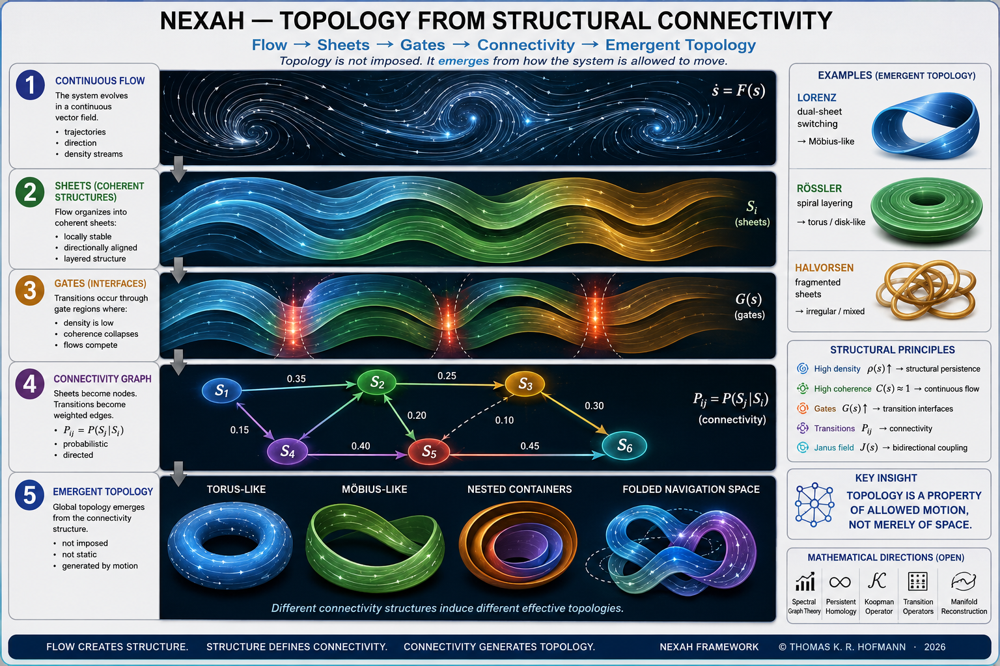

# 🧭 NEXAH — Research Navigation Index

This document defines the primary navigation layer
for the NEXAH research framework.

It describes:

- how the research stack is organized
- how concepts connect operationally
- how geometry emerges from dynamics
- how transition structure is reconstructed
- how navigation becomes possible inside nonlinear systems

---

# 🌌 Research Perspective

NEXAH investigates whether nonlinear systems exhibit:

- coherent transport organization
- structured transition geometry
- directional flow consistency
- emergent topology
- navigable state-space structure

The framework attempts to transform:

```text
dynamics
→ structure
→ coherence
→ transitions
→ topology
→ navigation
```

into a unified operational research architecture.

---

# 🌊 Emergent Transition Geometry


The JANUS layer reconstructs:

- directional coherence
- aperture regions
- shell crossings
- transport corridors
- recursive transition geometry
- orientation bias fields

This currently represents
the deepest geometric reconstruction layer
inside the NEXAH research stack.

---

# 🧠 Fundamental Transition Mechanism


The minimal operational mechanism currently consists of:

- phase (`φ`)
- phase velocity (`ω`)
- expected phase (`ω̂`)
- mismatch (`M`)
- instability (`I`)
- directional interaction (`s`)

Current empirical evidence suggests:

```text
transitions correlate more strongly
with coherence breakdown
than with instability magnitude alone.
```

---

# 🔁 Current Research Pipeline

The operational NEXAH stack currently evolves approximately as:

```text
Dynamics
↓
Trajectory Reconstruction
↓
Flow Structure
↓
Density Organization
↓
Directional Coherence
↓
Transition Geometry
↓
Phase Dynamics
↓
Connectivity
↓
Emergent Topology
↓
Navigation & Control
```

---

# 🧭 Recommended Reading Path

---

# 1. FOUNDATION

→ minimal structural grammar

Purpose:

- define assumptions
- define structural primitives
- define coherence concepts
- define topology emergence
- define navigation foundations

---

## Core Files

```text
FOUNDATION/README.md
FOUNDATION/axioms.md
FOUNDATION/core_variable_map.md
FOUNDATION/topology_structure.md
FOUNDATION/structural_theorems.md
```

---

## Core Role

```text
defines the abstract structural language
used throughout NEXAH
```

---

# 2. CORE_CONCEPTS

→ operational interpretation layer

Defines:

- phase mismatch
- field structure
- transport geometry
- vessel geometry
- aperture structure
- directional coherence
- JANUS transition organization

---

## Core Files

```text
CORE_CONCEPTS/minimal_system.md
CORE_CONCEPTS/equations.md
CORE_CONCEPTS/field_model.md
CORE_CONCEPTS/aperture_geometry.md
CORE_CONCEPTS/vessel_geometry.md
CORE_CONCEPTS/theory_to_field_mapping.md
CORE_CONCEPTS/JANUS_OPERATOR/
```

---

## Core Role

```text
translates empirical observations
into operational geometric structure
```

---

# 3. VALIDATION

→ empirical reconstruction layer

Demonstrates:

- reproducibility
- cross-system consistency
- noise robustness
- transition localization
- directional transport behavior
- phase-dependent transition activation

---

## Key Findings

```text
instability alone
does not explain transitions
```

and:

```text
directional organization
appears geometrically structured
```

---

# 4. TRANSITION & PHASE DYNAMICS

→ causal activation layer

Introduces:

- phase mismatch
- drift
- winding
- rotational asymmetry
- recursive phase organization
- directional transition activation

---

## Core Perspective

```text
phase mismatch
activates transitions
```

rather than instability magnitude alone.

---

# 5. JANUS TRANSITION GEOMETRY

→ directional coherence layer

This layer introduces:

- forward/backward transport overlap
- directional coherence fields
- aperture geometry
- recursive orientation structure
- shell crossings
- transition manifolds
- orientation bias geometry

---

## Core Insight

```text
transitions appear organized
along structured directional geometry
```

rather than purely stochastic switching.

---

# 6. FINDINGS

→ compressed structural principles

Purpose:

- extract invariant observations
- summarize validated behavior
- isolate system-independent structure

---

## Role

```text
distills operational principles
from the full research stack
```

---

# 7. APPLIED_CASES

→ real and simulated systems

Includes:

- Lorenz
- Rössler
- Duffing
- Halvorsen
- IEEE-inspired systems
- parameter-driven fractal systems

---

## Role

```text
demonstrates operational behavior
inside concrete dynamical systems
```

---

# 8. FIGURES

→ visual synthesis layer

Contains:

- transition geometry atlases
- coherence maps
- topology diagrams
- aperture structures
- navigation visuals
- orientation manifolds

---

## Role

```text
connects structure,
data,
geometry,
and interpretation
```

---

# 9. THEORETICAL_EXTENSIONS

→ future formalization layer

Includes exploratory work involving:

- operator theory
- topology
- spectral structure
- Koopman interpretations
- transport geometry
- bidirectional dynamics
- generalized navigation frameworks

---

## Status

```text
exploratory / semi-formal
```

---

# 🌌 Emergent Topology Layer

NEXAH increasingly interprets topology
as an emergent consequence
of structured transport organization.

Topology appears to emerge from:

- transition connectivity
- coherence persistence
- directional admissibility
- recursive transport organization
- accumulated winding structure

---

## Core Principle

```text
topology is not imposed externally.

it emerges from structured connectivity.
```

---



---

# 🧪 Experimental Extensions

Several modules extend NEXAH
beyond intrinsic system dynamics.

---

# Fractal Transition Geometry

→ `VALIDATION/fractal_tests/`

Observed:

$$P(\text{transition}) = f(\Delta, C)
$$

where:

- $\Delta$ = local structural change
- $C$ = global contextual geometry

---

## Observation

```text
local instability peaks
alone
do not fully determine transitions
```

Structural context matters.

---

# 🔁 Logical Dependency Structure

```text
FOUNDATION
↓
CORE_CONCEPTS
↓
VALIDATION
↓
TRANSITION & PHASE
↓
JANUS GEOMETRY
↓
FINDINGS
↓
APPLIED_CASES
↓
FIGURES
↓
THEORETICAL_EXTENSIONS
```

---

# 🔑 Current Operational Perspective

NEXAH is not currently a single predictive model.

It is:

```text
a framework for discovering,
reconstructing,
and navigating
structure inside nonlinear systems
```

---

# 🚀 Primary Entry Points

---

## Structural Foundations

```text
FOUNDATION/README.md
```

---

## Operational Concepts

```text
CORE_CONCEPTS/README.md
```

---

## Empirical Validation

```text
VALIDATION/README.md
```

---

## JANUS Geometry Layer

```text
CORE_CONCEPTS/JANUS_OPERATOR/
```

---

## Transition & Phase Dynamics

```text
FINDINGS/TRANSITION_PHASE_DYNAMICS/
```

---

## Fractal Transition Experiments

```text
VALIDATION/fractal_tests/
```

---

## Visual Navigation Layer

```text
FIGURES/README.md
```

---

# 🔥 Current Structural Insight

The current framework increasingly suggests:

```text
dynamics generate structure

structure generates coherence

loss of coherence generates transitions

transitions generate connectivity

connectivity generates topology

topology enables navigation
```

---

# ⚠️ Current Scope

NEXAH is currently:

```text
empirical
semi-formal
geometry-oriented
navigation-centered
transition-focused
```

It is NOT yet:

- a finalized mathematical theory
- universally validated
- analytically closed
- formally complete

---

# 🧠 Scientific Position

NEXAH should currently be interpreted as:

```text
an exploratory framework
for reconstructing
transition organization
inside nonlinear systems
```

rather than:

- a replacement for existing mathematics
- a universal physical law
- a completed theory

---

# 🌌 Current Interpretation

The framework increasingly explores whether:

```text
nonlinear systems possess
structured transport geometry
```

that governs:

- transitions
- coherence
- routing
- topology
- admissible motion paths

---

# 🚀 Long-Term Research Direction

Potential future directions include:

1. formal mathematical grounding
2. geometry-aware control systems
3. transport topology reconstruction
4. high-dimensional scaling
5. operator formalization
6. topology–probability integration
7. external scientific collaboration
8. generalized navigation systems

---

# 🧭 Final Perspective

```text
NEXAH studies how systems
become structurally navigable.

It does not seek to suppress complexity.

It investigates how motion organizes itself
into coherent geometry,
transition structure,
directional transport,
and admissible pathways.
```

---

**NEXAH — Research Navigation Index**  
Transition Geometry · Coherence · Directional Structure · Navigation  
Thomas K. R. Hofmann · 2026
- structured fields
- density regions
- transition corridors
- gates
- directional flow
- navigable trajectories
- topology through connectivity

---

# 🔁 Core Research Pipeline

The current NEXAH stack operates approximately as:

```text
Dynamics
↓
Flow Reconstruction
↓
Density Structure
↓
Coherence
↓
Transition Geometry
↓
Phase Dynamics
↓
Connectivity
↓
Emergent Topology
↓
Navigation & Control
```

---

# 🧭 Recommended Reading Path

## 1. FOUNDATION

→ minimal assumptions and structural grammar

Start here for:

- axioms
- structural variables
- coherence
- topology
- navigation primitives

Core files:

```text
FOUNDATION/README.md
FOUNDATION/core_variable_map.md
FOUNDATION/axioms.md
FOUNDATION/structural_theorems.md
FOUNDATION/topology_structure.md
```

---

## 2. CORE_CONCEPTS

→ operational interpretation layer

Defines:

- field structure
- transition geometry
- equations
- phase mismatch
- structural operators
- multi-layer dynamics

Purpose:

```text
translate observations into operational structure
```

---

## 3. VALIDATION

→ empirical verification layer

Demonstrates:

- reproducibility
- noise robustness
- cross-system consistency
- transition geometry
- directional control behavior

Core findings include:

```text
transitions are not driven by instability alone
```

and:

```text
control effectiveness depends on phase direction
```

---

## 4. TRANSITION & PHASE DYNAMICS

→ causal transition layer

Introduces:

- phase mismatch
- drift
- winding
- rotational asymmetry
- transition activation
- directional control effects

Core perspective:

```text
phase mismatch activates transitions
```

rather than instability magnitude alone.

---

## 5. FINDINGS

→ compressed structural principles

Purpose:

- identify invariant behavior
- summarize validated observations
- extract system-independent structure

This layer contains the distilled operational insights of NEXAH.

---

## 6. APPLIED_CASES

→ real and simulated systems

Includes:

- Lorenz
- Halvorsen
- Rössler
- Duffing
- IEEE-inspired systems

Purpose:

```text
demonstrate operational behavior
inside concrete systems
```

---

## 7. FIGURES

→ visual synthesis layer

Contains:

- system maps
- transition geometry
- topology diagrams
- navigation visuals
- structural atlases

Purpose:

```text
connect structure,
data,
and interpretation
```

---

## 8. THEORETICAL_EXTENSIONS

→ future formalization layer

Includes exploratory work related to:

- operators
- topology
- Koopman structures
- spectral interpretations
- generalized navigation frameworks

Status:

```text
exploratory / semi-formal
```

---

# 🌌 Emergent Topology Layer

NEXAH interprets topology
as an emergent consequence of structured motion.

Topology arises from:

- transition connectivity
- coherent trajectories
- accumulated winding
- admissible directional movement

---

## Core Principle

```text
Topology is not imposed externally.

It emerges from structured connectivity.
```

---


---

# 🧪 Experimental Extensions

Some modules extend the framework
beyond intrinsic system dynamics.

---

## Fractal Transition Validation

→ VALIDATION/fractal_tests/

Observed:

```text
P(transition)
=
f(Δ, distance)
```

where:

- Δ = local structural change
- distance = global parameter-space context

---

## Key Observation

```text
Δ peak ≠ transition
```

Meaning:

- local instability alone is insufficient
- transitions require structural context

---

# 🔁 Logical Dependency Structure

```text
FOUNDATION
↓
CORE_CONCEPTS
↓
VALIDATION
↓
TRANSITION & PHASE
↓
FINDINGS
↓
APPLIED_CASES
↓
FIGURES
↓
THEORETICAL_EXTENSIONS
```

---

# 🔑 Core Perspective

NEXAH is not a single predictive model.

It is:

```text
a framework for discovering,
mapping,
and navigating
structure inside dynamical systems
```

---

# 🚀 Primary Entry Points

## Conceptual Integration

```text
CORE_CONCEPT_MAP.md
```

---

## Structural Grammar

```text
FOUNDATION/README.md
```

---

## Empirical Validation

```text
VALIDATION/README.md
```

---

## Transition & Phase Dynamics

```text
FINDINGS/TRANSITION_PHASE_DYNAMICS/
```

---

## Fractal Transition Experiments

```text
VALIDATION/fractal_tests/
```

---

## Visual Navigation Layer

```text
FIGURES/README.md
```

---

# 🔥 Current Operational Insight

The current framework suggests:

```text
Dynamics generate structure.

Structure generates coherence.

Loss of coherence generates transitions.

Transitions generate connectivity.

Connectivity generates topology.

Topology enables navigation.
```

---

# ⚠️ Scope

NEXAH is currently:

```text
empirical
semi-formal
geometry-oriented
navigation-centered
```

It is NOT yet:

- a complete mathematical theory
- universally validated
- formally closed

---

# 🧠 Final Perspective

```text
NEXAH studies how systems become structurally navigable.

It does not seek to suppress complexity.

It seeks to understand how motion organizes itself
into coherent geometry,
transition structure,
and admissible paths.
```

---

**NEXAH — Research Navigation Index**  
Thomas K. R. Hofmann · 2026
