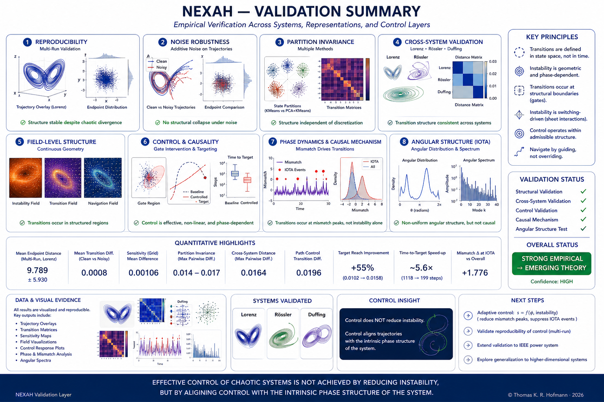
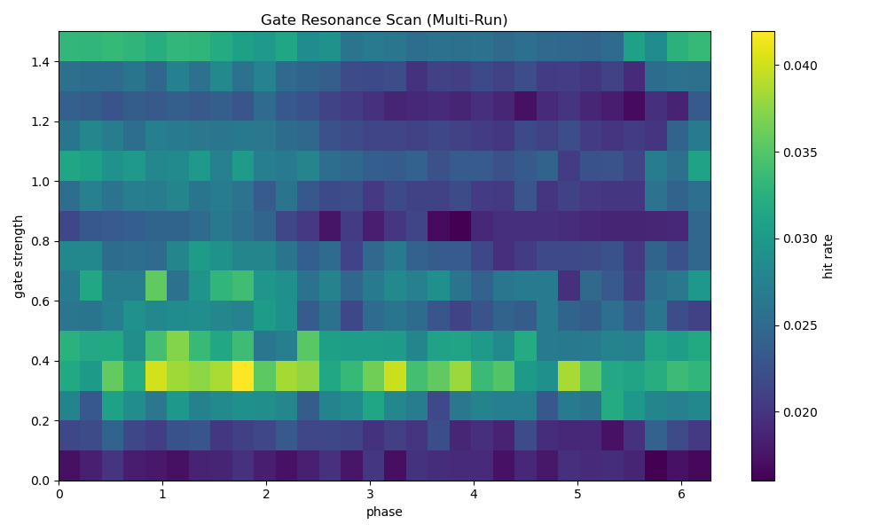
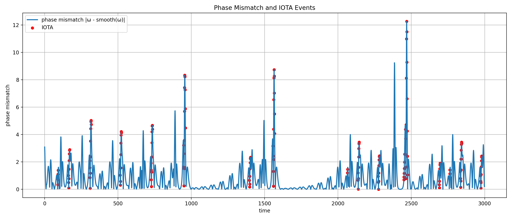
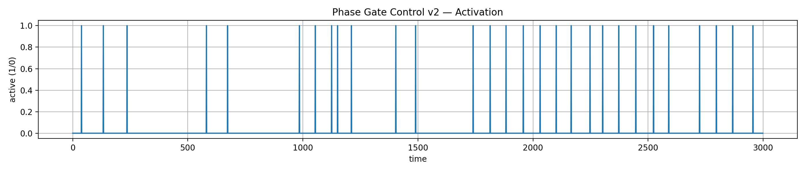

# NEXAH Research Vision (v5 — Field, Phase & Causal Structure)

NEXAH is a research framework for analyzing and navigating transitions in complex dynamical systems.

It identifies **structure within system dynamics** and enables **causal interaction** through alignment with that structure.

---

## 🧭 Conceptual Overview



*Empirical validation summary of structure, transitions, and control behavior.*

---

## 🔷 Structural Framework

See core figures:


The NEXAH framework reduces dynamical systems to a structural pipeline:

Flow → Sheets → Regimes & Gates → Transitions → Connectivity → Topology

Structure is not imposed — it is extracted from trajectory data.

---

## 🔷 Core Hypothesis

> Complex systems evolve within **structured fields**  
> and transition when **phase coherence breaks**.

---

## 🔷 Transition Geometry + Phase Dynamics



Observed structure:

- systems evolve within a **density + flow field**  
- stable regions form **basins (regimes)**  
- transitions occur through **gates (intersections)**  
- phase dynamics determine **when transitions activate**

This empirical structure corresponds to the extracted sheet, gate and transition layers shown in:


---

### 🔑 Key Insight

```text
Transitions are not random.

They follow geometrically constrained pathways
AND are triggered by phase mismatch.
```

---

## 🧠 Interpretation

```text
field → structure → geometry → phase → mismatch → transition
```

---

## 🔬 Structural Observations

Across systems:

- coherent regions (basins)  
- anisotropic motion (preferred directions)  
- layered dynamics (flow sheets)  
- structured transitions (non-random)  
- phase-dependent activation of transitions  

---

## 🔬 Causal Mechanism (Validated)



Observed:

```text
IOTA (instability activation metric) ⇔ phase mismatch >> 0
```

NOT:

```text
IOTA ⇔ instability
```

---

### Interpretation

- instability = potential  
- mismatch = trigger  

---

## 🧭 Control Principle



Control is not magnitude-based.

It is:

```text
phase-aligned intervention
```

---

### Key Law

```text
Control effectiveness depends on:

alignment(control, phase dynamics)
```

---

## 🔷 Field-Based System View

System state:

$$
s = (r, \theta)
$$

Dynamics:

$$
\dot{s} = F(s)
$$

---

## 🔷 Phase Dynamics Extension

Phase:

$$
\phi = \arctan2(y, x)
$$

Velocity:

$$
\omega = \frac{d\phi}{dt}
$$

Mismatch:

$$
\Delta_\phi = |\omega - \text{expected}(\omega)|
$$

---

## 🔷 Coherence

$$
C(s) =
\frac{\dot{s} \cdot F(s)}{\|\dot{s}\| \, \|F(s)\|}
$$

---

## 🔷 Navigation Principle

```text
navigate along structure
minimize mismatch
avoid unstable divergence
```

---

## 🧠 Unified Interpretation (Updated)

```text
System =
trajectory in structured field

Stability:
→ alignment + density + phase coherence

Instability:
→ misalignment + low density

Transition:
→ geometry-defined
→ phase-triggered (mismatch)
```

---

## ⚠️ Current Limitation

- phase-aligned control improves trajectories  
- BUT does not yet suppress transitions  

Missing:

```text
adaptive control depending on:

phase AND instability
```

---

## 🔧 Next Step

```text
s = f(φ, instability)
```

Expected:

- reduce mismatch peaks  
- suppress transitions  
- preserve structure  

---

## 🔬 Status

- empirically validated  
- cross-system confirmed  
- causally interpretable  
- partially controllable  

---

## 🧭 Final Insight

```text
Systems do not fail randomly.

They transition when phase coherence breaks
within a structured dynamical field.

Control succeeds when alignment is restored.
```

---

© Thomas K. R. Hofmann  
NEXAH — 2026
