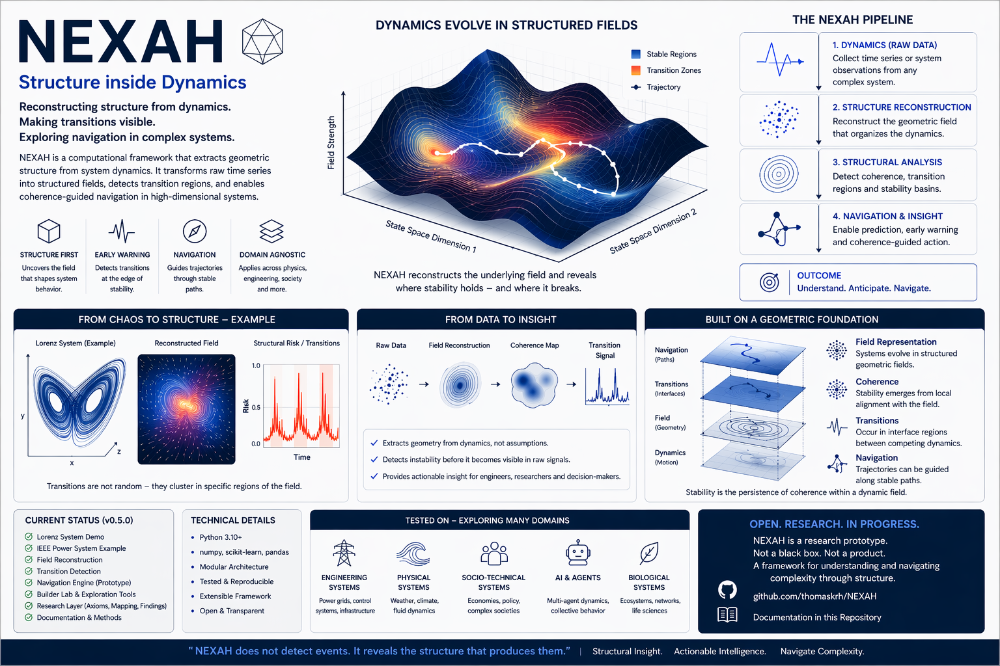

# NEXAH Research Vision (v3 — Field, Coherence & Navigation)

NEXAH is a research framework for analyzing and navigating transitions in complex dynamical systems.

It focuses on identifying structure within system dynamics and leveraging this structure for prediction and control.



*Conceptual illustration of the NEXAH framework.  
This visualization represents the hypothesized relationship between dynamics, structure, field geometry, and navigation.  
It is not a direct representation of implementation, but a synthesis of observed patterns and working interpretations.*

---

NEXAH is an orientation-based framework that investigates whether  

> **intrinsic stability in complex systems emerges from local structural coherence  
> and can be actively navigated through field-aware control**

---

## Core Hypothesis (Working)

Across multiple investigated systems, a recurring pattern is observed:

> Stability is associated with coherence in interface regions,  
> while system breakdown tends to occur when this coherence is lost.

Observed sequence:

```text
coherence → fragmentation → acceleration → collapse
```

Extended (v80):

```text
alignment → misalignment → transition corridor → regime shift
```

---

# 🔷 Key Extension (v56+)

A major shift in NEXAH:

```text
From:
    detection of transitions

To:
    navigation and control of transitions
```

---

## Updated Principle

> Systems do not only evolve within a field  
> — they can be **guided through it**

---

# 🌐 Field Layer & Geometric Flow

A key extension introduces:

> an **explicit field representation of system dynamics**

---

## State Representation

$$
s = (r, \theta)
$$

---

## Flow Field

$$
\dot{s} = F(s)
$$

---

## Interpretation

```text
System behavior = trajectory inside structured field
```

---

# 🧠 Coherence as Alignment

$$
C(s) =
\frac{\dot{s} \cdot F(s)}{\|\dot{s}\| \, \|F(s)\|}
$$

---

## Observed Behavior

```text
C ≈ 1 → stable motion  
C ≈ 0 → transition region  
C < 0 → opposing flow
```

---

## Interpretation

```text
Coherence defines stability of motion
```

---

# 🔹 Structural Observations

Across domains:

- interface-like regions (gaps / corridors)  
- anisotropic motion (preferred directions)  
- layered structure (sheets / basins)  
- structured transitions (not random)  

---

## Interpretation

> Systems follow **preferred paths within structured state space**

---

# 🔷 Transition Geometry

Observed:

```text
low-density regions → transition corridors
```

Define:

$$
G(s) = \frac{1}{\rho(s)}
$$

---

## Interpretation

```text
Instability emerges in low-density regions
```

---

# 🔷 Basin & Regime Structure

State space decomposes into:

```text
basins (regimes)
```

Transitions:

$$
P(B_i \rightarrow B_j)
$$

---

## Interpretation

```text
System evolves as transitions between regimes
```

---

# 🔷 Navigation Layer (v34+)

Control emerges as:

$$
u(s) = -\nabla P(\text{IOTA}) + \nabla \rho
$$

---

## Interpretation

```text
navigation = avoid instability + follow structure
```

---

# 🔷 Transition Control (v49+)

Observed:

- transition probabilities can be modified  
- dominant transitions can be amplified  

---

## Formal Idea

$$
P(B_i \rightarrow B_j \mid u)
\neq
P(B_i \rightarrow B_j)
$$

---

## Interpretation

```text
System behavior is not fixed —
it is shapeable
```

---

# 🔷 Phase & Timing Layer (v52–v53)

Control depends on:

```text
WHEN and WHERE it is applied
```

---

## Interpretation

```text
System has internal phase sensitivity
```

---

# 🔷 Sheet / Layer Dynamics (v76–v80)

Observed:

- multiple overlapping flow layers  
- structured switching between them  
- gates at layer intersections  

---

## Interpretation

```text
System moves across interacting flow layers
```

---

# 🔷 Kernel View (v80)

System evolution can be written as:

$$
\dot{s} = F(s) + u(s)
$$

## Interpretation

```text
System = natural dynamics + structured intervention

Control does not override the system —
it redirects motion within the existing field.
```

---

# 🧠 Unified Interpretation

```text
System =
trajectory in structured field

Stability:
→ alignment + density

Instability:
→ misalignment + low density + competing flows

Transition:
→ navigation through structured corridors
```

---

# 🔬 Cross-Domain Validation

| Domain        | Observation                 | Role                     |
|---------------|----------------------------|--------------------------|
| Primes        | modular corridors          | structural analogy       |
| IEEE systems  | early instability detection| primary validation       |
| Lorenz        | separatrix / switching     | geometric consistency    |
| Multi-agent   | structure without reward   | emergent behavior test   |

---

# 🧠 Central Insight (Updated)

> Systems do not fail due to limits alone  
> but due to **loss of alignment within structured motion**

---

# 🔬 Research Directions

1. Generalization  
2. Transition localization  
3. Temporal coherence dynamics  
4. Formal field properties  
5. Basin topology  
6. Control theory integration  

---

# 🔬 Current Position

NEXAH provides:

- field-based system representation  
- coherence-based stability measure  
- probabilistic transition modeling  
- navigation and control capability  

---

## Status

- empirical  
- simulation-supported  
- not formally proven  

---

# 🧭 Final Insight (v80)

```text
Stability is not resistance.

It is the ability to remain aligned
while moving through structure.

Transitions are not failures.

They are structured transformations that can be navigated.
```

---

© Thomas K. R. Hofmann  
NEXAH — 2026
