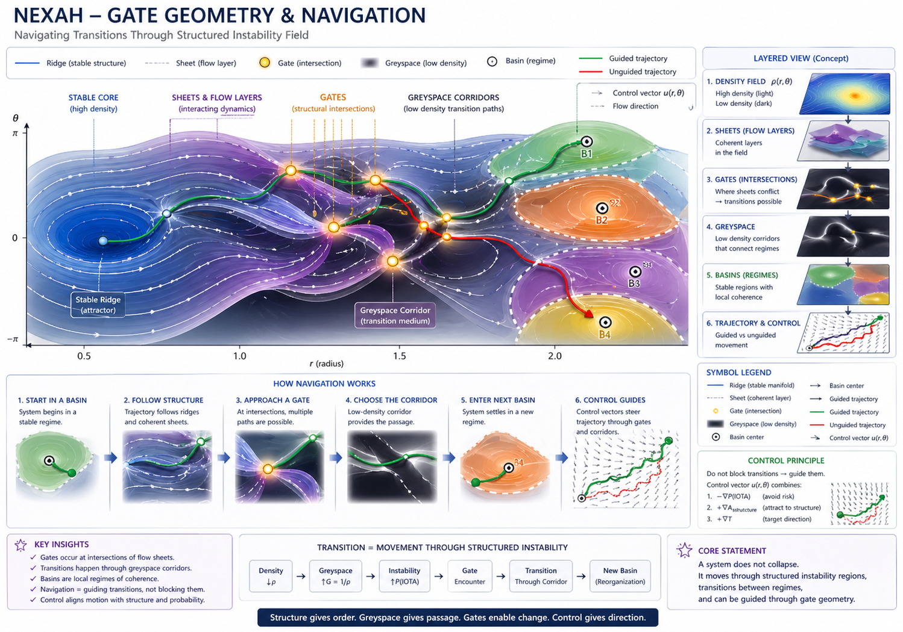
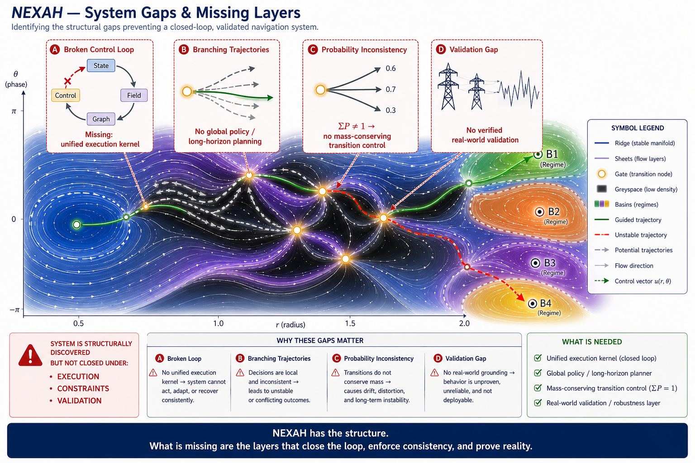

# NEXAH Research Vision (v4 — Field, Coherence & Navigation)

NEXAH is a research framework for analyzing and navigating transitions in complex dynamical systems.

It focuses on identifying structure within system dynamics and leveraging this structure for prediction and control.

---

## 🧭 Conceptual Overview


*Conceptual illustration of NEXAH as a field-based interpretation of dynamical systems.*

👉 This visualization represents a **synthesis of observations**, not a direct implementation.

---

## 🔷 Core Hypothesis

> Complex systems evolve within **structured fields**  
> that constrain motion, stability, and transitions.

---

## 🔷 Transition Geometry



Observed structure:

- systems evolve within a **density + flow field**  
- stable regions form **basins (regimes)**  
- transitions occur through **gates (intersections)**  
- low-density regions form **corridors (greyspace)**  

---

### 🔑 Key Insight

```text
Transitions are not random.
They follow geometrically constrained pathways.
```

---

## 🧠 Interpretation

```text
field → structure → gates → corridors → regime transition
```

---

## 🔬 Structural Observations

Across systems:

- coherent regions (basins)  
- anisotropic motion (preferred directions)  
- layered dynamics (flow sheets)  
- structured transitions (non-random)  

---

## ⚠️ Current System Gaps



NEXAH has discovered structure, but is not yet a closed system.

Main gaps:

- ❌ no unified execution kernel  
- ❌ no global trajectory policy  
- ❌ inconsistent transition probabilities  
- ❌ missing real-world validation  

---

## 🧠 Research Direction

The key challenge is:

```text
closing the loop between field, transition, and control
```

This requires:

- unified execution architecture  
- consistent transition modeling  
- long-horizon trajectory planning  
- real-world validation  

---

## 🔷 Field-Based System View

System state:

$$
s = (r, \theta)
$$

Dynamics:

$$
\dot{s} = F(s)
$$

---

## 🔷 Coherence

$$
C(s) =
\frac{\dot{s} \cdot F(s)}{\|\dot{s}\| \, \|F(s)\|}
$$

Interpretation:

- high coherence → stable motion  
- low coherence → transition regions  

---

## 🔷 Navigation Principle

Control:

$$
u(s) = -\nabla P(\text{instability}) + \nabla \rho
$$

---

## 🧠 Unified Interpretation

```text
System =
trajectory in structured field

Stability:
→ alignment + density

Instability:
→ misalignment + low density

Transition:
→ movement through structured corridors
```

---

## 🔬 Status

- empirical  
- simulation-supported  
- not formally proven  

---

## 🧭 Final Insight

```text
Systems do not fail randomly.

They move through structured transition regions
that define what outcomes are possible.
```

---

© Thomas K. R. Hofmann  
NEXAH — 2026
