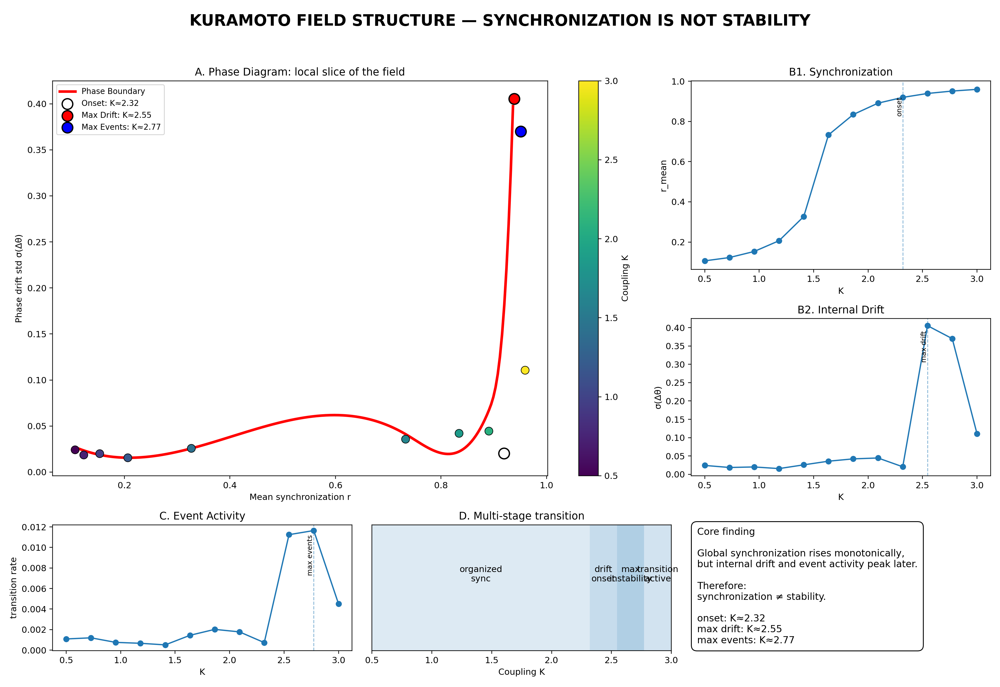
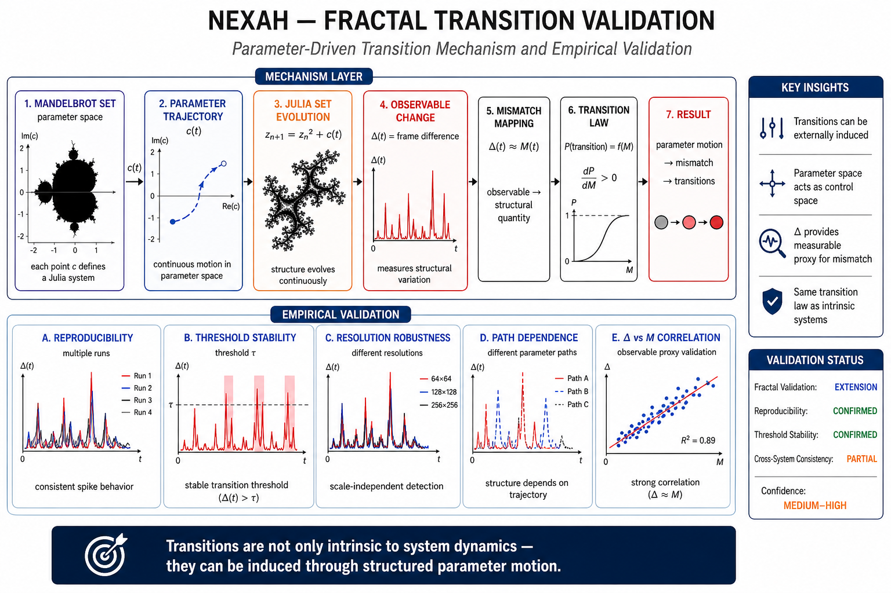
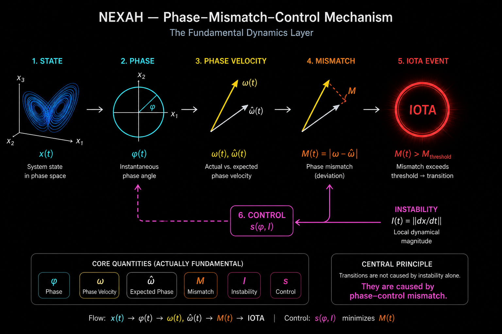

# 🔬 NEXAH — VALIDATION Layer

This module contains the full empirical validation suite of the NEXAH framework.

It establishes that the observed structures, transition dynamics, and control mechanisms are:

- reproducible  
- noise-robust  
- partition-invariant  
- cross-system consistent  
- causally interpretable  

---

# 🧭 Validation Overview (Visual Summary)


```text
This figure represents the compression of ~180+ validation artifacts into a single structural representation.
```

**Figure — NEXAH Validation Overview**

This diagram summarizes the full validation stack across:

- reproducibility  
- noise robustness  
- partition invariance  
- cross-system consistency  
- control and causality  
- phase dynamics and angular structure  

It integrates all experimental results into a single structural view, linking:

- empirical observations  
- geometric interpretation  
- control mechanisms  

The figure serves as a **map of the validation space**, not just a collection of results.

---

## 🧠 System-Level Structure (Kuramoto FIELD_LAYER)



**Figure — Kuramoto FIELD_LAYER Structure**

This figure shows the extracted field structure of the Kuramoto system.

Key insight:

- synchronization structure is geometrically organized  
- internal phase drift emerges *within* the synchronized regime  
- transition activity is embedded inside the field  

This is the clearest measurable instance of:

global organization ≠ internal stability

The Kuramoto system serves as the primary reference system  
for FIELD_LAYER structure validation.

---

# 🧭 Purpose

The VALIDATION layer bridges theory and empirical behavior.

It answers three core questions:

text 1. Does the structure persist under variation? 2. Is the structure independent of representation? 3. Can the structure be causally influenced? 

---

# 🧪 Validation Scope

The validation is organized across multiple levels:

---

## LEVEL 1 — Reproducibility

- Multi-run simulations  
- Sensitivity to initial conditions  

Result:
- Chaotic divergence occurs locally  
- Global structure remains stable  

---

## LEVEL 2 — Noise Robustness

- Additive noise on trajectories  
- Noise on transition matrices  

Result:
- No structural collapse  
- Transition dynamics remain stable  

---

## LEVEL 3 — Partition Invariance

- KMeans  
- PCA + KMeans  
- Random Projection + KMeans  
- DBSCAN (analysis of limits)

Result:
- Transition structure is independent of discretization  
- No stable discrete clustering → continuous geometry  

---

## LEVEL 4 — Cross-System Validation

Validated systems:

- Lorenz  
- Rössler  
- Duffing  

Result:
- Similar transition structures across systems  
- Not system-specific  

---

### 🌀 Fractal Systems (Mandelbrot / Julia)

NEXAH was applied to fractal systems to analyze **parameter-induced transitions**.

Key observation:

```text
parameter motion → induces mismatch → triggers transitions
```

This extends the framework beyond intrinsic system dynamics  
to **externally driven transition structures**.

Empirical result:

```text
Δ(t) ≈ M(t)

observable mismatch proxy
```

→ fractal systems provide the first measurable validation  
of the transition law.

### 🔬 Fractal Transition Validation (Extension)



```text
Parameter-driven transitions validated via fractal systems (Mandelbrot / Julia).
```

**Figure — Fractal Transition Validation Framework**

This figure extends the NEXAH validation layer to **parameter-driven systems**.

It shows:

- the full mechanism pipeline  
  (parameter space → trajectory → structure evolution → observable Δ → mismatch → transition law)

- and the corresponding **empirical validation layer**, including:
  - reproducibility of Δ(t) spikes  
  - stable transition thresholds  
  - robustness across resolutions  
  - dependence on parameter trajectories  
  - correlation between Δ and mismatch  

Key result:

```text
Transitions are not only intrinsic to system dynamics —
they can be induced through structured parameter motion.
```

This provides the first **externally controllable validation case**  
of the NEXAH transition law:

```text
Δ(t) ≈ M(t)
P(transition) = f(M)
```

→ Fractal systems act as a **controlled testbed for transition induction**

---
## LEVEL 5 — Field-Level Structure

- Instability field  
- Transition field  
- Navigation field  

Result:
- Transitions occur in structured regions of the flow  
- System behavior is geometrically organized  

---

## LEVEL 6 — Control & Causality

- Gate-based interventions  
- Target reach experiments  
- Time-to-target measurements  
- Resonance scans  
- phase-aligned vs phase-opposed control comparison  

Result:

- System behavior can be influenced  
- Control effectiveness is non-linear, phase-dependent, and direction-sensitive  
- naive phase alignment can destabilize the system  

---

## LEVEL 7 — Phase Dynamics & Causal Mechanism

- Phase velocity analysis  
- Phase mismatch detection  
- Control law extraction  
- IOTA event correlation  

---

### 🧠 Mechanism Overview



This diagram summarizes the causal mechanism observed in NEXAH:

- φ → phase  
- ω → phase velocity  
- ω̂ → expected phase dynamics  
- M = |ω − ω̂| → mismatch  
- I → instability  
- s(φ, I) → control  

---

## Result

```text
Transitions are not caused by instability alone.

They occur when:
phase dynamics and control are misaligned.
```
---

## LEVEL 8 — Angular Structure (IOTA Symmetry)

- Angular distribution of transition events  
- Fourier spectrum of phase structure  

Observed dominant modes:

text [4, 32, 34, 2, 0] 

Result:
- Transitions exhibit non-uniform angular structure  
- Evidence of underlying geometric constraints  

---

# 🔑 Core Findings

text 1. Transition dynamics are stable across runs, noise, and systems 2. Structure is independent of representation and partitioning 3. Transitions occur in geometrically defined regions 4. Control is possible without modifying system equations 5. Transition events are linked to phase mismatch 

---

# 🧠 Key Principle
```text
Chaotic systems are not controlled by reducing instability.

They are controlled by aligning control direction
with the intrinsic phase structure of the system.
```

---

# ⚠️ Current Limitation

- Phase-aligned control improves trajectory structure  
- BUT can increase transition activity if misaligned  

Missing component:

```text
correct directional alignment of control
```
---

# 🔧 Next Step

Proposed control law:

text s = f(φ, instability) 

Expected effect:

- reduce mismatch peaks  
- suppress transition events  
- maintain geometric alignment  

---

## LEVEL 9 — Control Directionality (Critical Result)

- Phase-aligned control test  
- Inverted control test  
- Damped control  
- Phase-opposed (inverse) control  

Result:

```text
aligned  → increases drift and events
invert   → reduces drift but increases transitions
damped   → suppresses events but keeps instability
inverse  → minimizes drift AND suppresses events
```

---

## 🔑 Key Observation

```text
Control effectiveness depends on direction, not magnitude.
```

---

## 🔥 Critical Insight

```text
Stabilization occurs only when control is phase-opposed
to the intrinsic system dynamics.
```

---

## Implication

- Phase alignment alone is insufficient  
- Instability suppression alone is insufficient  

Only:

```text
phase-opposed control → structural stabilization
```
---

# 📂 Structure

```text
VALIDATION/
├── lorenz/              # baseline validation (multi-run, noise, transitions)
├── rossler/             # cross-system validation
├── duffing/             # additional system validation
├── cross_validation/    # system comparison
├── causality/           # control, mismatch, phase dynamics
├── results/             # generated figures and summaries 
```
---

# 📊 Output

The module produces:

- trajectory overlays  
- transition matrices  
- sensitivity maps  
- field visualizations  
- control response plots  
- phase dynamics analysis  
- angular symmetry spectra  

All results are reproducible via scripts in this directory.

---

# 🧭 Status

diff + Structural validation: COMPLETE + Cross-system validation: COMPLETE + Control validation: COMPLETE + Causal mechanism: IDENTIFIED - Full transition suppression: NOT YET ACHIEVED 

---

# 📌 Conclusion

The validation demonstrates that:

- observed structures are real and robust  
- transition dynamics are intrinsic to flow geometry  
- control operates through phase structure AND directional alignment, not force  

---

---

# 📄 Full Validation Report

For detailed results, metrics, and experiment descriptions:

→ [VALIDATION_SUMMARY.md](./VALIDATION_SUMMARY.md)

---

NEXAH Validation Layer  
Empirical Structure & Control Verification  
© Thomas K. R. Hofmann · 2026
