# 🔬 NEXAH — Validation Summary

## 🧭 Purpose

This document summarizes the current empirical validation status of the NEXAH framework.

The validation layer investigates whether:

```text
transition structure,
phase mismatch,
and directional control behavior
persist reproducibly
across fundamentally different systems.
```

The goal is NOT to prove a finalized theory.

The goal is to determine whether observed structural behavior is:

- reproducible
- noise-robust
- geometry-consistent
- cross-system persistent
- causally interpretable

---

# 🌌 Validation Perspective

NEXAH currently validates:

- multi-run reproducibility
- noise robustness
- partition invariance
- cross-system consistency
- field reconstruction
- transition geometry
- causal intervention
- phase mismatch dynamics
- directional control behavior
- parameter-driven transition systems

The framework currently investigates whether:

```text
complex systems transition through
structured dynamical geometry
rather than unconstrained randomness.
```

---

# 🔥 Current Empirical Conclusion

Observed consistently across investigated systems:

```text
transition activation correlates more strongly
with phase mismatch
than with instability magnitude alone
```

Operational mismatch definition:

$$
M(t)=|\omega(t)-\hat{\omega}(t)|
$$

Interpretation:

```text
instability = potential

mismatch = trigger
```

---

# 🌌 Featured Validation Visuals

## Validation Summary


---

## Transition Activation Framework

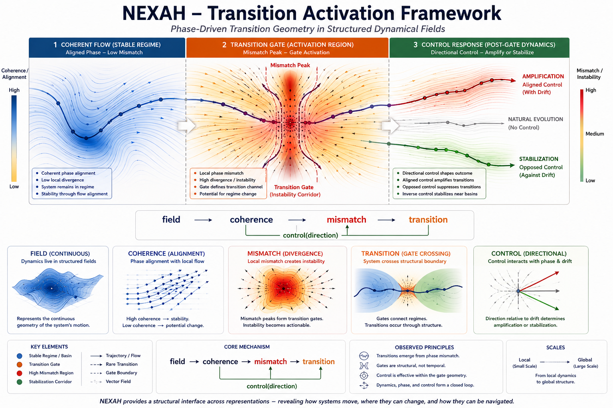

---

## Directional Control Comparison

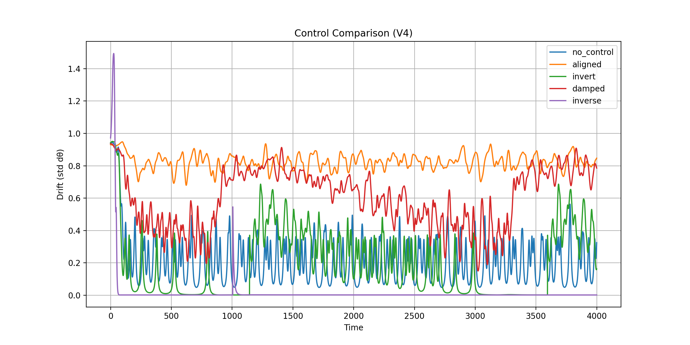

---

## Fractal Transition Validation


---

# 🧭 Validation Architecture

The validation stack currently operates across multiple levels.

---

# ✅ LEVEL 1 — Reproducibility

Validated:

- multi-run trajectory consistency
- bounded attractor persistence
- repeatable transition structure

Goal:

```text
verify that extracted structure
is reproducible across runs
```

---

# ✅ LEVEL 2 — Noise Robustness

Validated:

- trajectory stability under perturbation
- transition stability under noise
- robustness of extracted geometry

Goal:

```text
verify persistence under perturbation
```

---

# ✅ LEVEL 3 — Partition Invariance

Validated:

- KMeans
- PCA + KMeans
- Random Projection
- DBSCAN comparison

Goal:

```text
verify that structure
is not projection-specific
```

---

# ✅ LEVEL 4 — Cross-System Consistency

Validated across:

- Lorenz
- Rössler
- Duffing
- Kuramoto

Goal:

```text
verify that observed structure
is not system-specific
```

---

# ✅ LEVEL 5 — Continuous Geometry

Validated:

- flow reconstruction
- instability fields
- transition fields
- navigation geometry

Goal:

```text
verify that transition structure
exists in continuous state space
```

---

# ⚡ LEVEL 6 — Control & Causality

Validated:

- gate intervention
- target reachability
- resonance structure
- directional control effects
- mismatch correlation

Goal:

```text
verify that structure
is causally influenceable
```

---

# 🔥 LEVEL 7 — Phase Dynamics & Transition Mechanism

Validated:

- mismatch correlation
- phase-dependent transitions
- directional asymmetry
- angular modulation structure
- inverse control stabilization

Goal:

```text
identify operational transition mechanism
```

---

# 🔬 Validation Scope

Current primary systems include:

- Lorenz
- Rössler
- Duffing
- Kuramoto
- parameter-driven fractal systems

---

# 🧪 1. Multi-Run Validation (Lorenz)

**Script:** `run_lorenz_multirun_validation.py`  
**Runs:** 10  

---

## Results

- Mean endpoint distance: **9.7892**  
- Std deviation: **5.9301**  
- Attractor stability: **MEDIUM**

---

## Visual Evidence


---

## Interpretation

- trajectories diverge locally (expected for chaotic systems)
- trajectories remain globally bounded
- attractor geometry persists across runs

---

# 🌫️ 2. Noise Robustness

**Script:** `run_lorenz_noise_validation.py`

---

## Results

### Clean

- Mean distance: **9.7892**
- Std deviation: **5.9301**

### Noisy

- Mean distance: **10.4864**
- Std deviation: **4.9895**

---

## Visual Evidence

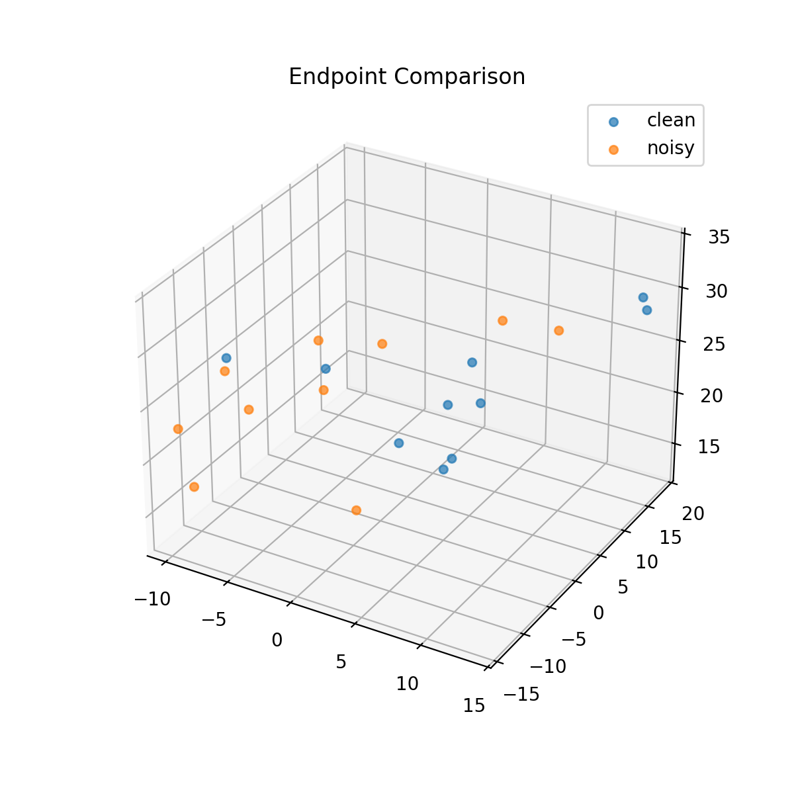

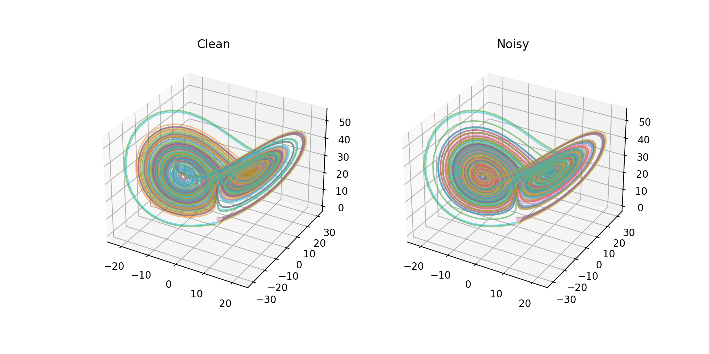

---

## Interpretation

```text
noise perturbs trajectories,
but does not destroy global structure
```

---

# 🔁 3. Transition Stability Under Noise

**Script:** `run_transition_noise_validation.py`

---

## Results

- Mean transition difference: **0.0008**

---

## Visual Evidence


---

## Interpretation

- transition matrices remain visually similar
- differences remain localized
- transition structure persists under perturbation

---

# 🧭 4. Transition Sensitivity

## Grid Partition

**Script:** `run_transition_sensitivity_map.py`

### Results

- Mean difference: **0.001060**
- Mean noisy variance: **0.000022**

---

## Real Partition

**Script:** `run_transition_sensitivity_real_partition.py`

### Results

- Mean difference: **0.004940**
- Mean noisy variance: **0.000223**

---

## Visual Evidence

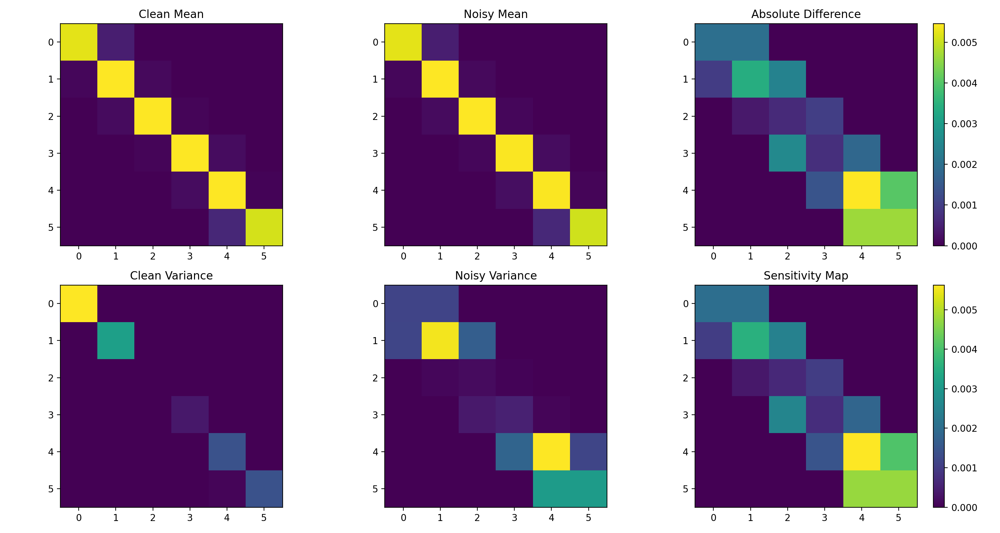

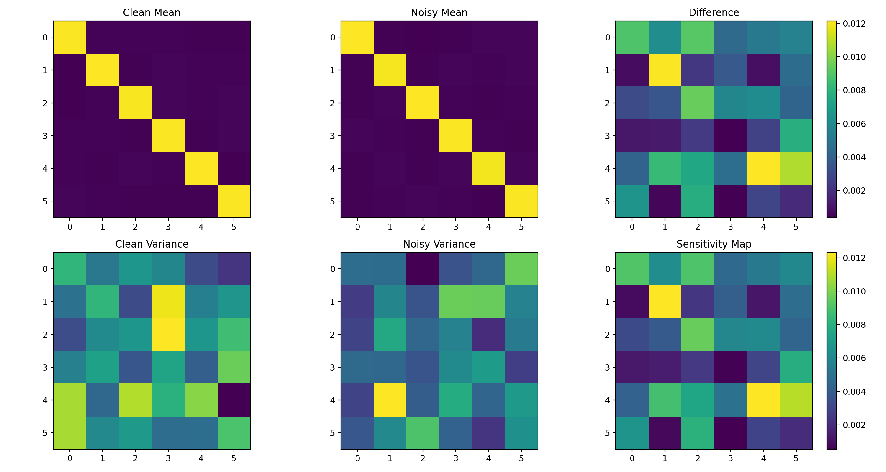

---

## Interpretation

```text
transition probabilities are highly stable
despite noise and partition changes
```

---

# 🧬 5. Partition Invariance

**Script:** `run_multi_partition_invariance_test.py`

---

## Methods

- KMeans
- PCA + KMeans
- Random Projection + KMeans
- DBSCAN

---

## Results

- KMeans vs PCA: **0.014032**
- KMeans vs Random Projection: **0.017065**
- PCA vs Random Projection: **0.012935**

---

## Visual Evidence


---

## Interpretation

```text
transition structure
is not tied to a specific embedding
or discretization method
```

---

# 🌊 6. Continuous Geometry Validation

**Scripts:**

- `run_instability_field_estimation.py`
- `run_transition_field_estimation.py`
- `run_navigation_field.py`

---

## Visual Evidence

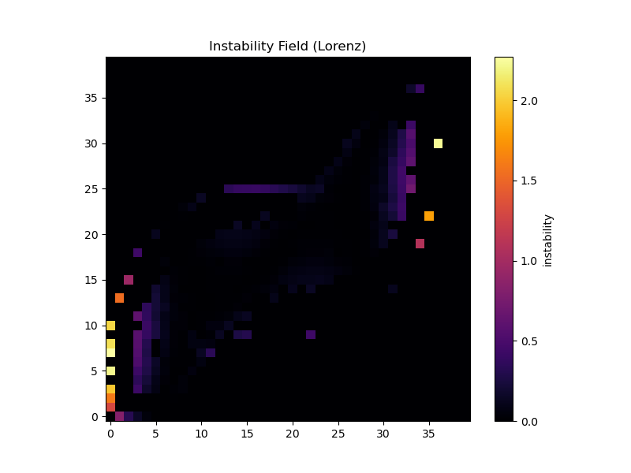

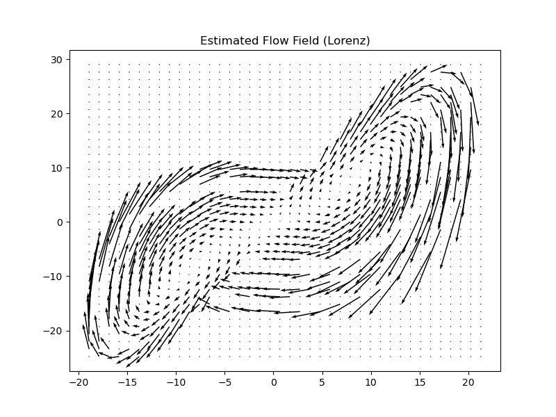

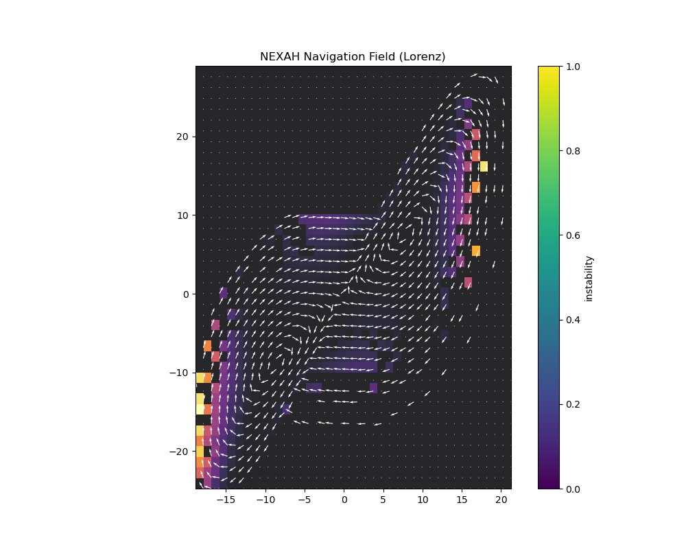

---

## Interpretation

Observed structure includes:

- localized transition zones
- smooth directional flow
- coherent geometric regions
- structured navigation pathways

---

## Key Observation

```text
transitions are not random jumps

they occur in structured regions
of the reconstructed field
```

---

# 🌐 7. Cross-System Validation

## Systems

- Lorenz
- Rössler
- Duffing

---

## Pairwise Transition Distances

- Lorenz vs Rössler: **0.0164**
- Lorenz vs Duffing: **0.0163**
- Rössler vs Duffing: **0.0017**

---

## Visual Evidence

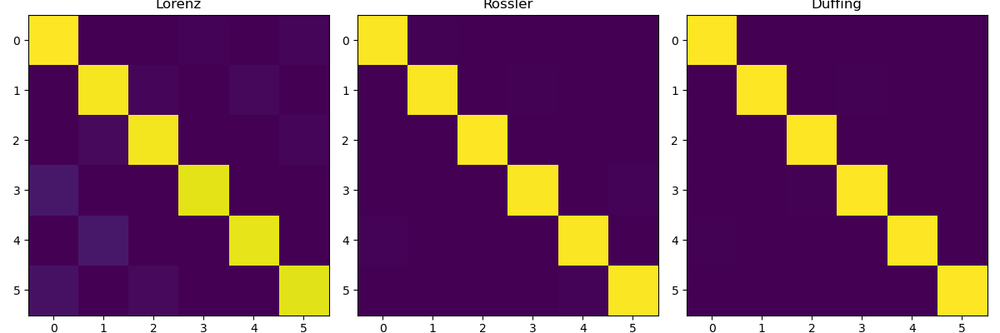

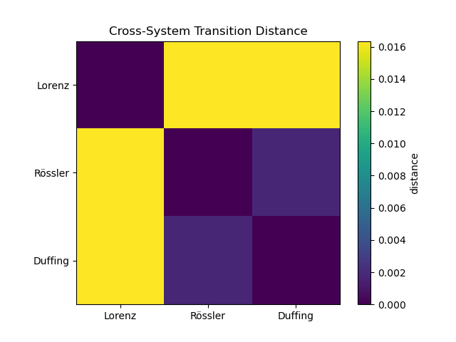

---

## Interpretation

```text
qualitatively different systems
still exhibit highly similar
transition organization
```

---

# 🧪 8. Gate Intervention & Causality

**Script:** `run_gate_transition_causality.py`

---

## Results

- Mean transition difference: **0.014460**

---

## Visual Evidence

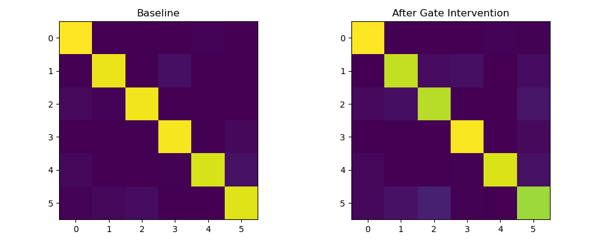

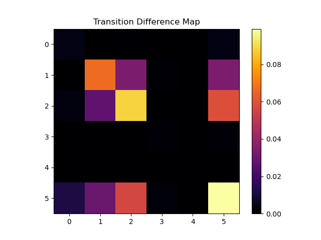

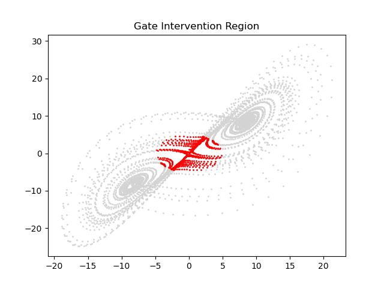

---

## Interpretation

- local intervention modifies transition structure
- effects remain localized and structured
- global attractor geometry persists

---

# 🎯 9. Directional Control Validation

## Key Experimental Result

```text
control effectiveness depends on direction,
not magnitude alone
```

---

## Results

```text
no_control → drift: 0.2156, events: 5

aligned → drift: 0.8245, events: 47

invert → drift: 0.1899, events: 58

damped → drift: 0.6030, events: 0

inverse → drift: 0.0165, events: 0
```

---

## Visual Evidence


---

## Interpretation

### aligned

- amplifies drift
- amplifies transitions

### invert

- suppresses drift
- increases transition activity

### damped

- suppresses events
- retains instability

### inverse

- suppresses drift
- suppresses events

---

## Key Observation

```text
stabilization occurs only when control
is phase-opposed
to intrinsic system dynamics
```

---

# 🔥 10. Phase Mismatch Validation

## Core Observation

IOTA events correlate strongly with:

- mismatch peaks
- phase deviation
- directional misalignment

NOT with:

- instability magnitude alone

---

## Results

- Mean mismatch at IOTA: **2.5432**
- Mean mismatch overall: **~0.0**

---

## Visual Evidence

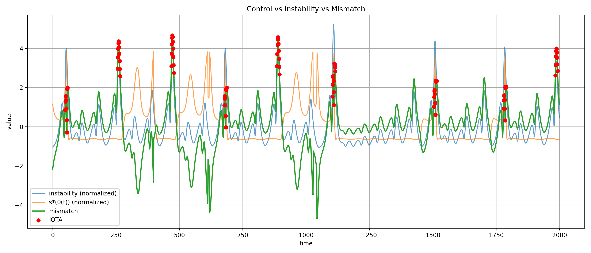

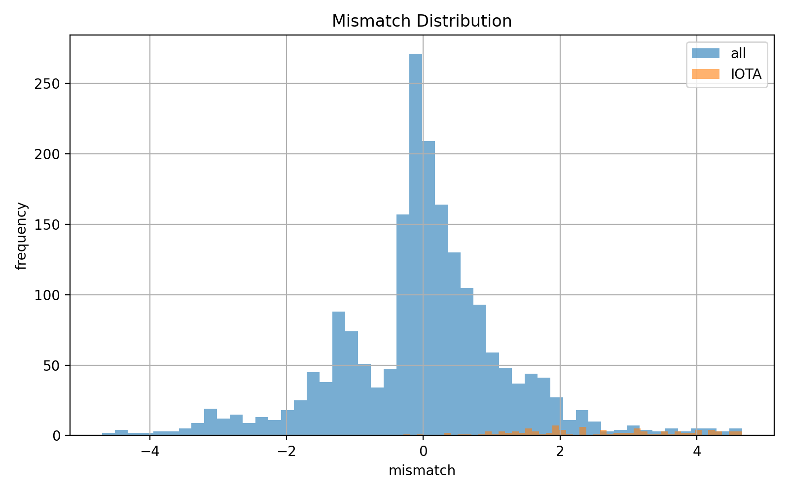

---

## Interpretation

```text
transitions activate when
local phase evolution
breaks coherence
relative to expected dynamics
```

---

# 🧭 11. Angular Structure Analysis

## Dominant Angular Modes

```text
[4, 32, 34, 2, 0]
```

---

## Interpretation

Observed:

- non-uniform angular distribution
- harmonic modulation structure
- directional asymmetry

BUT:

```text
angular structure modulates transitions

it does NOT define the transition mechanism
```

---

# 🌀 12. Fractal Transition Validation (Experimental Extension)

## Purpose

Extend transition analysis beyond intrinsic system dynamics
into parameter-driven systems.

---

## System

Julia / Mandelbrot parameter trajectories.

---

## Structural Observable

$$
\Delta(t)
=
\text{frame-to-frame structural difference}
$$

---

## Core Relation

$$
P(\text{transition})
=
f(\Delta, distance)
$$

---

## Visual Evidence

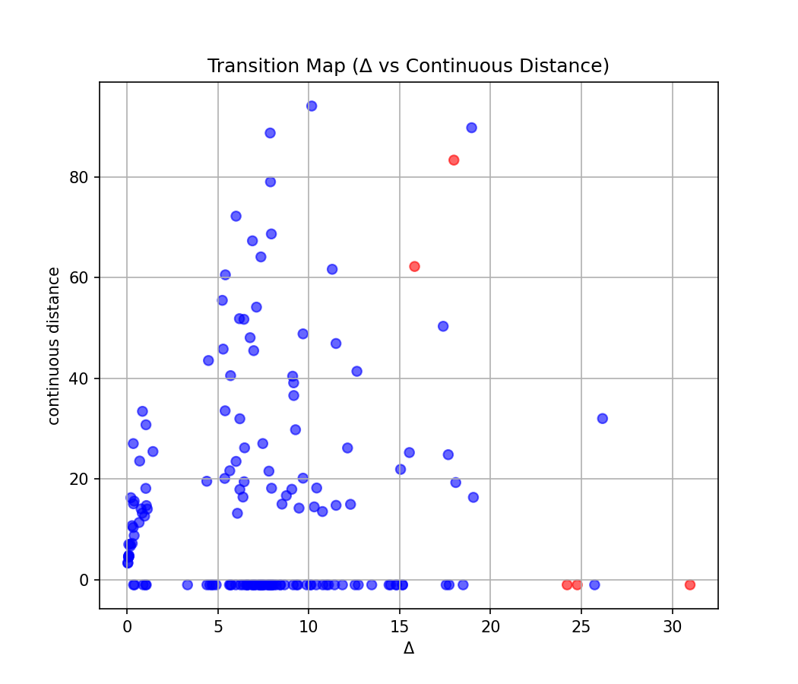

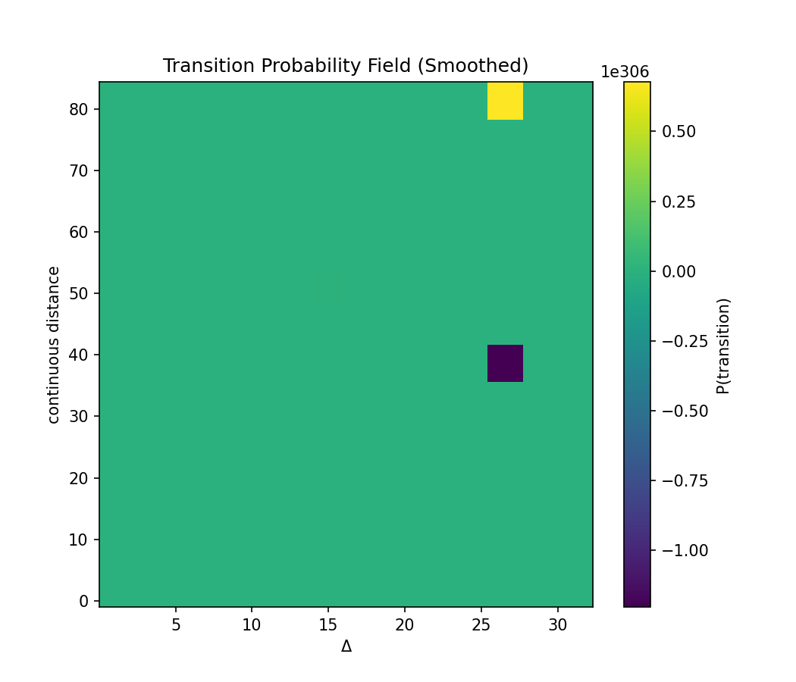

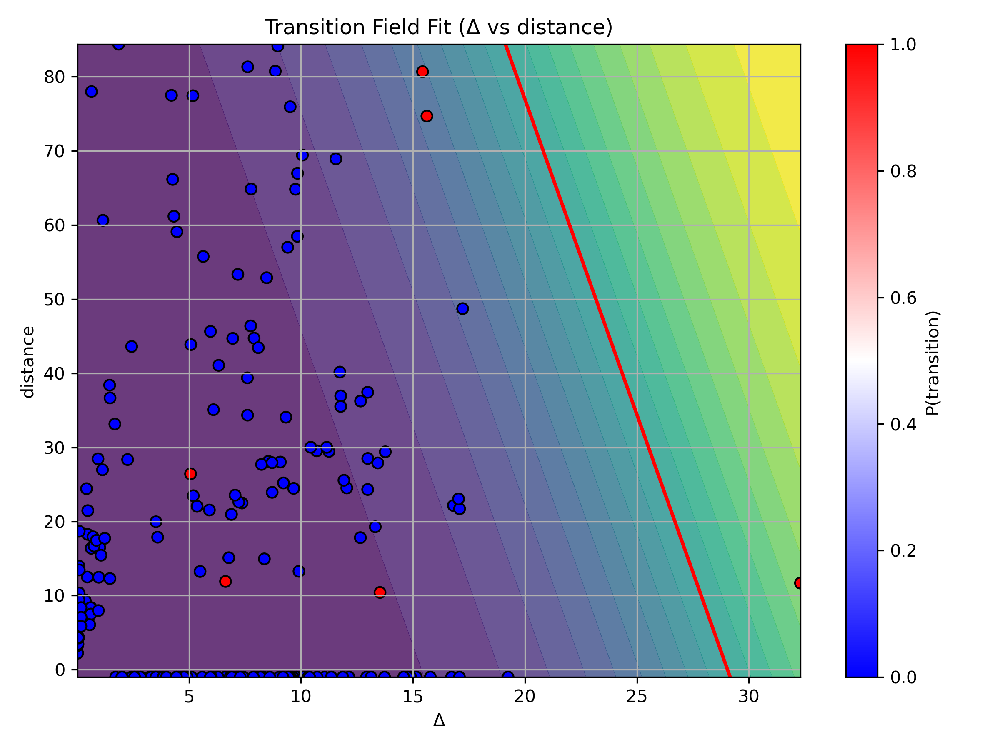

---

## Interpretation

- local change alone is insufficient
- transitions require global structural context
- transition regions remain bounded and structured

---

## Relation to Core Mechanism

```text
parameter motion
→ structural mismatch
→ transition activation
```

---

# 🔬 What is CURRENTLY strongly supported?

## ✅ Strong Empirical Support

- transition reproducibility
- noise robustness
- partition invariance
- cross-system consistency
- mismatch-transition correlation
- directional control asymmetry
- geometric transition localization

---

## ⚠️ Emerging / Exploratory

- generalized causal laws
- universal mismatch dynamics
- topology emergence
- universal control kernels
- generalized transition geometry
- parameter-space universality

---

# 🧠 Current Scientific Interpretation

The validation layer currently supports the interpretation that:

```text
transition structure
is reproducible,
geometry-dependent,
and phase-sensitive
across multiple classes
of dynamical systems
```

However:

```text
formal universality
has NOT yet been established
```

---

# 🔥 Emerging Principle

```text
effective control of chaotic systems
is not achieved
by reducing instability alone

but by aligning control
with intrinsic phase structure
and directional system geometry
```

---

# ⚠️ Current Status

NEXAH validation is currently:

```text
empirical
cross-system consistent
geometry-oriented
semi-formal
causally suggestive
```

It is NOT yet:

- mathematically closed
- universally proven
- fully generalized
- production-level validated

---

# 🧭 Final Perspective

```text
The validation layer suggests that
complex systems may transition
through structured dynamical geometry
rather than unconstrained randomness.
```

---

**NEXAH Validation Layer**  
Empirical Transition & Control Validation Framework  
Thomas K. R. Hofmann · 2026
