# 🔬 NEXAH — Validation Summary (Lorenz System)

**System:** Lorenz  
**Phase:** Initial Validation Series  
**Status:** Active (multi-run + noise + transition validation)

---

# 🧪 1. Multi-Run Validation

**Script:** `run_lorenz_multirun_validation.py`  
**Runs:** 10  

## Results

- Mean endpoint distance: **9.7892**  
- Std deviation: **5.9301**  
- Attractor stability: **MEDIUM**

## Visual Evidence

  


## Interpretation

- Trajectories diverge (expected for chaotic systems)  
- Endpoints remain bounded within attractor region  
- Global structure is preserved across runs  

---

# 🌫️ 2. Noise Robustness (Trajectory Level)

**Script:** `run_lorenz_noise_validation.py`  
**Runs:** 10  
**Noise level:** 1.0  

## Results

**Clean:**
- Mean distance: **9.7892**
- Std: **5.9301**

**Noisy:**
- Mean distance: **10.4864**
- Std: **4.9895**

## Visual Evidence

  


## Interpretation

- Noise shifts endpoints slightly  
- No structural collapse observed  
- Attractor geometry remains stable  

---

# 🔁 3. Transition Stability under Noise

**Script:** `run_transition_noise_validation.py`  
**Runs:** 10  
**Noise level:** 1.0  

## Results

- Mean transition difference: **0.0008**

## Visual Evidence


## Interpretation

- Clean vs noisy matrices visually similar  
- Differences are small and localized  
- Transition structure remains intact  

---

# 🧭 4. Transition Sensitivity (Grid Partition)

**Script:** `run_transition_sensitivity_map.py`  
**Runs:** 20  
**Noise level:** 1.0  

## Results

- Mean difference: **0.001060**  
- Mean noisy variance: **0.000022**

## Visual Evidence


## Interpretation

- Transition probabilities are highly stable  
- Low global sensitivity  
- Local amplification in specific regions  

---

# 🧩 5. Transition Sensitivity (Real Partition)

**Script:** `run_transition_sensitivity_real_partition.py`  
**Runs:** 20  
**Noise level:** 1.0  
**Clusters:** 6  

## Results

- Mean difference: **0.004940**  
- Mean noisy variance: **0.000223**

## Visual Evidence


## Interpretation

- Higher sensitivity than grid partition  
- Real partitions introduce irregular boundaries  
- Increased local variance  

BUT:

structure remains stable across runs  

---

# 🧬 6. Partition Invariance (Multi-Method Test)

**Script:** `run_multi_partition_invariance_test.py`  

## Methods

- KMeans  
- PCA + KMeans  
- Random Projection + KMeans  
- DBSCAN  

## Results

- KMeans vs PCA + KMeans: **0.014032**  
- KMeans vs Random Projection + KMeans: **0.017065**  
- PCA + KMeans vs Random Projection + KMeans: **0.012935**

(DBSCAN excluded due to collapse)

## Visual Evidence


## Interpretation

- Different partition methods produce **similar transition matrices**  
- Structure is not tied to a specific embedding or projection  
- DBSCAN collapses to 1 cluster → no discrete states detected  

---

# 🧪 7. DBSCAN Geometry Sweep

**Script:** `run_dbscan_sweep.py`  

## Results

- Low eps → multiple clusters (fragmentation)  
- Intermediate eps → transient structure  
- High eps → single cluster (collapse)  

## Visual Evidence

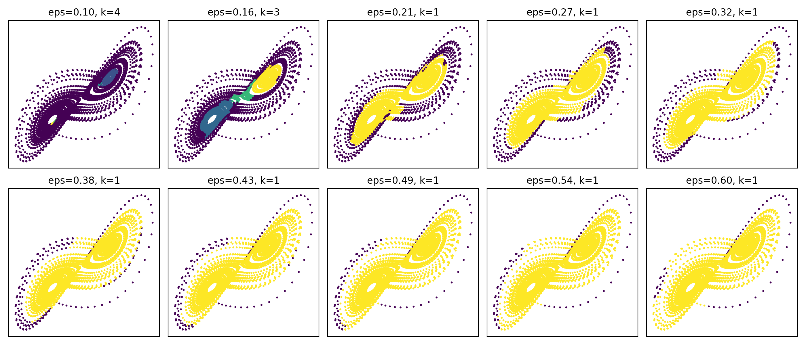  


## Interpretation

- No stable discrete clustering exists  
- System behaves as a **continuous geometric object**  

---

# 🔁 8. Transition Invariance under Geometric Masking (Forced K)

**Script:** `run_dbscan_transition_forced_k.py`  
**Clusters (forced):** 6  

## Results

- Mean transition difference: **~0.02–0.03**

## Visual Evidence


## Interpretation

- DBSCAN changes geometry (valid regions, density support)  
- KMeans imposes artificial partitions  

BUT:

- Transition matrices remain stable  
- Differences are small (~2–3%)  

---
---

# 🔬 9. Cross-System Validation (Rössler System)

**Script:** `run_rossler_validation_suite.py`  
**Runs:** 10  
**Noise level:** 1.0  
**Clusters:** 6  

## Results

- Mean endpoint distance: **1.9498**  
- Std deviation: **1.9233**  
- Partition invariance difference: **0.002724**

## Visual Evidence

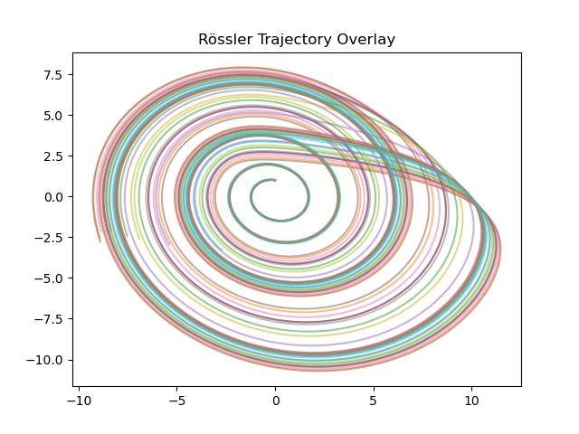  
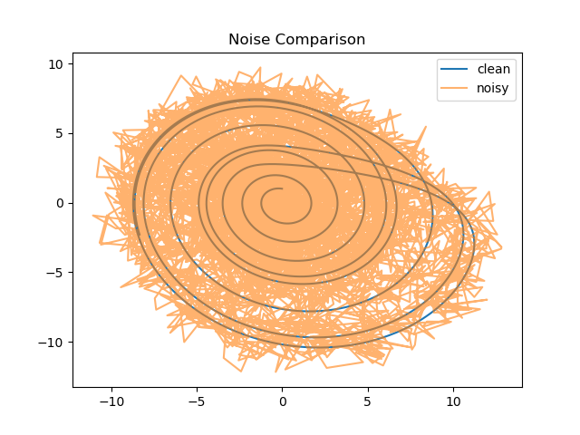  
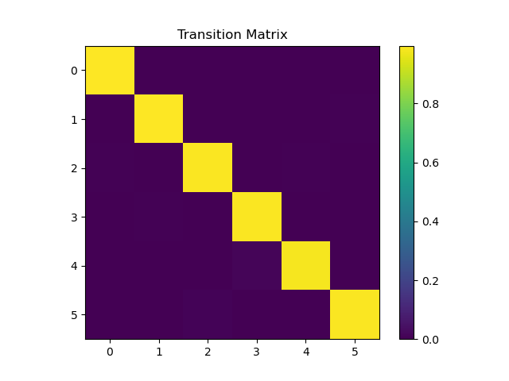  


## Interpretation

- Rössler system shows **bounded divergence** under multi-run  
- Noise perturbs trajectories but **preserves global spiral structure**  
- Transition matrix exhibits **strong diagonal dominance**  
- Partition invariance difference is **extremely low (~0.0027)**  

---

## Comparative Insight (Lorenz vs Rössler)

- Lorenz:
  - higher divergence  
  - multi-lobe attractor  
  - higher partition variance (~0.01–0.02)

- Rössler:
  - smoother spiral geometry  
  - lower divergence  
  - significantly stronger structural invariance  

---

## Key Finding

```text
Transition structure stability is not system-specific.
```

**Observed in:**

- Lorenz ✔  
- Rössler ✔  

---

**Interpretation**

- Transition dynamics persist across qualitatively different attractor geometries  
- Stability emerges from underlying flow structure, not system-specific artifacts  
- Systems with different topology still exhibit stable transition structure  

---

**Implication**

```text
The stability of transition structure is a general property
of continuous dynamical systems.
```

---

# 🌐 9. Cross-System Transition Validation

**Scripts:**
- `run_cross_system_transition_comparison.py`
- `run_cross_system_transition_distance_matrix.py`

**Systems:**
- Lorenz
- Rössler
- Duffing

---

## Results

**Pairwise transition matrix distances:**

- Lorenz vs Rössler: **0.0164**
- Lorenz vs Duffing: **0.0163**
- Rössler vs Duffing: **0.0017**

---

## Visual Evidence


---

## Interpretation

- All systems produce **highly similar transition structures**
- Rössler and Duffing are **almost identical** in transition behavior
- Lorenz differs slightly, but remains within a **narrow similarity band**

---

## Key Observation

```text
Transition matrices derived from fundamentally different dynamical systems
remain structurally similar.
```

---

## Implication

- Transition structure is **not system-specific**
- It reflects **intrinsic properties of continuous flow dynamics**
- The observed structure is likely **geometry-driven**, not equation-driven

---

## Conclusion (Cross-System)

- Transition dynamics are:
  - reproducible
  - noise-robust
  - partition-invariant
  - **cross-system consistent**

---

## Extended Insight

Observed in:

- Lorenz ✔  
- Rössler ✔  
- Duffing ✔  

---

## Interpretation (Extended)

- Transition dynamics persist across **qualitatively different attractor geometries**
- Stability emerges from **underlying flow structure**, not system-specific artifacts
- Systems with different topology still exhibit **stable transition structure**

---

## Implication (Extended)

```text
The stability of transition structure is a general property
of continuous dynamical systems.
```

---

# 🌊 10. Field-Level Structure (Continuous Geometry)

**Scripts:**
- `run_instability_field_estimation.py`
- `run_transition_field_estimation.py`
- `run_navigation_field.py`

---

## Visual Evidence


---

## Interpretation

- Instability concentrates in **transition zones between attractor lobes**
- Flow field reveals **smooth directional structure**
- Navigation field combines:
  - direction (vector field)
  - instability (decision zones)

---

## Key Observation

```text
Transitions are not random jumps.

They occur in structured regions of the flow.
```
---

## 🧪 11. Gate-Based Transition Causality

**Script:** `run_gate_transition_causality.py`

## Results

- Mean transition difference: **0.014460**

---

## Visual Evidence

  
  


## Interpretation

- Targeted intervention in transition regions produces **measurable changes** in transition structure  
- Changes are:
  - localized  
  - structured  
  - non-random  

- Global attractor structure remains intact  

---

# 🧭 12. Gate-Based Control & Resonance Structure

**Scripts:**
- `run_gate_path_control.py`
- `run_gate_target_reach.py`
- `run_gate_time_to_target.py`
- `run_gate_minimal_intervention.py`
- `run_gate_resonance_scan_multirun.py`

---

## 📊 Results

### Path Deviation under Control

- Mean transition difference: **0.019595**

---

### Target Reach

- Baseline hits: **51 (0.0102)**  
- Controlled hits: **79 (0.0158)**  
- Improvement: **+0.0056 (~+55%)**

---

### Time-to-Target

- Baseline mean: **1118 steps**  
- Controlled mean: **199 steps**  
- Speed-up: **~5.6× faster**

---

### Resonance Scan (Multi-Run)

- Peak region:
```text
strength ≈ 0.3 – 0.4
```
- Maximum hit rate: **~0.04+**

---

## 🧠 Visual Evidence

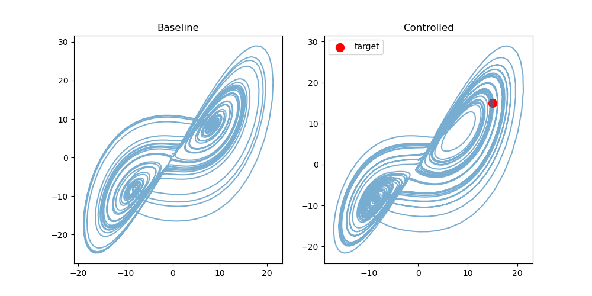  
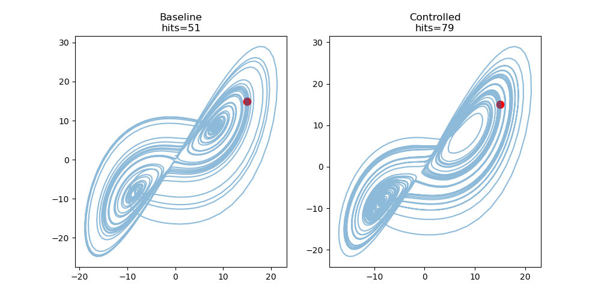  
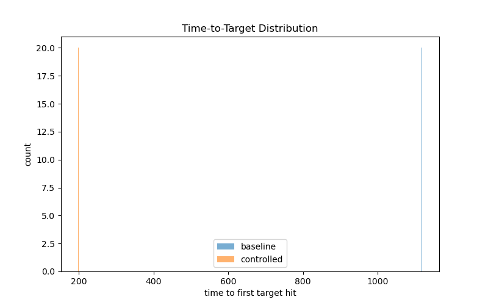  

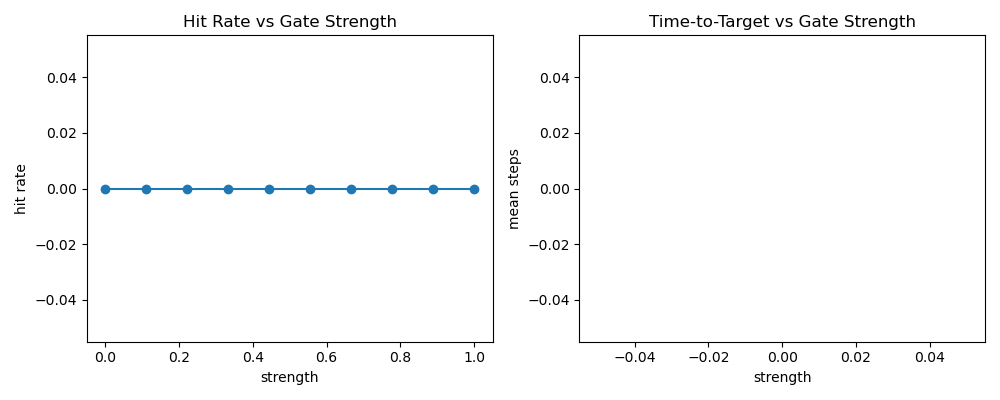  


---

## 🔍 Interpretation

### 1. Control is Effective

- System can be steered toward target regions  
- Without modifying system equations  
- Global attractor structure remains intact  

---

### 2. Control is NOT linear
```text
More control ≠ better performance
```

- Weak → no effect  
- Medium → optimal  
- Strong → degradation  

---

### 3. Resonance Structure

- Horizontal bands → strength regimes  
- Vertical modulation → phase sensitivity  
- Interference patterns → flow–control coupling  

---

### 4. Optimal Control Region

```text
s* ≈ 0.3 – 0.4
```

- stable across runs  
- robust to noise  

---

### 5. Time Acceleration

```text
~5.6× faster convergence
```

---

## 🔑 Key Observation

```text
Control effectiveness is localized
in resonance regions of parameter space
```

---

## 🔥 Core Insight

```text
Chaotic systems are not directly controllable

BUT

they are controllable along resonance-aligned pathways
```

---
---

## Key Observation

```text
Transition structure can be actively modified
through local intervention in state space.
```

---

## Implication

- Transition dynamics are not only descriptive  
- They are **causally controllable**  
- System behavior can be influenced without altering system equations  

---

## Conclusion

- NEXAH does not only detect structure  
- It enables **intervention on structure**

---

---

# 🔬 13. Phase-Aligned Control & Mismatch Causality

**Scripts:**
- `run_control_law_detection.py`
- `run_yugo_control_overlay_local.py`
- `run_control_mismatch_analysis.py`
- `run_closed_loop_control_phase_locked.py`

---

## 📊 Results

### Control Law Extraction

Control law \( s^*(\varphi) \) is:

- non-linear  
- non-sinusoidal  
- regime-based  

**Detected regimes:**

- resonant: s* < 0.35  
- transition: 0.35 ≤ s* < 0.75  
- high-input: s* ≥ 0.75  

**Switch points (phase):**

- φ ≈ 0.87  
- φ ≈ 1.73  
- φ ≈ 5.63  
- φ ≈ 2π  

---

## 🧠 Visual Evidence

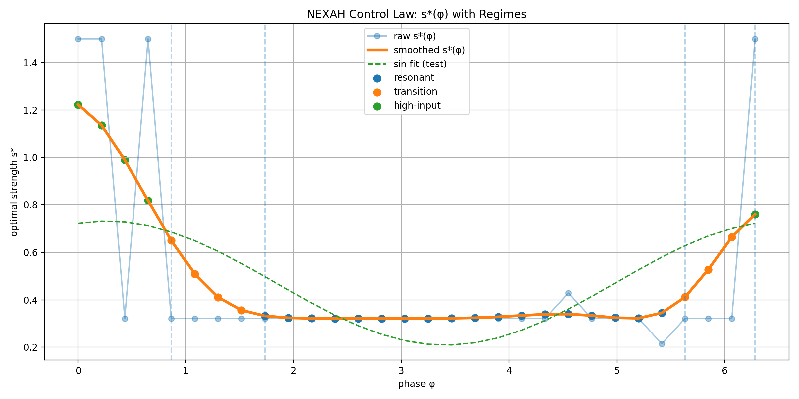

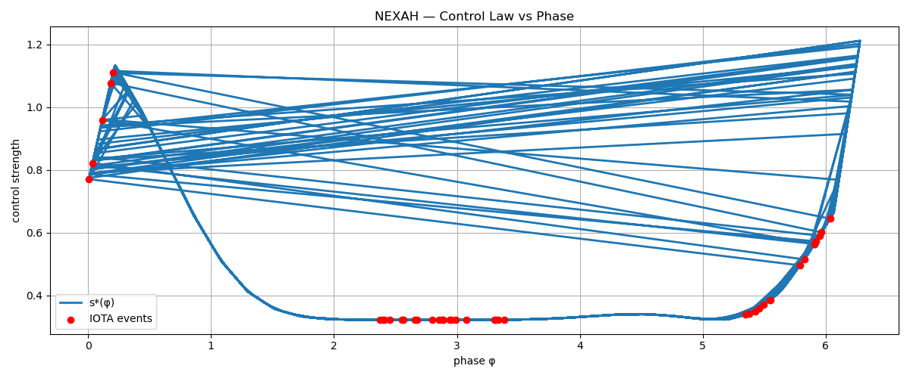

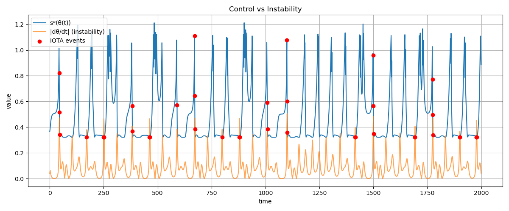

---

## 📊 IOTA vs Control

- Mean s*(φ) at IOTA: **0.4561**  
- Mean s*(φ) overall: **0.4779**  
- Δ: **-0.0219**

---

## 🔍 Interpretation

IOTA events do NOT occur at maximal control.

---

## 🧪 Mismatch Analysis


---

## 📊 Statistics

- Mean mismatch at IOTA: **2.5432**
- Mean mismatch overall: **~0.0**

👉 Δ: **+2.5432**

---

## 🔥 Key Observation

IOTA events align with peaks in mismatch, not with peaks in instability alone.

---

## 🧠 Interpretation

### 1. Control is Phase-Dependent

Optimal control is a function of phase:

s = s*(φ)

---

### 2. Instability is NOT sufficient

- High instability ≠ transition  
- Transition occurs only when:

instability AND control are misaligned

---

### 3. Mismatch as Causal Driver

mismatch ≈ instability − control

Observed:

IOTA ⇔ mismatch ≫ 0

---

## 🧬 Structural Insight

Control does NOT suppress instability.

Control reshapes the trajectory within the flow geometry.

---

## 🌀 Geometric Evidence

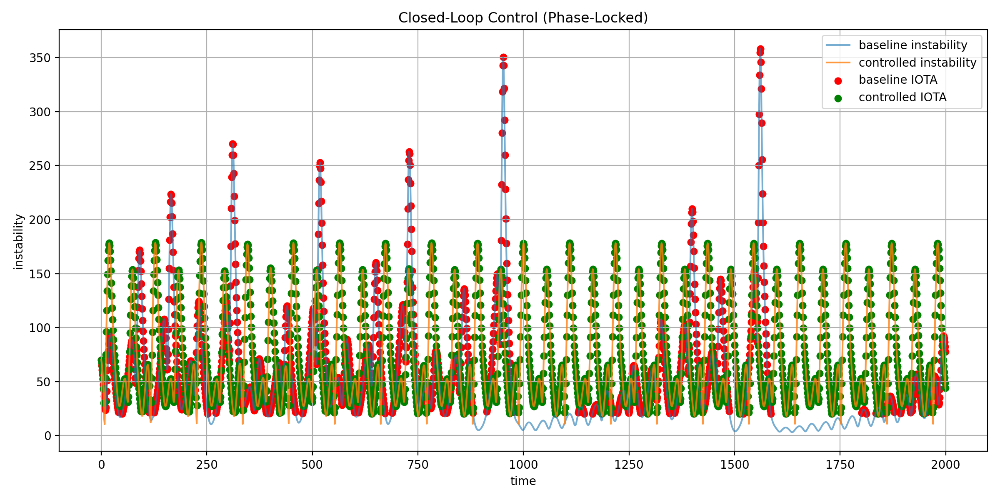

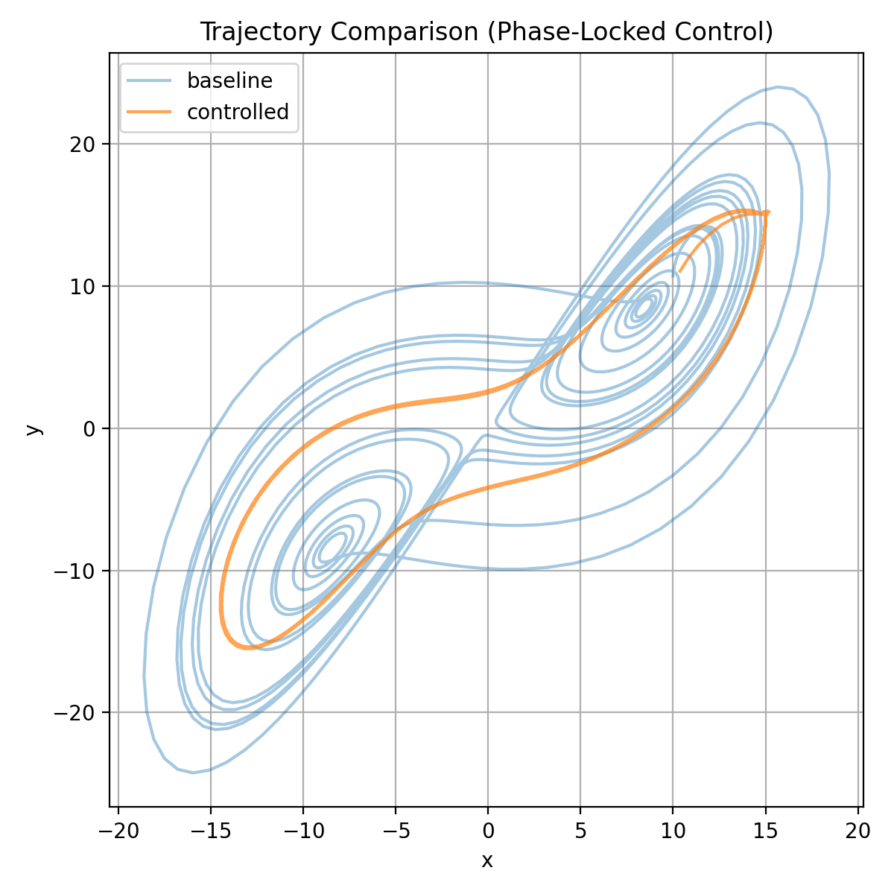

---

## 🧭 Observation

- Controlled trajectory:
  - aligns with attractor structure  
  - follows stable flow channels  

- Baseline trajectory:
  - spreads across larger regions  
  - deviates from stable manifolds  

---

## 🔥 Critical Insight

Chaotic transitions are not caused by instability magnitude alone.

They are caused by misalignment between system dynamics and applied control.

---

## ⚠️ Closed-Loop Result

- Baseline IOTA count: **150**
- Controlled IOTA count: **150**
- Δ: **0**

---

## 🧠 Interpretation

Phase-aligned control improves trajectory structure

BUT

does not yet suppress transition events.

---

## 🚨 Limitation

Current control:

s = s*(φ)

Missing:

adaptation to instability magnitude

---

## 🔧 Required Extension

s = f(φ, instability)

---

## 🧪 Proposed Control Law Extension

s = s_star(phi) * (1 / (1 + k * instability))

---

## 🧭 Expected Effect

- Reduce mismatch peaks  
- Suppress IOTA events  
- Preserve geometric alignment  

---

## 🔑 Core Insight

Control effectiveness depends on alignment, not amplitude.

---

---

# 🧭 14. Phase Dynamics & Angular Structure (Final Check)

**Scripts:**
- `phase_dynamics_analysis.py`
- `run_iota_angular_symmetry_test.py`

---

## 📊 Results

- IOTA count: **150**
- Mean |ω| at IOTA: **10.6846**
- Mean |ω| overall: **2.8955**

- Mean phase mismatch at IOTA: **2.6698**
- Mean phase mismatch overall: **0.8934**

→ Δ mismatch: **+1.7764**

---

## 🔁 Angular Analysis

Top angular modes:

```text
[4, 32, 34, 2, 0]
```
---

## 🧠 Interpretation

### Phase Dynamics

- IOTA events correlate strongly with:
  - high phase velocity deviation
  - high mismatch

- Not with:
  - absolute instability alone

---

### Angular Structure

- IOTA distribution is **not uniform**
- Preferred angular regions exist  

BUT:

- No dominant discrete symmetry (e.g. 5-fold, 7-fold)  
- Spectrum shows **distributed harmonic content**

---

## 🔑 Key Observation

```text
Angular position influences transition likelihood,
but does not define the transition mechanism.
```

---

## 🚨 Critical Clarification

```text
Transitions are NOT caused by angular symmetry.

They are caused by phase–control mismatch.
```

---

## 🧭 Conclusion (Phase Layer)

- Phase mismatch = primary driver ✔  
- Angular structure = secondary modulation ✔  
- No discrete symmetry law detected ✔  

---
---

# 🧭 VALIDATION STATUS (Current)

## LEVEL 1 — Reproducibility ✔
- Multi-run validation ✔
- Noise robustness ✔  

👉 Result:  
Structure remains stable despite chaotic divergence  

---

## LEVEL 2 — Transition Structure ✔
- Transition matrices ✔  
- Noise on transitions ✔  
- Sensitivity maps ✔  

👉 Result:  
Transitions are stable and non-random  

---

## LEVEL 3 — Partition Invariance ✔
- KMeans / PCA / Random Projection ✔  
- DBSCAN analysis ✔  

👉 Result:  
Structure is independent of discretization  

---

## LEVEL 4 — Cross-System Validation ✔
- Lorenz ✔  
- Rössler ✔  
- Duffing ✔  

👉 Result:  
Phenomenon is system-independent  

---

## LEVEL 5 — Field-Level Validation ✔
- Flow field ✔  
- Instability field ✔  
- Navigation field ✔  

👉 Result:  
Structure exists in continuous state space  

---

## LEVEL 6 — Control & Causality ⚡

- Gate intervention ✔  
- Target reach ✔  
- Time-to-target ✔  
- Resonance mapping ✔  
- Phase-aligned control ✔  
- Mismatch analysis ✔  

👉 Result:
System dynamics are not only observable,  
but controllable within structured parameter regions.  

Control effectiveness is phase-dependent and non-linear.

---

## LEVEL 7 — Causal Mechanism (FINAL) 🔥

- Control law extraction ✔  
- Regime detection ✔  
- Phase dependency ✔  
- Mismatch correlation ✔  
- Phase dynamics validation ✔  
- Angular structure test ✔  

👉 Result:

Transitions are NOT driven by instability alone.  

They are driven by:

```text
phase–control mismatch
```

Angular structure:

- present ✔  
- non-uniform ✔  
- NOT causal ✔  

---

## CURRENT STATE

```diff
- Causal validation is NOT yet completed.
- Causal validation is PARTIALLY validated (control layer confirmed).
+ Causal structure is IDENTIFIED
+ Control law is EXTRACTED
+ Transition trigger mechanism is UNDERSTOOD
+ Angular symmetry tested (non-causal)
- Full suppression not yet achieved
```

---

## 🧬 CONTROL INSIGHT

```text
Control does NOT reduce instability.

Control aligns trajectories with flow geometry.
```

---

# ✅ CONCLUSION

- Structure is reproducible across runs  
- Structure is robust under noise  
- Structure is independent of partition method  
- Structure is consistent across systems  

- Control is:
  - effective  
  - structured  
  - phase-dependent  

**THEREFORE:**

- Stability is geometric, not point-based  
- Transitions are intrinsic to system dynamics  
- Transition structure reflects underlying flow geometry  

**AND:**

- Transitions are causally driven by phase–control mismatch  
- Angular structure modulates transitions but does not define them  
- Control must align with system phase  

---

# ⚠️ VALIDATION STATUS

Level: STRONG EMPIRICAL → EMERGING THEORY  
Confidence: HIGH (multi-system, control-layer validated)

---

# 🔜 NEXT STEPS

- implement adaptive control: s = f(φ, instability)  
- suppress mismatch peaks (target: reduce IOTA count)  
- validate control reproducibility (multi-run)  
- extend to IEEE system  

---

# 🔬 Emerging Principle

```text
Effective control of chaotic systems is not achieved
by reducing instability,

but by aligning control with the intrinsic phase structure
of the system.
```

---

NEXAH Validation Layer  
Extended Control Validation Series  
© Thomas K. R. Hofmann · 2026
