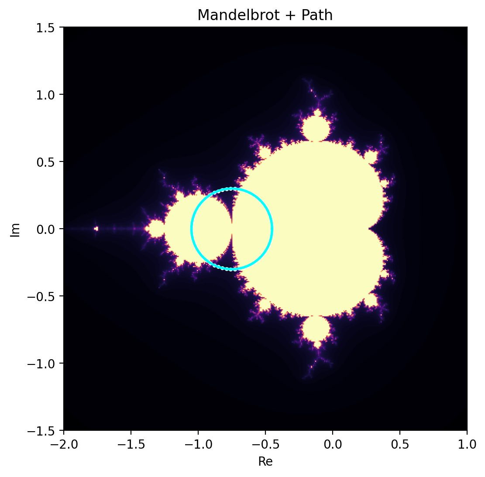

# 🌀 Mandelbrot–Julia Transition Structure

## 🧭 Purpose

This document analyzes the relationship between:

```text
parameter space (Mandelbrot)
→ dynamical realization (Julia)
→ transition detection (Δ)
```

---

## 🔬 Background

Both Mandelbrot and Julia sets are defined by the same iteration:

```text
z_{n+1} = z_n^2 + c
```

- Mandelbrot: varies parameter $begin:math:text$ c $end:math:text$
- Julia: fixes $begin:math:text$ c $end:math:text$, varies initial condition

There is a direct correspondence:

```text
Mandelbrot point c → defines Julia set structure
```

 [oai_citation:0‡Dynamic Mathematics](https://www.dynamicmath.xyz/mandelbrot-julia/?utm_source=chatgpt.com)

---

## 🔁 Structural Relation

```text
parameter space → indexes dynamical regimes
```

Observed:

- inside Mandelbrot → connected Julia sets  
- outside Mandelbrot → disconnected (dust-like) structures  

 [oai_citation:1‡icefractal.com](https://icefractal.com/julia/?utm_source=chatgpt.com)

---

## ⚡ Transition Interpretation (NEXAH)

We define:

```text
c(t) → parameter trajectory
```

This induces:

```text
Julia(t) → evolving dynamical structure
```

---

## 📊 Transition Metric

We measure:

```text
Δ(t) = mean(|frame(t) - frame(t-1)|)
```

---

## 🔥 Key Observation

```text
Δ(t) remains low during smooth parameter motion
Δ(t) spikes at structural transitions
```

---

## 🧠 Interpretation

```text
Transitions correspond to boundary crossings
in parameter space
```

More precisely:

```text
parameter boundary → structural instability → mismatch spike
```

---

## 🔁 Mechanism

```text
c(t) moves across Mandelbrot boundary
→ Julia topology changes
→ Δ spike occurs
→ transition detected
```

---

## 🧩 Structural Insight

```text
Mandelbrot boundary = transition manifold
```

Interpretation:

```text
Not just geometric boundary

→ dynamic bifurcation surface
→ transition activation region
```

---

## ⚡ NEXAH Extension

```text
transition ≠ instability

transition = mismatch event
```

Here:

```text
mismatch induced by parameter motion
```

---

## 🔬 Implication

```text
Fractal systems provide a clean separation:

internal dynamics → fixed  
external control → parameter path
```

---

## 🧭 Generalization

```text
Any parameterized system:

x'(t) = F(x, p(t))

can exhibit:

transition ← parameter-induced mismatch
```

---

## 📊 Visual Reference



---

## 🔥 Core Insight

```text
Mandelbrot is not just a set.

It is a transition map of dynamical behavior.
```

---

## 🧭 Status

- empirically supported  
- structurally consistent  
- not yet formally proven  

---

**NEXAH Fractal Transition Analysis**  
Thomas K. R. Hofmann · 2026
