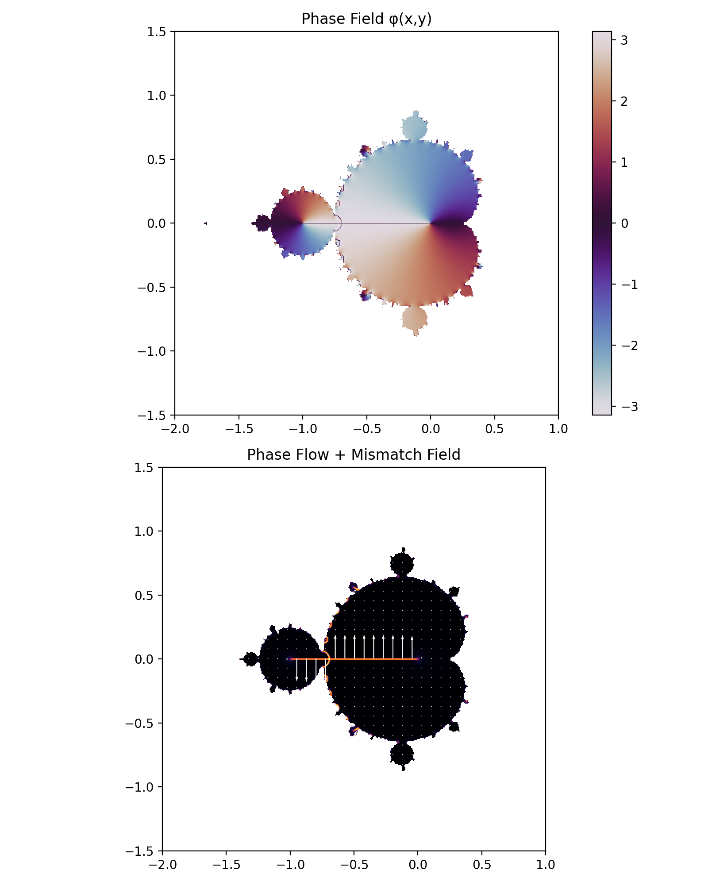

# 🌀 Phase Flow in Fractal Systems

## 🧭 Purpose

This document analyzes fractal systems from a **phase flow perspective**.

Goal:

```text
reinterpret fractals as dynamical flow systems
```

---

## 🔬 Classical Background

A dynamical system defines a flow:

```text
Φ^t(x₀)
```

which describes how a state evolves over time  [oai_citation:0‡Wikipedia](https://en.wikipedia.org/wiki/Flow_%28mathematics%29?utm_source=chatgpt.com)

In phase space:

```text
each point → state  
flow → trajectory  
```

 [oai_citation:1‡Mathematics LibreTexts](https://math.libretexts.org/Bookshelves/Scientific_Computing_Simulations_and_Modeling/Introduction_to_the_Modeling_and_Analysis_of_Complex_Systems_%28Sayama%29/03%3A_Basics_of_Dynamical_Systems/3.02%3A_Phase_Space?utm_source=chatgpt.com)

---

## 🔁 Fractal System Reformulation

Julia iteration:

```text
z_{n+1} = z_n^2 + c
```

can be interpreted as:

```text
discrete phase flow
```

---

## 🧠 Interpretation

```text
initial point z₀ → phase point  
iteration → flow evolution  
escape / convergence → trajectory outcome  
```

---

## ⚡ Key Observation

Fractal images are not static objects.

They represent:

```text
trajectory outcomes under iteration
```

---

## 🔁 Flow Structure

We define:

```text
flow(z₀, c) = trajectory of z under iteration
```

This induces:

```text
phase partition:
    bounded trajectories → stable region  
    escaping trajectories → unstable region  
```

---

## 🧩 NEXAH Interpretation

```text
flow structure encodes transition geometry
```

Specifically:

```text
smooth flow → coherent region  
flow distortion → transition region  
escape → phase release (IOTA)
```

---

## ⚡ Transition Relation

From previous results:

```text
Δ spike ↔ structural transition
```

We now interpret:

```text
Δ spike ↔ disruption in phase flow continuity
```

---

## 🔬 Mechanism

```text
parameter change c(t)
→ modifies flow field
→ alters trajectory geometry
→ induces mismatch
→ triggers transition
```

---

## 🧠 Structural Insight

```text
Fractals are flow maps,
not just geometric sets
```

---

## 🔁 Flow vs Geometry

| Classical View | NEXAH View |
|---------------|-----------|
| fractal = set | fractal = flow structure |
| boundary = shape | boundary = transition zone |
| escape = divergence | escape = phase release |

---

## 📊 Visual Reference



---

## 🔥 Core Insight

```text
Fractal geometry is a projection
of underlying phase flow dynamics
```

---

## 🧭 Generalization

```text
Any iterative system defines a flow:

x_{n+1} = F(x_n)

→ induces phase structure
→ induces transition zones
```

---

## ⚠️ Scope

This interpretation is:

- structurally consistent  
- empirically supported (via Δ and transitions)  
- not yet formally derived  

---

## 🧭 Status

- validated at structural level  
- consistent with dynamical systems theory  
- integrated into NEXAH transition model  

---

**NEXAH Phase Flow Interpretation — Fractals**  
Thomas K. R. Hofmann · 2026
