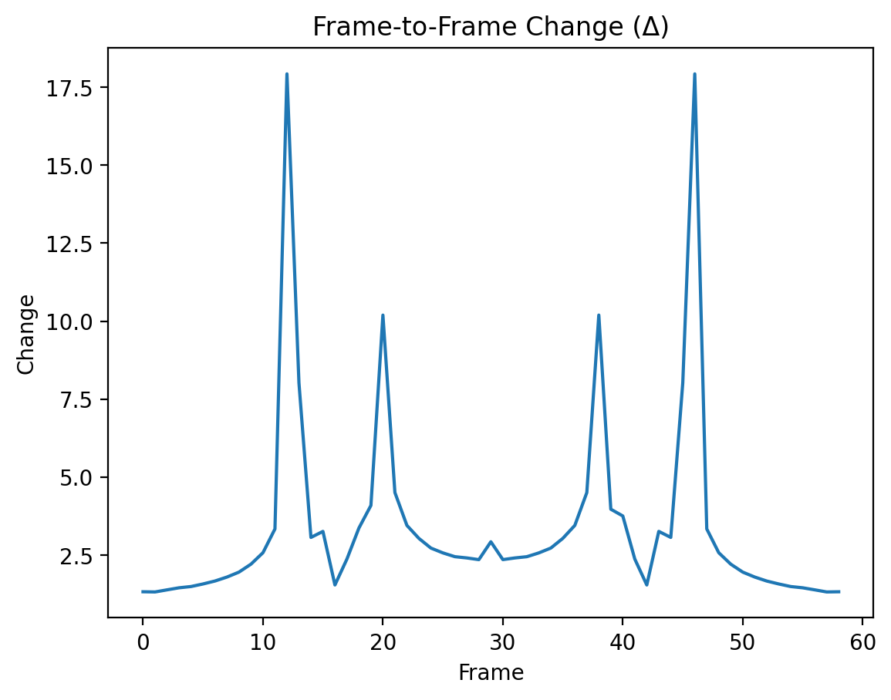

# ⚡ Transition Detection

## 🧭 Purpose

This document defines how transitions are **detected empirically**  
in fractal systems.

---

## 📏 Definition

We define transition intensity as:

```text
Δ(t) = mean absolute frame difference
```

---

## 🔁 Interpretation

```text
Δ(t) measures structural change between states
```

---

## 🎯 Threshold

Empirically:

```text
Δ > 0.08 → transition
```

---

## 🔬 Observed Events

Examples:

- frame 13 → Δ ≈ 0.13  
- frame 47 → Δ ≈ 0.13  

---

## 🧠 Interpretation

```text
Transitions correspond to structural changes
in Julia set topology
```

---

## 🔁 Key Insight

```text
Transition is not continuous

it appears as a discrete event
within continuous parameter evolution
```

---

## 📊 Visual



---

## 🔗 Connection to NEXAH

```text
Δ(t) ≈ M(t)

transition detection via mismatch proxy
```

---

**NEXAH Transition Detection**  
Fractal Validation Layer  
Thomas K. R. Hofmann · 2026
